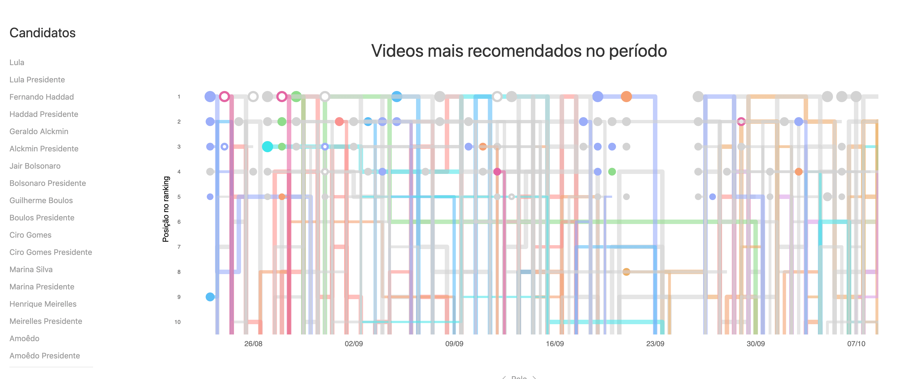

O YouTube, por meio do seu sistema de recomendação de vídeos, vem sendo apontado como uma plataforma de disseminação de ideias conservadoras, na qual se desenvolve um modelo alternativo de influência que favorece a promoção de temas contrários às noções de justiça social e direitos humanos. A partir de um levantamento de vídeos mais recomendados no YouTube durante as eleições de 2018, este estudo traz apontamentos sobre os modos de ação desta plataforma, a atividade dos algoritmos e as estratégias dos actantes, humanos ou robôs, no cenário político eleitoral brasileiro, no qual  predominaram os temas da campanha do candidato Jair Bolsonaro e o discurso conservador que marcou sua trajetória até a presidência do Brasil.

Disponível aqui: [https://doi.org/10.21878/compolitica.2020.10.1.333](https://doi.org/10.21878/compolitica.2020.10.1.333)

Como citar:
Reis, R., Zanetti, D., & Frizzera, L. (2020). A conveniência dos algoritmos. Compolítica, 10(1), 35–58. [https://doi.org/10.21878/compolitica.2020.10.1.333](https://doi.org/10.21878/compolitica.2020.10.1.333)
