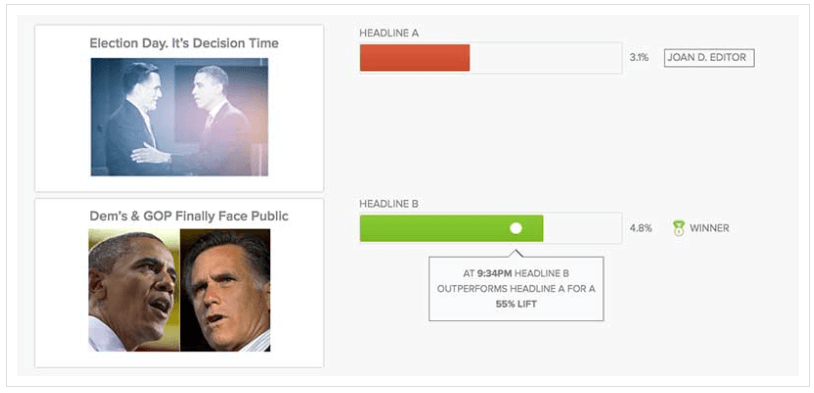

In this probe, I want to explore some ideas about how algorithms are shaping our view of what we know about current affairs. But before jumping to any conclusions of technological determinism, I must clarify that algorithms should not be considered just pieces of code running on machines that make decisions by themselves, but as an intermingle of pre-established technical protocols, a particular view of communications (commonly known as “transmission view”), and an ideological and biased practice of news making. Ergo, we must understand algorithms as a “formalization” of current practices — written and non-written — materialized in computer codes: a _routine_, as it is called by programmers.

A code is, of course, produced by humans. It carries ideologies, bias, opinions, strategies, and tactics. They are not, in any shape or form, neutral or objective. However, if algorithms are not neutral, how can they possibly deliver “the most interesting news” to you, as it is promised by so many different media companies? What is or should be considered interesting news? How “interest news” are valued? And who, or what, have a final say in what is delivered to you?

Let’s consider this new practice called A/B testing, which many editorial companies, including Buzzfeed, is using to optimize titles and images in their posts. This technique is commonly used by scientists in experimental researches. In its simplest format (here applied to the news) a news report is released with two versions of its title. Then, half of the audience sees version 1 and the other half sees version 2. After a period of tests, the title with the best performance (in terms of clicks, shares, or views) is chosen as the final one. While this can work well to increase sales and improve “engagement,” whatever this means, it does not necessarily deliver the **most interesting** content to the reader, since in A/B test the reader only sees one of the options, not both.

In Ivor Tossell’s **frivolous** example, he demonstrated how to test a title for a post about dogs:

**A: Thank god for puppies**

**B: 17 Puppies Out-Puppying Themselves**

If you are exposed to one of them, which one do would you pick? And does it matter?

Let’s say that \[Samia\] loves dogs. she probably would click on this post regardless of the title. \[Luciano\], on the other hand, does not really pay attention to dogs; so, neither title one would work. However, \[Samia\] and \[Luciano\] cases really do not matter because A/B test only works with large sample sizes.

The assumption of this test is that the **best** title is the one chosen by the majority of the audience. But in this case, there is no control version. That is, there is nothing to compare. We see one or the other variation of the title. If the audience does not see both, how can they judge if one is better than the other? Well, this is not the case. The question is not a qualitative one; it is quantitative. The best is the one that receives more clicks. It is **not the most interesting, but the most effective one.**

News organizations can use the test to understand how readers are engaging with their websites, but this is more of in the design and layout level. From an editorial perspective, increasing reader engagement could correlate to growing an informed audience, which is often a news organization’s mission. But it can also manipulate the audience to generate more revenue: one can say that Buzzfeed uses A/B testing as a “click baits” strategy, for instance.

At first, we can infer that the so-called “most interesting” news is collective chosen by the audience in a series of blind tests. But the use blind tests and black box algorithms in newsmaking practices provokes a series of speculative questions, such as:

What happens when we do A/B testing on a serious topic (not puppies or celebrities), like cultural, social, and political stories? What sort of bias will emerge from the title selected by the first wave of readers?

Consider this example: This is an A/B testing for the election day story. The first alternative is centred in the elections, the moment of decision, with the two main candidates talking to each other (bad photo, though). The second is focused on the only main two possibilities of American elections: Dem’s and GOP. The two leader are apart, almost facing each other. It is a war between two, not a democratic election.

To continue with my inquiry, what happens if we extend A/B testing beyond the title into the content itself, including photos? Perhaps a whole paragraph or certain adjectives can be “optimized” by/for the target audience.

In fact, we do not know that we are being tested; so how do we know that we are getting the right information or, at least, the same information as other people?

What if we combine A/B testing with other general parameters, like demography and location, or even more specific variables, such as user behaviour and personal preferences? Imagine that instead of resolving the title of an A/B testing into the most popular one, the algorithm delivers different titles based on your own preferences.

This sounds very speculative, but we are already experiencing similar situations. At this point, I am relating to the topics of visibility and accessibility discussed by Bucher (2012) and Ørmen (2016). Consider that digital platforms, either social media or news outlets, have access to a number of different variables about their audience that it is possible to conceive that they can use these sort of data to “target” the reader. That is, to display (or allow access to) stories specific tailored to you based on your locations, behaviour, and preferences.

Ørmen shows how technical settings like language and IP address matters when you are searching on Google. Boucher (2012) demonstrated quite well how Facebook’s EdgeRank shapes the Newsfeed. We can see the same thing happening on Facebook’s Trending section: what is trend depends on your previous behaviour, affinity to other people, and maybe also politic inclination.

The word _trend_ loses its meaning and becomes more like a “click bait” based on your own bias. It distorts (and perhaps manipulate) the sense of reality making people believe that some topics are currently most important than others in a given moment. However, what we see is the result of a complex algorithmic operation that filters topics based on cultural, social, political and behavioural assumptions: the filter bubble. This is also known as the “splinternet” effect, where information is distributed according to various factors, like technology, commerce, politics, nationalism, religion, and interests. Social media and algorithmic news have the potential to lock users in “echo chamber” in which people are exposed only to information from like-minded individuals. If social media and search engine do this, why to say of newspaper?

In the end, the question goes beyond to simply pointing out what are the most interesting stories, and who is selecting these stories, but how this selection is made and what do we understand as “most interesting stories.”
