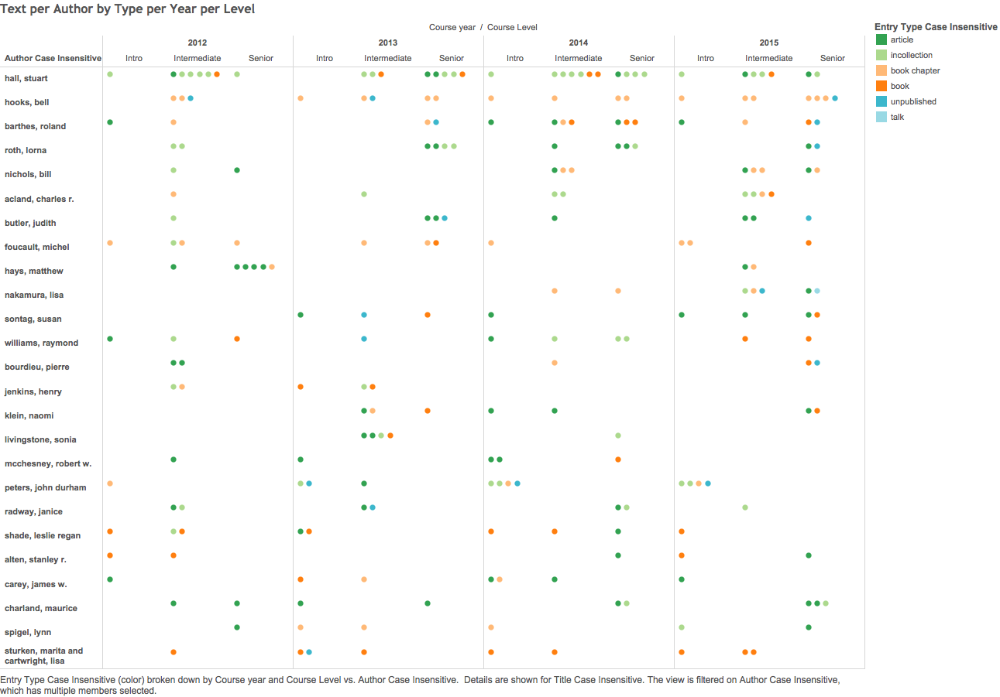
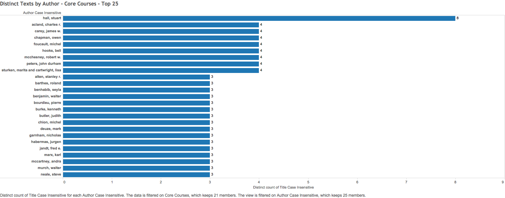
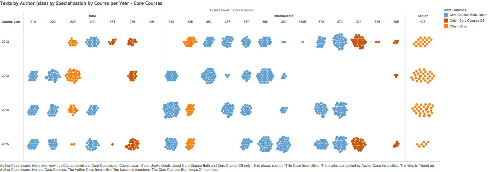
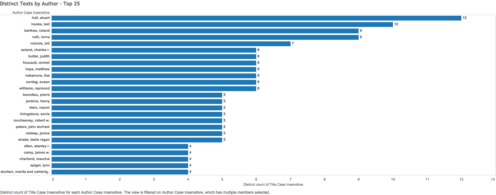
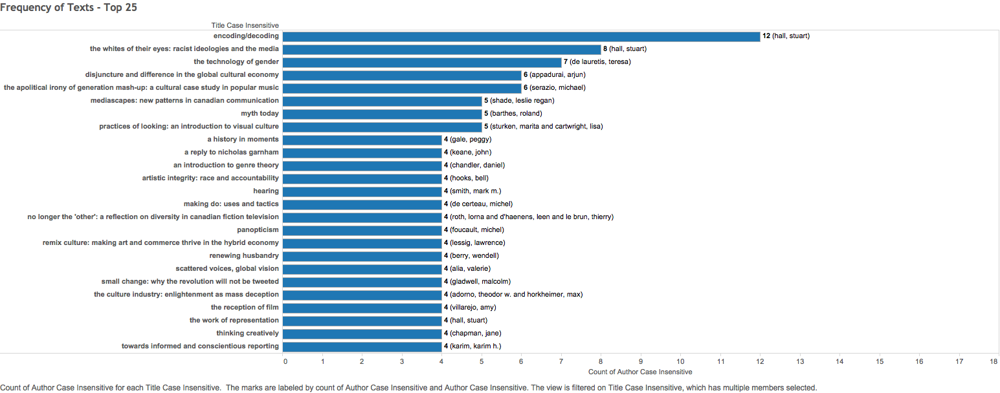
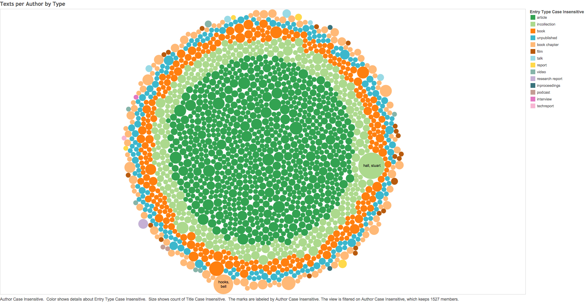

During the Summer I was hired by the Deparmetnof Communication studies at Concordia University to produce visualization on the collection of readings used in the undergraduate program between 2014-2016. The department is updating the undergraduate curriculum, thus understanding what the faculty is using for lectures is one of the guidelines for the future of this program at Concordia. Here are some of the sketches I produced:

There is also a network visualization here: [https://netvis-citation-depcom-concordia.lucianofrizzera.com/](https://netvis-citation-depcom-concordia.lucianofrizzera.com/)
