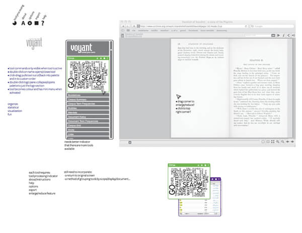
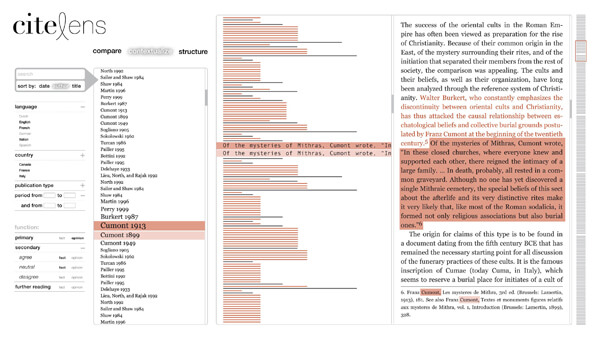
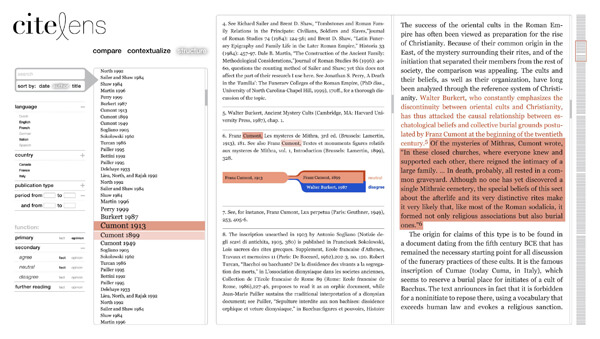
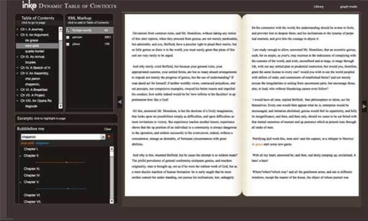
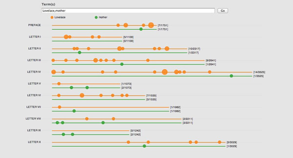

At Digital Humanities 2012, in Hamburg, Germany, INKE ID team presented the panel "Designing Interactive Reading Environments for the Online Scholarly Edition". In this panel, members of the Interface Design team of the Implementing New Knowledge Environments (INKE) project presented a set of ideas, designs, and prototypes related to the next generation of the online scholarly edition, by which we mean a primary text and its scholarly apparatus, intended for use by people studying a text.

Geoffrey Rockwell, Stéfan Sinclair, Mihaela Ilovan, Geoff Roeder, and Daniel Sondheim presented a paper entitled “Designing Interactive Reading Environments for the Online Scholarly Edition” at Digital Humanities 2012 at the University of Hamburg in Hamburg, Germany. It was presented on July 20, 2012, and written by Milena Radzikowska, Stan Ruecker, Geoffrey Rockwell, Susan Brown, Luciano Frizzera, and the INKE Research Group.

You can read the abstract here, or check more information at the INKE website: [http://inke.ca/2012/07/20/inke-id-presents-a-panel-at-digital-humanities-2012/](http://inke.ca/2012/07/20/inke-id-presents-a-panel-at-digital-humanities-2012/)

## _Introduction to Designing Interactive Reading Environments for the Online Scholarly Edition_

In this panel, members of the Interface Design team of the Implementing New Knowledge Environments (INKE) project will present a set of ideas, designs, and prototypes related to the next generation of the online scholarly edition, by which we mean a primary text and its scholarly apparatus, intended for use by people studying a text.

We begin with ‘Digital Scholarly Editions: An Evolutionary Perspective’, which proposes a taxonomy of design features and functions available in a wide range of existing projects involving scholarly editions. ‘Implementing Text Analysis E-reader Tools to Create Ad-hoc Scholarly Editions’ draws on this taxonomy and examines how the strategies of ubiquitous text analysis can be applied to digital texts as a means of providing new affordances for scholarship. ‘Visualizing Citation Patterns in Humanist Scholarship’ looks at the use of citations in scholarly writing and proposes visual models of possible benefit for both writers and readers. ‘The Dynamic Table of Contexts: User Experience and Future Directions’ reports our pilot study of a tool that combines the conventional table of contents with semantic XML encoding to produce a rich-prospect browser for books, while ‘The Usability of Bubblelines: A Comparative Evaluation of Two Prototypes’ provides our results in looking at a case where two distinct prototypes of a visualization tool for comparative search results were created from a single design concept.

### Digital Scholarly Editions: A Functional Perspective

Sondheim, Daniel, University of Alberta, Canada; Rockwell, Geoffrey, University of Alberta, Canada; Ruecker, Stan, IIT Institute of Design, USA; Ilovan, Mihaela, University of Alberta, Canada; Frizzera, Luciano, University of Alberta, Canada; Windsor, Jennifer, University of Alberta, Canada

Definitions of the scholarly edition at times seem as diverse as their content; definitions may highlight usefulness (e.g., Hjørland, n.d.), reliability (e.g. Lyman, 2009), or editorial expertise (e.g. Price 2008). Nevertheless, it is clear that scholarly editions ‘comprise the most fundamental tools in literary studies’ (McGann 2001: 55). The move from print to screen has offered scholars an opportunity to remediate scholarly editions and to improve upon them (Werstine 2008; Shillingsburg 2006), perhaps in the hope of producing their ‘fullest realization’ (Lyman 2009: iii).

Online, distinctions between traditional types of scholarly editions are blurred. Variorum editions are increasingly becoming the norm (Galey 2007), since the economy of space is no longer as important a variable. The notion of a ‘best version’ of a text is also becoming less of an issue, as what constitutes ‘the best’ is open to interpretation and is often irrelevant with regard to questions that scholars would like to ask (Price 2008).

Rather than categorizing electronic scholarly editions, we propose to evaluate a selection of influential and/or representative examples on the basis of a series of functional areas that have been noted in relevant literature as having undergone substantial changes in their move to the digital environment. These areas include (1) navigation, including browsing and searching; (2) knowledge-sharing, including public annotation; (3) textual analysis, including graphs and visualizations; (4) customizability of both interface and content; (5) side-by-side comparisons of multiple versions; and (6) private note-taking and markup.

This study reveals that although all of the functionalities available in the digital medium are not implemented in every digital scholarly edition, it is nevertheless the case that even the simplest amongst them offer affordances that are different than their printed counterparts. The fact remains, however, that due to a variety of functionalities implemented in digital scholarly editions, we are still negotiating what Lyman’s ‘fullest realization’ could be.

### Implementing Text Analysis E-reader Tools to Create Ad-hoc Scholarly Editions

Windsor, Jennifer, University of Alberta, Canada; Ilovan, Mihaela, University of Alberta, Canada; Sondheim, Daniel, University of Alberta, Canada; Frizzera, Luciano, University of Alberta, Canada; Ruecker, Stan, IIT Institute of Design, USA; Sinclair, Stéfan, McMaster University, Canada; Rockwell, Geoffrey, University of Alberta, Canada

With the proliferation of e-readers, the digitization efforts of organizations such as Google and Project Gutenberg, and the explosion of e-book sales, digital reading has become a commonplace activity. Although resources for casual reading are plentiful, they are insufficient to support in-depth scholarly research.

To alleviate this difficulty, we propose integrating Voyant tools, a user-friendly, flexible and powerful web-based text analysis environment developed by Stéfan Sinclair and Geoffrey Rockwell, with current e-reader technology, such as that used in the Internet Archive reader.

In this design, Voyant functions as a sidebar to e-readers, allowing the text to remain visible during analysis. Choosing from a list of tools allows scholars to create a custom text analysis tool palette and having more than one tool open allows cross-referencing between results. Tools can be dragged into a custom order and a scroll bar allows navigation between several tools at once. A Voyant tutorial is available and each individual tool also has its own instructions for use, as well as a help feature and an option to export results.

We anticipate this tool being of use to scholars in various fields who wish to use quantitative methods to analyze text. By implementing tools for textual analysis in an online reading environment, we are in effect offering scholars the ability to choose the kinds of analysis and depth of study that they wish; they will in effect be able to produce ad-hoc customized editions of digital text.

Figure 1: Integration of Voyant tools with the Internet Archive e-reader

## Visualizing Citation Patterns in Humanist Monographs

Ilovan, Mihaela, University of Alberta, Canada; Frizzera, Luciano, University of Alberta, Canada; Michura, Piotr, Academy of Fine Arts in Krakow, Poland; Rockwell, Geoffrey, University of Alberta, Canada; Ruecker, Stan, IIT Institute of Design, USA; Sondheim, Daniel, University of Alberta, Canada; Windsor, Jennifer, University of Alberta, Canada

This paper documents the design and programming of a visualization tool for the analysis of citation patterns in extended humanist works such as monographs and scholarly editions. Traditional citation analysis is widely acknowledged as being ineffective for examining citations in the humanities, since the accretive nature of research (Garfield 1980), the existence of multiple paradigms, the preference for monographs (Thompson 2002), and the richness of non-parenthetical citations all present problems for interpretation and generalization.

To address this situation, we employ non-traditional methods of content and context analysis of citations, like functional classification (Frost 1979) and the exploration of the way in which sources are introduced in the flow of the argument (Hyland 1999). Acknowledging the richness of citations in humanist research, we employ graphic visualization for display and data inquiry, which allows us to carry out visual analytical tasks of the referencing patterns of full monographs.

We opted to provide three distinct views of the analyzed monograph. The first one – a faceted browser of the references, affords the comparison of different aspects of the references included and introduces the user to the structure and content of the monograph’s critical apparatus. The second view contextualizes individual citations and highlights the fragments of text they support (see Figure 2); by representing both supported and non-supported portions of the monograph in their natural order, the view facilitates the linear reading of the way in which argument is built in the citing work. Finally, the third view of the visualization tool represents the internal structure of complex footnotes (see Figure 3) and visually highlights the relationship between different citations included in the same note, as well as their function in relation to the argument of the citing text.

In this presentation, we will introduce the visualization tool, demonstrate its functionalities and provide the results of initial testing performed. We will also discuss the lessons learned from this early stage of the project.

Figure 2: ‘Contextualize’ view (citations in context)

Figure 3: Displaying complex footnotes

## The Dynamic Table of Contexts: User Experience and Future Directions

Dobson, Teresa, University of British Columbia, Canada; Heller, Brooke, University of British Columbia, Canada; Ruecker, Stan, IIT Institute of Design, USA; Radzikowska, Milena, Mount Royal University, Canada; Brown, Susan, University of Guelph, Canada

The Dynamic Table of Contexts (DToC) is a text analysis tool that combines the traditional concepts of the table of contents and index to create a new way to manipulate digital texts. More specifically, DToC makes use of pre-existing XML tags in a document to allow users to dynamically incorporate links to additional categories of items into the table of contents. Users may load documents they have tagged themselves, further increasing the interactivity and usefulness of the tool (Ruecker et al. 2009).

DToC includes four interactive panes, and one larger pane to view the text (see Figure 4). The first two panes are the table of contexts and the XML tag list: the former changes when a particular tag is selected in the latter, allowing the user to see where tokens of the tag fall in the sequence of the text. The third and fourth panes operate independently of each other but with the text itself: the ‘Excerpts’ pane highlights a selected token in the text and returns surrounding words, while the ‘Bubbleline’ maps multiple instances of a token across a pre-designated section (such as a chapter, or scene).

Figure 4: The Dynamic Table of Contexts, showing three of four interactive panes at left along with the text viewing pane at right

With twelve pairs of participants (n = 24), we completed a user experience study in which the participants were invited: 1) to complete in pairs a number of tasks in DToC, 2) to respond individually to a computer-based survey about their experience, and 3) to provide more extensive feedback during an exit interview. Their actions and discussion while working with the prototype were recorded. Data analysis is presently underway: transcribed interview data has been encoded for features of experience in XML; screen captures are supplementing our understanding of the participants’ experience. In this paper we will report results and discuss future directions for development of the prototype.

### The Usability of Bubblelines: A Comparative Evaluation of Two Prototypes

Blandford, Ann, University College London, UK; Faisal, Sarah, University College London, UK; Fiorentino, Carlos, University of Alberta, Canada; Giacometti, Alejandro, University College London, UK; Ruecker, Stan, IIT Institute of Design, USA; Sinclair, Stéfan, McMaster University, Canada; Warwick, Claire, University College London, UK

In this paper, we explore the idea that programming is itself an act of interpretation, where the user experience can be profoundly influenced by seemingly minor details in the translation of a visual design into a prototype. We argue that the approach of doing two parallel, independent implementations can bring the trade-offs and design decisions into sharper relief to guide future development work. As a case study, we examine the results of the comparative user evaluation of two INKE prototypes for the bubblelines visualization tool. Bubblelines allows users to visually compare search results across multiple text files, such as novels, or pieces of text files, such as chapters. In this case, we had a somewhat rare opportunity in that both implementations of bubblelines began from a single design sketch, and the two development teams worked independently to produce online prototypes. The user experience study involved 12 participants, consisting of sophisticated computer users either working on or already having completed computer science degrees with a focus on human-computer interaction. They were given a brief introduction, exploratory period, assigned tasks, and an exit interview. The study focused on three design aspects: the visual representation, functionality and interaction.

All users liked the idea of bubblelines as a tool for exploring text search results. Some users wanted to use the tools to search and make sense of their own work, e.g. research papers and computer programming codes. The study has shown that there was no general preference for one prototype over the other. There was, however, general agreements of preferred visual cues and functionalities that users found useful from both prototypes. Similarly, there was an overall consensus in relation to visual representations and functionalities that users found difficult to use and understand in both tools. Having the ability to compare two similar yet somehow different prototypes have assisted us in fishing out user requirements summarized in the form of visual cues, functionalities and interactive experiences from a dimension that that would have been difficult to reach if we were testing a single prototype.

Figure 5: The two alternative implementations of Bubblelines (t1 & t2)

Our plan is to take these requirements into account in order to generate a third prototype which we envision to evaluate with expert users where our focus would be on the ability of the tool in assisting experts in making sense of the data.In summary, most participants preferred the visual appearance and simplicity of t1, but the greater functionality offered by t2. Apparently incidental design decisions such as whether or not search was case sensitive, and whether strings or words were the objects of search (e.g. whether a search for ‘love’ would highlight ‘lover’ or ‘Love’ as well as ‘love’) often caused frustration or confusion. We argue that the approach of doing two parallel, independent implementations can bring the trade-offs and design decisions into sharper relief to guide future development work.

## References

Garfield, E. (1980). Is Information Retrieval in the Arts and Humanities Inherently Different from That in Science? The Effect That ISI®’S Citation Index for the Arts and Humanities Is Expected to Have on Future Scholarship. The Library Quarterly 50(1): 40–57.

Galey, A. (2007) How to Do Things with Variants: Text Visualization in the Electronic New Variorum Shakespeare. Paper presented at the Modern Language Association Annual Convention, Chicago.

Frost, C.O. (1979). The Use of Citations in Literary Research: A Preliminary Classification of Citation Functions. The Library Quarterly 49(4): 399–414.

Hyland, K. (1999). Academic attribution: citation and the construction of disciplinary knowledge. Applied Linguistics 20(3): 341–367.

Lyman, E. (2009). Assistive potencies: Reconfiguring the scholarly edition in an electronic setting. United States-Virginia: University of Virginia.

Hjørland, B. (n.d.). Scholarly edition. Available at: [http://www.iva.dk/bh/core%20concepts%20in%20lis/articles%20a-z/scholarly\_edition.htm](http://www.iva.dk/bh/core%20concepts%20in%20lis/articles%20a-z/scholarly_edition.htm) (accessed 20 October, 2011).

Lyman, E. (2009). Assistive potencies: Reconfiguring the scholarly edition in an electronic setting. United States-Virginia: University of Virginia. [http://www.proquest.com.login.ezproxy.library.ualberta.ca](http://www.proquest.com.login.ezproxy.library.ualberta.ca) (accessed Sept, 2010).

McGann, J. (2001). Radiant textuality: literature after the World Wide Web. New York: Palgrave.

Price, K. (2008). Electronic Scholarly Editions. In S. Schreibman and R. Siemens (eds.), A Companion to Digital Literary Studies. Oxford: Blackwell [http://digitalhumanities.org/companion/view?docId=blackwell/9781405148641/9781405148641.xml&chunk.id=ss1-6-5](http://digitalhumanities.org/companion/view?docId=blackwell/9781405148641/9781405148641.xml&chunk.id=ss1-6-5) (accessed 25 October, 2011)

Radzikowska, M., S. Ruecker, S. Brown, P. Organisciak, and the INKE Research Group (2011). Structured Surfaces for JiTR. Paper presented at the Digital Humanities 2011 Conference, Stanford.

Rockwell, G., S. Sinclair, S. Ruecker, and P. Organisciak (2010). Ubiquitous Text Analysis. Poetess Archive Journal 2(1): 1-18.

Ruecker, S., S. Brown, M. Radzikowska, S. Sinclair, T. Nelson, P. Clements, I. Grundy, S. Balasz, and J. Antoniuk (2009). The Table of Contexts: A Dynamic Browsing Tool for Digitally Encoded Texts. In L. Dolezalova (ed.), The Charm of a List: From the Sumerians to Computerised Data Processing. Cambridge: Cambridge Scholars Publishing, pp. 177-187.

Shillingsburg, P. L. (2006). From Gutenberg to Google: electronic representations of literary texts. Cambridge, UK; New York: Cambridge UP.

Thompson, J. W. (2002). The Death of the Scholarly Monograph in the Humanities? Citation Patterns in Literary Scholarship. Libri 52(3): 121-136.

Werstine, P. (2008). Past is prologue: Electronic New Variorum Shakespeares. Shakespeare 4: 208-220.
