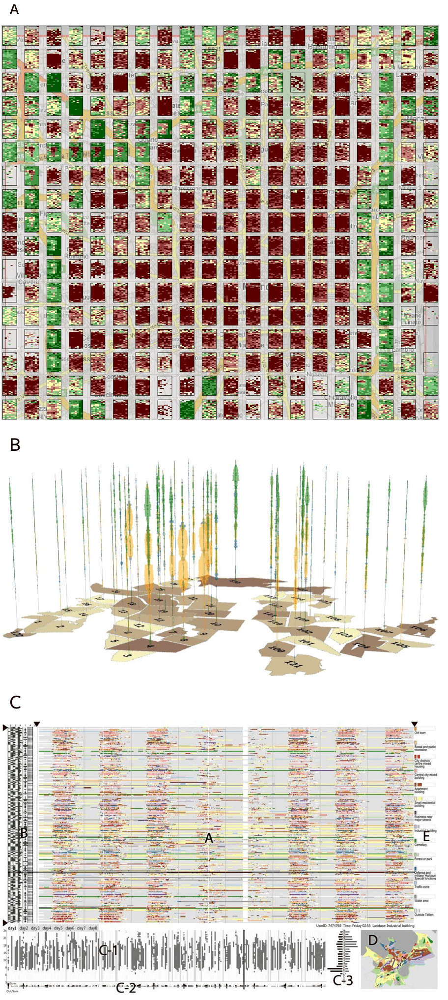
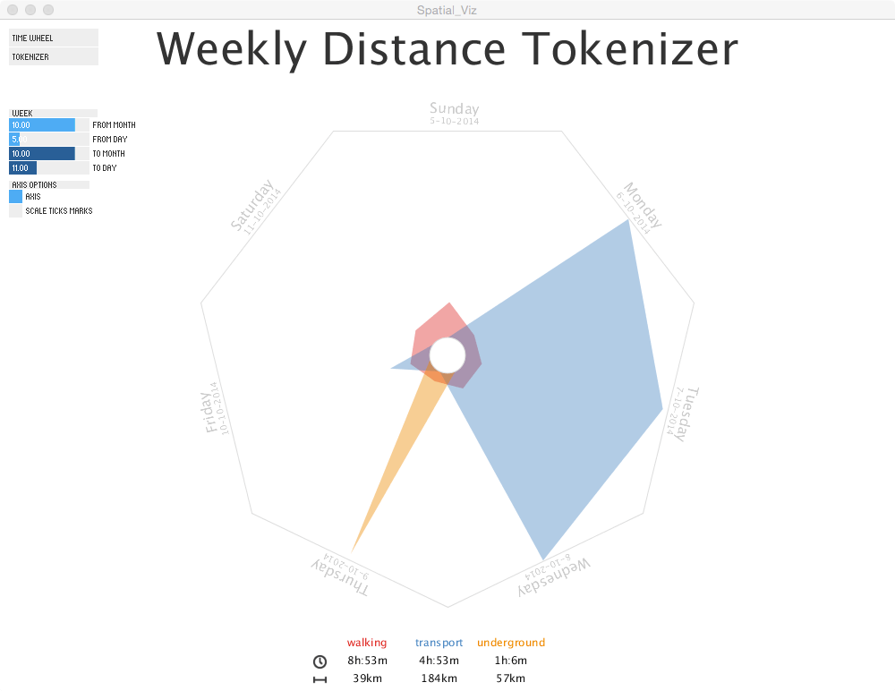

Leibniz (1646-1716) once observed that all things “are, like ‘rivers, in a perpetual flux; small parts enter and leave them continually,’” suggesting that “‘the very substance of things’ consists in ‘their force to act and be acted upon’” (as cited in Tiessen, 2008, p. 114). As an inherent human condition, mobility brings together communicative, technological, geographical, economic, cultural, and social issues. As we walk from one point to another, we transform space into place (De Certeau, 2002); in fact, space becomes meaningful through human activities and agency, such as walking and the desire to move in one direction. Therefore, human spatial movement must leave some sort of traces behind, both immaterial, like nostalgia or desire, and concrete, such as marks on the sand, and built environment.

At first glance, human spatial flow seems to be chaotic: endless vectors of movement coming and going to an infinite number of places. We drive from home to work; take public transportation to go to school; ride bikes in parks, walk on the streets, and fly to any place on the planet. Movements are transitory (space) and temporary (time), which makes difficult to understand and analyze their nature and rules. But if we follow our trails, and track our position in space, we might be able to understand our interactions with the surrounding environment and with other people (Zhao et al., 2008). We might be able to grasp the patterns and rules (culture, tradition, agency, anxiety) that govern our movements.

Much has been made to improve visualization of human flows for planning, management, and economic purposes, usually exclusively focus on the analysis of the data for answer very specific questions. Occasional and informal use of such tool should also allow regular people to see and perceive a pattern in their own movements. This paper presents two interactive visualization prototypes focus on personal spatial movement as a way to augmenting our levels of understating of how we use the space.

## Human Spatial Data

Human spatial movement data is composed of multiple dimension: (1) space (latitude, longitude, altitude, and its derive information — distance, direction, orientation, position, etc.), (2) time (in all its refined magnitude), (3) derived data from space and time together, like speed, and velocity, and (4) whatever feature is attached to this movements, for instance, type of activity, mode of transportation, companion, desire, and so on. Additionally, local features, like barriers, shortcuts, and paths, also affect the movement of individuals. Thus, it is important to think about movement not only in term of trajectories through time and space but also as human actions upon an environment. That is, it is important to incorporate social, cultural, and geographical contextual information to help us understand the properties and motivations of human spatial movement (Zhang et al., 2014).

### Mobility

Follow and keep the record of our unceasing movement across space is not an easy task: even materialized traces, like trails on the snow, disappearing after some time. Digital mapping is an answer to this issue. Notwithstanding the fact that digital maps are a very new technology, only made available to the public in the last 15 years (e.g., vehicle GPS), they have become a very popular (also very intrusive) mobile media experiences. We began to heavily (and blindly) depend on them all the time, transferring to the machine the effort required to locate ourselves in and navigate through space. Not surprisingly, Google Maps is the most frequently used mobile app — 54% of global smartphone users in the world (GlobalWebIndex, 2013).

Tiessen (2008) states that mobility “has become a most suitable trope for our time, an era accelerating at what seems to be ever faster rates of speed, an era penetrated by pervasive and proliferating technologies and riven with the effects of neoliberal economics” (p. 112). In fact, new technologies, mobile devices, in particular, are making geo-locative data more accessible: location-based information has been increasing not only in volume but also in resolution, which for Zhao _et al._ (2008) is burgeoning of a corpus that could enhance our knowledge of mobility and behaviour over space.

## Visualization

The problem is that these corpora mentioned by Zhao _et al._ are enormous. Now, with the technological equipment to track, record, and retrieve our spatial movement, the question is how we make sense of such of big datasets. Andrienko and Andrienko (2007) points that the best way to analyze such a corpus is through visualizations: the “appropriate positioning and/or appearance of graphical elements representing data items can stimulate holistic perception of multiple data items as a unit” (Andrienko & Andrienko 2007, p. 51).

Nonetheless, as the data increase in size and complexity, we should add computation techniques, such as smoothing, filtering, and data aggregation in order to ease data overload and enable human interpretation. Visualizations of spatial and temporal data can tell much about a certain environment, but the richest stories combine the type of desires and choices people make when they are moving from one place to another.

The most common techniques for human spatial analysis are maps and timelines. For instance, Andrienko and Andrienko (2007) use geographic maps, heat maps, and vectors to show traffic data aggregated by space and time in Milan, Italy (Fig. 1A). Zhao _et al._ (2008) developed new approaches to visualize large human movements in Halifax, Canada, and the type of activity these movements embody to demonstrate the importance of contextual data in the interpretation of the movement (Fig. 1B). Zhang _et al._ (2014) make intense usage of multiple timelines to show individuals’ temporal connections to the city Tallinn, Estonia (Fig. 1C).

All the examples mentioned above attempts to visualize spatial movement from multiple individuals at once — 17,241 cars in Milan (Andrienko & Andrienko, 2007); 2,000 participants in Halifax (Zhao _et al._, 2008); 277 people in Tallinn (Zhang _et al._, 2014) — in the same period of time — one week. These examples aim to build tool for visual analytics made by professionals interested in the urban spatial flow, which restrict the scope and the audience of these tools.

Instead of using maps and geo-locative information, which is very common in this kind of visualization, this project explores time and space patterns in uncommon ways, proposing two interactive visualization prototypes focus on personal spatial movement design to be seen and used by occasional users: (1) Time Wheel — movements’ duration by day in a month, and (2)Weekly Distance Tokenizer — creates visual shapes driven by movements’ distance by day.

Figure 1: (A) Traffic view showing speed by days of the week and hours of the day per region in Milan (Andrienko & Andrienko, 2007). (B) Daily patterns of three activities of Halifax Census Tracts: work, travel, and leisure, the vertical dimension being the time of day (Zhao et al., 2008). (C) Multiple coordinated views visualization showing movement patterns Tallinn Metropolitan Area, Estonia (Zhang et al., 2014)

### Method

Since this project is in the prototypical phase, the visualization was built using Processing 2.0, a computer language designed to promoted software literacy within the visual arts and visual literacy within technology. The two proposed visualizations are different components, or views, of the same dataset, though they will not be seen at the same time on screen. Each one of them will be placed in a separated class, which will extend a superclass “view”. Depending on the particularities of each visualization's component, different objects and visual elements will be used to draw, organize, and allow interaction with the dataset.

Since all visualizations consume the same dataset, a separate class “SpatialData” will manage, parse and store the raw data. Some external libraries are used in this project in order to assist interactivity: (1) Calendar — Java class to manage date objects, (2) Ani — creates small transitions and animations, (3) ControlP5 — build the graphical interface to enable user interaction with the visualization.

### Dataset

The dataset used in this project were collected by a mobile app called _Moves,_ using a smartphone (iPhone 5C), and represents the movements of a single person. It is stored in a CSV file containing geolocation information with spatial coordinates (latitude and longitude), timestamps (start and end), type of activity (mode of transportation), number of steps, and calories. The data spans seven months, from May to November 2014, having a range of different modes of transportation, such as walking, running, bus, subway, and aircraft.

## Time Wheel

The Time Wheel (Fig. 2) visualization aims to show patterns of time and duration of each mode of transportation in a circular 24-hour clock. The circular view emphasizes the continuum endless cycle of time (when a day ends, another begins), facilitating comparison across wedges (hours) and rings (days, or mode of transportation) of the data being visualized.

The data is sorted by month, and for each movement in this period, an arc is drawn to the screen following ring (track): start and end angle corresponds to movement’s start and end time (up to the second), and colour represent a mode of transportation. When the mouse is over an arc, the movement’s information — mode of transportation, day, duration, and distance traveled— is displayed in the centre of the circle.

There are three ways to partition the data: (1) none, (2) mode of transportation, and (3) day. In the first option (Fig.2A), all movements of all days in a month are drawn in the same ring, causing overplotting of arcs that share the same span of time. The colour of each arc have its alpha channel reduced, in order to partly show what is bellow, building an even strong colour is objects pile up one in the top of the other. This technique is known as a heat map, and it is useful to represent data density, which, in this case, serves to point when, in a 24-hour period, a certain type of transportation prevails over the others.

Figure 2A: Time Wheel show duration of movements by mode of transportation. A circular 24-hour heat map divided in rings shows an (A) heat map of movement in a given month, which can be (B) partitioned by mode of transportation, or (C) by days of the month. Colours represent different types of transportation.

The second partition (Fig. 2B), by mode of transportation, generates as many rings as modes of transportation used in the chosen month, and position the arcs accordingly. Again, the heat map is the technique used to identify the density of movement during in a given time, though now users can observe the patterns of each mode of transportation individually.

Figure 2B: Time Wheel show duration of movements by mode of transportation. A circular 24-hour heat map divided in rings shows an (A) heat map of movement in a given month, which can be (B) partitioned by mode of transportation, or (C) by days of the month. Colours represent different types of transportation.

Partition by day produces (Fig. 2C) as many rings as days in the chosen month, stretching from the edge to the centre of the circle, positioning the arcs accordingly. Since there is no overlap in this visualization, it is possible to examine each individual movement instances and their relationship.

Figure 2C: Time Wheel show duration of movements by mode of transportation. A circular 24-hour heat map divided in rings shows an (A) heat map of movement in a given month, which can be (B) partitioned by mode of transportation, or (C) by days of the month. Colours represent different types of transportation.

Finally, two visual features work as a baseline to help the user identify and compare individual data points: (1) Tracks (rings), and (2) Radial divisions. The former are concentric circles that users to keep track of partition categories (none, mode of transportation, or day). The latter are linear divisions, from the centre to the edge of the circle, that slices the circle in section in order to help users to keep track of periods of time. The user can refine the number of sections, or turn on and off both of these visual features. A legend, with total duration and distance by mode of transportation in the selected month, also gives support information for this visualization.

## Weekly Distance Tokenizer

Weekly Distance Tokenizer (Fig. 3) strives to “shapefy” distance traveled by week in each mode of transportation. The resulting shape should work as a glyph, or symbol, that represents the pattern distance traveled in a given week. With unique shapes and colours, each week could be visually compared side-by-side.

Users pick a start date the system automatically generates the visualization with the seven following days. The data is sorted by week in a regular heptagon, where each side represents a weekday. A token is defined by a coloured irregular geometric polygon based on the distances traveled by a particular mode of transportation in the selected week: each vertex of the polygon corresponds to the distance traveled in a specific day. The colour is unique for each mode of transportation, and the maximum distance traveled in the chosen week determines the scale.

Two visual features work as a baseline to help the user identify and compare individual data points: (1) Axis, and (2) Tick Marks. The former is the edge of the heptagon and marks the maximum traveled distance in the selected week. The latter divides the visualization region in regular section to work as a grid for value comparison. A legend, with total duration and distance by mode of transportation in the selected week, also gives support information for this visualization.

Figure 3: Weekly Distance Tokenizer “shapefy” your movements in a given week using distances traveled by mode of transportation These weekly glyphs are unique and can be visually compared side-by-side to show similarities and differences.

## Limitation

Both prototypes proposed in this paper have a number of limitations. The heat map technique in the Time Wheel has a severe limitation: It uses alpha channel (transparency attribute) to overlay objects on the screen. 32-bit graphics system reserves 8-bits per colour channel and 8-bits to the alpha channel, which are quickly consumed when object pile up in the same region. Moreover, depending on the transparency values used to draw the objects, it can be harder to differentiate between them.

Space is another limitation in Time Wheel. Arc’s angles are based on movement’s start and end time of the, which reaches a resolution up to the second. Current display’s resolution cannot show such a refined data. However, the movements considered for this visualization are those with enough time (one minute) and distance (10 meters) to separate two distinct places.

In the Weekly Distance Tokenizer, a missing data point in the dataset, for instance, can disrupt the visualization, or transform a seven-days-week-heptagon into a six-days-week-hexagon. The algorithm should be able to find and deal with these flaws, or explicitly show the defect to the user. This visualization has also a legibility problem: the labels turn upside-down as they follow the rotation of heptagon’s edges.

## Conclusion

Space only becomes meaningful with human movement through the mapped space (De Certeau, 2002; Farman, 2011). If we track our movements and follow our path through space, we might be able to understand our interactions with the surrounding environment and with other people (Zhao et al., 2008). We might be able to find patterns and interpret how we use the space, enhancing our knowledge of mobility and behaviour over space.

Geo-locative data is becoming more accessible through new technologies, especially mobile devices. The power to track our movements on the streets is to take control of the space: our position in space is used to retrieve locational information from the Internet, augmenting our levels of understating. As a result, we are observing an increase in the volume and resolution of this type of information. Such a big data is only possible to grasp using visualizations techniques, such as maps and timelines.

The two visualizations presented in this paper aims to assist non-professionals to have insights about their own movement spatial movement. It is important to design simple visualization tools that are more comprehensive and easily understood by a layperson since a serendipitous exploration of a personal data can reveal in-depth mobility patterns only perceived by who traveled those routes.

The future direction for this project should look at (1) data aggregation techniques in order to solve some technical problems, as well as to scale as the dataset grows, (2) filtering functionalities, so the user can focus in a certain time period, and (3) geographic representations of the routes been visualized.

## Bibliography

Andrienko, N., & Andrienko, G. (2007). Designing Visual Analytics Methods for Massive Collections of Movement Data. Cartographica: The International Journal for Geographic Information and Geovisualization, 42(2), 117–138. doi:10.3138/carto.42.2.117

De Certeau, M. (2002). The Practice of Everyday Life. University of California Press.

Farman, J. (2011). Mobile Interface Theory: Embodied Space and Locative Media (1st ed.). New York, NY, USA: Routledge.

GlobalWebIndex. (2013). Top global smartphone apps, who’s in the top 10. GlobalWebIndex | Analyst View Blog. Retrieved from [http://blog.globalwebindex.net/Top-global-smartphone-apps](http://blog.globalwebindex.net/Top-global-smartphone-apps)

Tiessen, M. (2008). Uneven Mobilities and Urban Theory: The Power of Fast and Slow. In P. Steinberg & R. Shields (Eds.), What Is a City?: Rethinking the Urban after Hurricane Katrina (pp. 112–128). Athens, Georgia, USA: University of Georgia Press.

Zhang, Q., Slingsby, A., Dykes, J., Wood, J., Kraak, M.-J., Blok, C. A., & Ahas, R. (2014). Visual analysis design to support research into movement and use of space in Tallinn: A case study. Information Visualization, 13(3), 213–231. doi:10.1177/1473871613480062

Zhao, J., Forer, P., & Harvey, A. S. (2008). Activities, Ringmaps and Geovisualization of Large Human Movement Fields. Information Visualization, 7(3-4), 198–209. doi:10.1057/palgrave.ivs.9500184

* * *

_This project was developed as an assignment for the course Foundations of Computational Art and Design in the SIAT PhD program._
