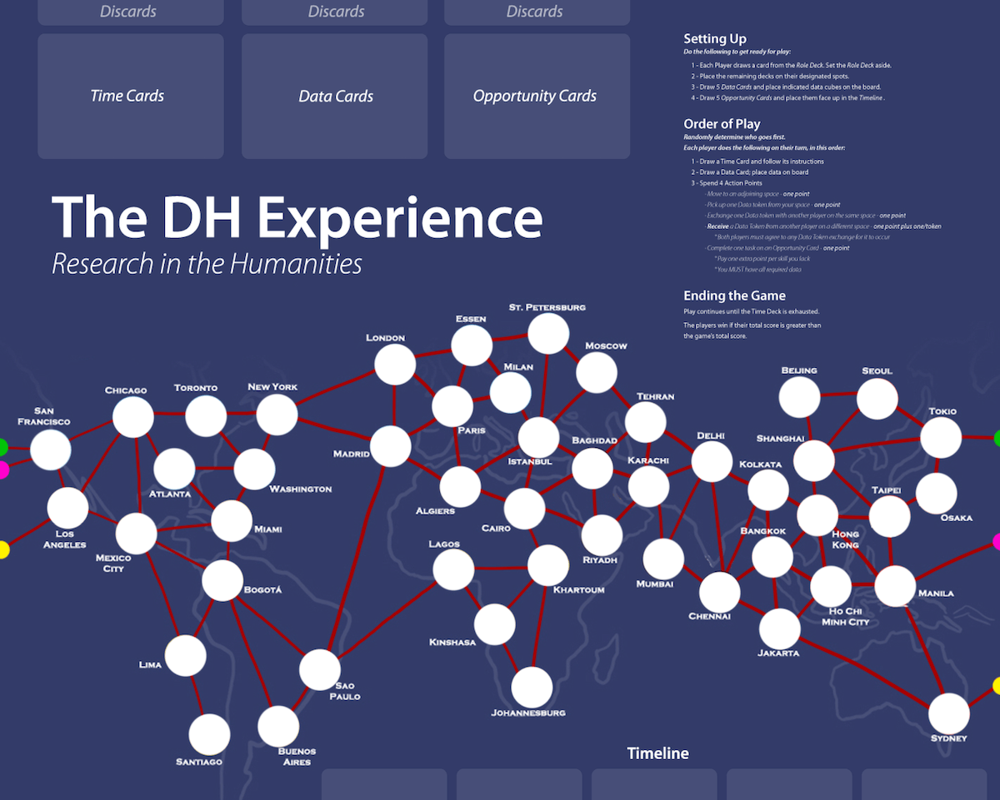
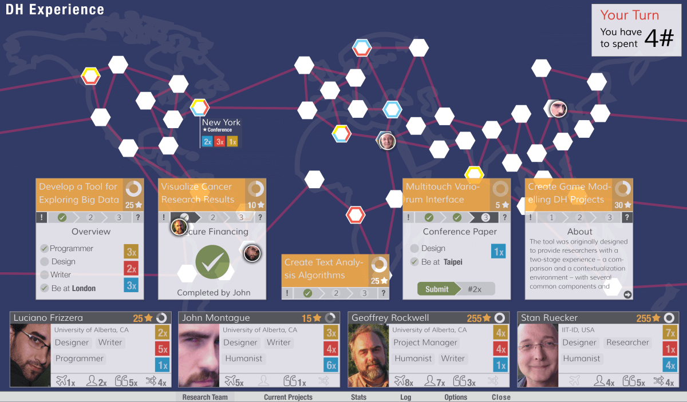

_Written by John Montague_

It is a fundamental precept of Digital Humanities (DH) that the work be multilingual and multi-disciplinary. In support of this, we have developed a serious game, in the form of a customizable, updatable digital board game, intended to promote awareness and interdisciplinary collaboration among the international DH community.

As Gee argues, games offer “players continual opportunities to learn, solve problems, and become more skilled. That is, indeed, what makes \[...\] games fun” (Gee, 2005, p. 29). While play as an exploratory method for producing new knowledge breaks with the traditional model of pedagogy practices usually disseminated (Thomas & Brown, 2007), Butler (2012) points out “play is our first tool for making sense of the world” (p. 32). Therefore, playing a game could both help those in the DH community and the general public become more familiar with important interdisciplinary work being done worldwide.

The concept we have developed is a cooperative game based on the work of DH practitioners, modeling the experience of researching and publishing in a multi-disciplinary academic environment. In _The DH Experience_, players collaborate to collect data from around the world, perform research and appropriately complete their projects in order to succeed, competing against time and the system inherent to the game.

The complete, tested paper prototype uses a fixed number of real-world inspired projects. However, in order to have an ongoing relevance to the DH community, the digital version that is now under development allows participating organizations to contribute their own projects, making the experience of the game more familiar and meaningful for players. In attempting to increase awareness of contemporary research and interdisciplinary collaboration, this project explores the utility of games as a means of increasing effective interaction within a community of non-game players.

Good morning everyone. At the risk of dampening my own looming presentation thunder, I have a very short video a colleague and I produced a little earlier in the year that I’d like to play for you as a brief introduction to the work about which I’ll be speaking.

<iframe loading="lazy" title="vimeo-player" src="https://player.vimeo.com/video/90163548?h=7659a9b6d5" width="640" height="360" referrerPolicy="strict-origin-when-cross-origin" allow="autoplay; fullscreen; picture-in-picture; clipboard-write; encrypted-media; web-share" allowFullScreen></iframe>

Digital Humanities is relatively new and relatively unknown outside the field, and what exactly it encompasses is even less well understood. In her 2012 paper “This is Why We Fight”, Lisa Spiro explains how members of the DH community are continually debating “what counts as digital humanities and what does not, who is in and who is out, and whether DH is about making or theorizing, computation or communication, practice or politics”.

Because it is a fundamental tenet of Digital Humanities to strive for multilingualism and multi-disciplinarity, the research work being undertaken worldwide is tremendously varied in both scope and focus. As a result, it is awfully difficult to keep abreast of the volume and variety of innovative work being done.

So… to try and raise Digital Humanities’ profile in the general public, and to promote both awareness of and participation in interdisciplinary collaboration among our colleagues worldwide, we developed _The DH Experience_ game…

## How Did We Get Here?

… at least that’s how we describe the game’s purpose _now_. Initially my colleague Luciano Frizzera and I, in our capacity as Research Assistants for the _Implementing New Knowledge Environments_ research team, were asked to develop some kind of game that we could use to prove the efficacy of a digital tool that Luciano had created for rapidly prototyping workflows; we wanted to see if it could be used to help rapidly develop a game prototype.

After much discussion, brainstorming and bantering back and forth, during which we considered a plethora of _competitive_ possibilities, we decided that given the _collaborative_ nature of much Digital Humanities work it only made sense that we develop a game that was itself collaborative; the idea to create a self-referential game that modeled the process we were going through in developing the game itself followed pretty shortly thereafter.

## Analogue Prototype

We currently have a fully fleshed out and tested proof of concept. In fact, I brought ten copies of the game with me; if anyone here would like a copy, please see me when my presentation wraps up. The game accommodates from 2 to 6 players, and as you saw in the video, simulates the experience of academics and researchers in the Digital Humanities community. Players must work cooperatively and carefully plan their strategy in order to have any chance of outperforming the system inherent to the game, which is furiously working toward completing and publishing the research players wish to themselves complete.

Each player begins the game with a randomly drawn set of skills; one player might be skilled as a writer, a researcher, and a programmer, while another player might be a scientist, a designer, and a project manager. Nothing in the game absolutely requires any given skill, but having the right skill at the right moment will save you time, and efficiency is the name of the game.

The board players are presented with is a stylized map of the world, around which they must navigate their pawns. The board is populated with two kinds of items; projects and data. Five projects exist in this area, the “timeline”, at any given moment, representing research projects the team is currently racing to complete before their international colleagues (that is, before the game system itself does so).

On his or her turn, a player spends a number of action points, moving their pawns from location to location around the world, collecting coloured data cubes as they go, and sometimes sending data from one pawn to another. The “data cubes” that the players collect in their travels represent three broad categories of resources necessary to research projects in the humanities; text data, technology/code, and image data. These cubes are an absolute necessity in the completion of the projects in the timeline.

Each project has multiple stages to be completed, each of which requires a player to discard zero or more data cubes of specific colours, and spend at **_least_** one action point. If a player lacks one or more of the skills listed as being necessary, the stage costs them additional action points to complete. Occasionally, the final stage of a project is geo-specific; that is, a player must be on a specific board space in order to present the research at a conference and complete the project.

As each player takes his or her turn, time advances abstractly via a card drawn from the _Time Deck_. Most cards in the Time Deck add a _Time Cube_ to the oldest project in the Timeline. When any timeline project is fully populated by time cubes, it is removed, and a new project is drawn to replace it. Projects removed in this way are scored against the players, representing their completion by other researchers.

Occasionally, time cards offer the players a bonus, though this is certainly the exception and not the rule. _Travel Funding_ allows a player to move anywhere on the board; _Hire Experts_ allows a player to ignore any skills he or she lacks when completing a project stage.

In order to emerge victorious as a group, the players must carefully plan how to most efficiently gather and trade necessary resources, and how best to divide up the task of finishing the projects various stages.

Download the print version:

Instructions and Cards: [DH_game_board](/DH-Experience-Game.pdf)

Board: [Download the print version](/DH_game_board.png)

## Testing

Testing has been both fruitful and rewarding. Even from the very first trial games, the response from players has been very positive, much more so than I could have hoped, though in fairness, the test players have mostly been gleaned from a pool of DH research types, whose appreciation for the subject matter may influence their opinions! We were quickly able to address issues surrounding gameplay, things like speed of play, appropriateness of opportunity costs, and level of difficulty, as well as issues surrounding the accuracy of the reality we were attempting to abstract, things like skill utility, and the variety of potential project end-stages. As it stands, the game balance is _very_ competitive, guaranteeing the necessity of collaborative cooperation in order to give the best chance of success.

One of the most significant issues raised by our testing (and incidentally, the foundation of a possible thesis direction for me) involves the players’ desire for the projects to be a reflection of contemporary research being performed by academics around the world. The current analog version of the game presents several roadblocks to making this a reality.

First, this would require regularly publishing new sets of cards. Distributing them would itself be a bit of an issue, but could be overcome by publishing printable PDFs. The real trick here involves collecting the necessary data from appropriate institutions and individuals around the world; those who are actually doing the research.

Second, assuming the project data could be collected, the board needs to accommodate the projects being used in the game. I invented the game’s current projects based on my own decidedly imperfect understanding of the kinds of DH work being done around the world, and the cities represented on the board reflect that ad hoc, imperfect knowledge.

I’ve considered re-designing the board in a much more abstract way, eliminating the need for geography at all, but I hesitate for two reasons. First and foremost, I want to promote the international, global nature of Digital Humanities work, and removing geography from the game rather moves in the opposite direction. Second, both my own experience and interviews with play-testers indicate that a good amount of the joy of playing involves the “flying all over the world” aspect of the game. Abstracting that too many risks making the game both less _fun_ (and thus less likely to be played), and potentially more difficult to learn and understand.

## Digital Version

With our proof of concept well in hand (but limited in practical scope), the next step in the game’s development involves creating a digital touch-screen version, for both local and online multiplayer games. I’d like to pause here to give credit to my colleague and co-developer Luciano Frizzera, without whom not only would the analog version of the game not have taken flight as it has, but the digital version of the game would NEVER see the light of day! We’re still in the early stages of development of this digital version, but we have a plan and we’re moving forward…

As you may recall from the video, we are engaged in discussions with an organization called _GO::DH_, or more properly “Global Outlook:: Digital Humanities”. GO::DH is a “Special Interest Group of the Alliance of Digital Humanities Organizations” whose purpose is to “help break down barriers that hinder communication and collaboration among researchers and students of the Digital Arts, Humanities, and Cultural Heritage sectors around the world.” With their help, we hope to recruit international research organizations as participants in the digital game. With their ongoing participation, the digital version of the game will be able to provide players with up to date, contemporary DH projects currently being undertaken in all corners of the globe.

This is a screenshot of the current state of digital development. The move to digital opens up a lot of possibilities, but it also brings with it a great many hurdles, not the least of which is simply maintaining the challenging balance of play while changing a host of game mechanics to incorporate things like suspending games, synching turns, player discussion, and of course the inclusion of actual, contemporary projects.

One of the most significant challenges requires dealing with a distinct contraction of the real estate available for information display. A board game on a table tends to sprawl, making every bit of pertinent information available to the players simultaneously. This is a luxury lost in translation to even laptop-sized monitors, and one that is certainly lost on a monitor the size of an iPad. Maintaining an uncluttered feel while also making all pertinent information available in an instinctive, easy to access fashion is paramount, and difficult.

To do so, we deconstructed the game into discrete, broad function categories; the board and its components (pawns, data cubes and pending conferences) the players and their unique items (skills, data cubes, and bonuses conferred by time cards), and the timeline (projects available to be completed, their stages, and the necessary data and skills required to do so).

The board is a permanent layer, and the other two categories of information are easily accessed via a quick swipe, creating overlays to be consulted as required. A system of clear, easily distinguishable icons representing things like data cubes, pending conferences and special bonus abilities, will help preserve space while maintaining player understanding at a glance.

There remains in the digital version of the game, the difficulty of how to incorporate the real-world projects into a map of the world balanced for gameplay. Our intention is to begin with a limited number of juried projects, representing what we consider an appropriate international distribution. We know what kind of information we need from each project to accommodate the gameplay as we’ve designed it, and this test set of projects will allow us to begin identifying problems in the collection and standardization of the necessary data.

Once we’ve established a procedure for the reliable collection of project data, we will publish an online form to be filled out by prospective participants, allowing the process of incorporating new projects to be automated. Our hope is to attract significant enough participation to provide a bank of projects sufficient to offer a great deal of variety in gameplay, with each game a snapshot of contemporary Digital Humanities research worldwide.

Over time, as the game develops into a significant sort of repository of up to date research in the Digital Humanities, we hope it will encourage an increased exploration of effective interaction in a community of non-gamers by more readily familiarizing the disparate participants with one another’s work.

In his 2005 book _Why Video Games Are Good for Your Soul_, James Paul Gee argues that games offer “players continual opportunities to learn, solve problems, and become more skilled. That is, indeed, what makes \[...\] games fun” (Gee, 2005, p. 29).

While play as an exploratory method for producing new knowledge breaks with traditional models of pedagogy (Thomas & Brown, 2007), Christopher Butler points out in his 2012 essay _Playing With Data,_ “play is our first tool for making sense of the world” (p. 32). A game like ours could help both those in the DH community and the general public become more familiar with important interdisciplinary work being done worldwide, and in times of shrinking funding for the humanities, increasing your profile is a good survival strategy for any discipline.

 First iteration on the design for the digital version.

## References

Butler, C. (2012). Playing with data. A theory of amateur information design. \[Melbourne, Vic.\]: Common Ground Publishing. _Print, 66_(3), 32-33.

Gee, J. P. (2005). _Why video games are good for your soul: pleasure and learning_. \[Melbourne, Vic.\]: Common Ground Publishing.

Spiro, L. (2012). ’This Is Why We Fight:’ Defining the Values of the Digital Humanities. In M. K. Gold (Ed.), _Debates in the Digital Humanities_. U of Minnesota Press.

Thomas, D., & Brown, J. S. (2007). The Play of Imagination Extending the Literary Mind. _Games and Culture_, _2_(2), 149–172. [doi:10.1177/1555412007299458](https://doi.org/10.1177/1555412007299458)

* * *

Authors: John Montague, Luciano Frizzera, Simone Sperhacke, Maurício Bernardes, Geoffrey Rockwell, Stan Ruecker, and the INKE Team.

_This paper was presented by John Montague at the Canadian Games Studies Association (CGSA) 2014 Conference at Saint-Catherine, Canada._

This project is based on a series of prototypes the INKE team made on workflows. See more here: [workflow-mutation-from-tedious-to-fun](/blog/workflow-mutation-from-tedious-to-fun)