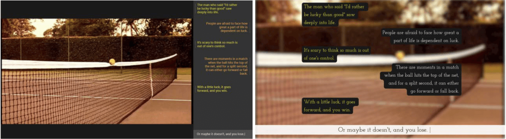

_Salles, J., Frizzera, L. (2019) Loto-doc: Exploring chatbot in an interactive documentary. International Communication Association (ICA) Pre-Conference on Human-Machine Communication. Washington, USA_

Prototype is available here: [https://onchance.net/](https://onchance.net/)

In recent years, human-machine interaction has been integrated into the audiovisual documentary language and has created new forms of storytelling on a wide variety of media, such as the web, smartphone applications, installations and augmented and virtual realities (Gifreu, 2013). The development of digital technologies has played a fundamental role in the emergence of interactive narratives and allowed for new forms of documentary storytelling. One mode of human-machine interaction applied in documentary storytelling is the “conversational mode” (Gaudenzi, 2013). In this type of interactive documentary, the algorithm is constantly responding to the user’s inputs and simulating an intelligent conversation. 

This research-creation project aimed to explore how chatbots can be used as interactive tools for conversational documentary storytelling. We developed and tested Loto-documentary, an interactive documentary that integrates a chatbot. A chatbot is a human-computer interaction interface that uses artificial intelligence (AI), especially in natural language processing. In this presentation, we will discuss the insights and results of this research-creation project.

### Chatbot in storytelling

The use of chatbots in storytelling has a history of at least 40 years. _Tale-Spin_, developed in 1976 by James Meehan, is cited as the first application of chatbot in storytelling (Curry & O'Shea, 2011). The stories and modes of exploration in this type of chatbot are closed and fixed. Recent advances in machine learning techniques have allowed for a more open experience in the framework of chatbots. 

In a report released in 2016 (Hoguet, 2016), the Canada Media Fund pointed out two main trends in the narrative styles used in chatbots. The first and most popular trend is to allow the user to converse with virtual characters. The second line of development for narrative bots is based on “on the user’s choices to develop interactive fictions in much the same way as ‘books in which you are the conversational hero.’” (Hoguet, 2016) 

A different approach was adopted by Botnik Studios. In 2017, they trained an algorithm on the seven Harry Potter books and using predictive keyboards created a new chapter to the saga. In this type of procedure, the outcome is not as predictable as in the Tale-Spin example and offers more open-ended storytelling. This unpublished “Harry Potter chapter” went viral on Twitter and started a public conversation about the use of AI and algorithms in storytelling. As one user commented: “It’s very hard to believe this was entirely automated—there’s too much logic & story structure” (@carljonard, 2017). To that comment, one of the Botnik Studios creators replied and explained in more details the creative process behind the chapter and the role of AI in it: “It's not automated! We have a team of writers who all use the Botnik predictive text keyboard. We trained keyboards on all 7 books and had a big writing jam. Then I took the best pieces of copy, arranged them into a narrative, and wrote some copy to fill in the gaps” (@NatTowsen, 2017). Even though chatbots have been used in storytelling for at least 40 years, its application in the field of the audiovisual documentary is incipient. 

### Loto-documentary

In this research-creation, we developed the chatbot _Loto-documentary_, an online interactive platform that combines original audiovisual and textual content with archive material. In this documentary chatbot, the user can “discuss” with a machinic agent about the subject of the documentary (randomness, chance and related topics). The audiovisual content appears to the audience according to the dialogue. The idea that the content is provided according to the user’s desire is at the core of chatbot interaction. As Hoguet puts it, “The relationship is inverted in that it’s no longer the editor who proposes content to the audience but the audience that requests content that resembles it or is adaptable to its specific situation.” (Hoguet, 2016) This research-creation addresses the challenges of using the chatbot as a tool for interaction in the field of documentary. In our discussion of the project, we will focus on two main aspects of the development: the storytelling design and the technical choices for the development. 

Regarding our technical choices, after trying different approaches and platforms to the development, we decided to use Recast.AI (aka SAP Conversational AI). We developed a hybrid chatbot, that uses rule-based conversation combined with natural language processing and customized code in Node.JS. In the presentation, we will detail the reasons behind those technical choices, the challenges that we faced and discuss the outcomes.

Loto-documentary interface tests

In the discussion about the storytelling design, we will be able to address the structure and content of the dialogues that were created. In this regards, we will offer an overview of the different approaches we tried while building the structure of the documentary chatbot conversation. Loto-documentary combines original content and archive material, text and audiovisual. Thus, we will also explore the challenges of working with a wide diversity of content formats and simultaneous interactions in text and audiovisual. The different tests and choices for the interface design will also be discussed.

We will conclude our talk with some general considerations on the lessons we have learned through this research-creation project in a way that potentially can be useful for other creators in the field of chatbot development, documentary and journalism if they are thinking to work on a similar format.

### Bibliography

Curry, C., & O'Shea, J. D. (2011). The Implementation of a Story Telling Chatbot. Paper presented at the New Directions in Agent Research workshop at KES-AMSTA-2011, Manchester.

Gaudenzi, S. (2013). The Living Documentary: from representing reality to co-creating reality in digital interactive documentary. (PhD), University of London, London.

Gifreu, A. (2013). The Interactive Multimedia Documentary: A proposed Analysis Model. (PhD), Pompeu Fabra University.

Hoguet, B. (2016). How can chatbots be used to tell stories? Retrieved from [https://trends.cmf-fmc.ca/how-can-chatbots-be-used-to-tell-stories/](https://trends.cmf-fmc.ca/how-can-chatbots-be-used-to-tell-stories/)
