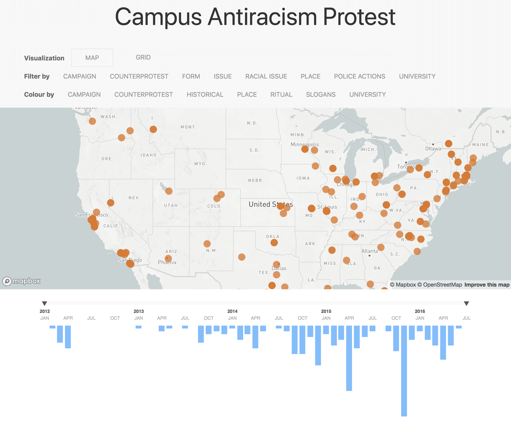

I developed a prototype for interactive interface visualization on Campus Antiracism Protest. The data was collected by Alex Hanna and Ellen Berrey (University of Toronto) using a machine learning algorithm developed for this task. The source of data is a collection of student association lead and university focused newspapers. The prototype visualization has a subset of the dataset with about 200 records of protests in the USA and Canada between 2012 and 2016.

The visualization was developed using web standard technology: HTML, CSS, and Javascript. A few Javascript libraries were used to facilitates data processing, UI implementation, and visualization development.  
Javascript Libraries  
[D3](https://d3js.org/) - Creates graphs  
[UIKit](https://getuikit.com/) - Interface framework  
[jQuery](https://jquery.com/) - DOM manipulation  
[Mapbox](https://www.mapbox.com/) - Map service  
[Moment.js](https://momentjs.com/) - Date-time manipulation  
[Papaparse](https://www.papaparse.com/) - CSV Parser  
[Chroma.js](http://gka.github.io/chroma.js/) - Color manipulation
