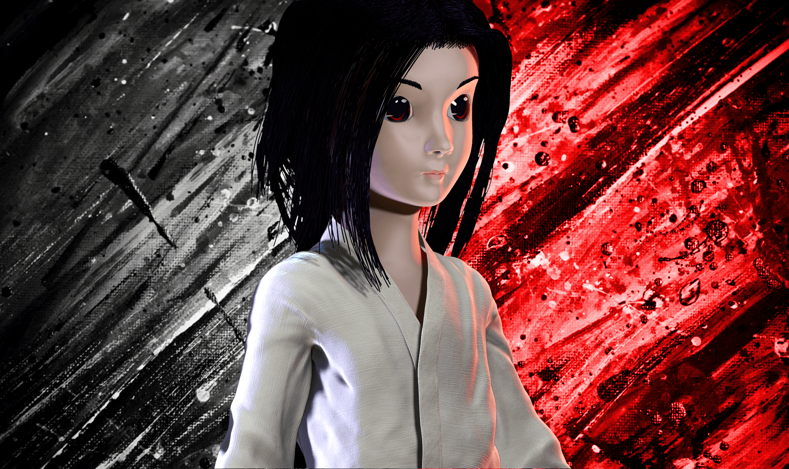

I had the opportunity to participate as a programmer in the development of this short-story video game. This work was a collaboration with Ryan Scheiding, Marilyn Sugiarto, Samia Pedraça, and Mimi Okabe. The project was presented and previewed at the Canadian Games Studies Association (CGSA) 2017 conference in Toronto, Canada.

Here is the description of the project:

Video games based on historic wars have tended to focus on depictions of the combat and violence experienced by soldiers. This has led to a climate where non-combat casualties have been ignored and marginalized within the traditional narrative framework of war games. As a result, both women and children have been largely underrepresented in war games despite the fact that they typically represent the majority of casualties. One specific example of this phenomenon can be found in Pacific War (1941-1945) games that ignore the victims of bombings, especially the atomic bombings of Hiroshima and Nagasaki. The hibakusha (bomb affected persons) of Hiroshima and Nagasaki have been ignored in the representation of the war, especially in North America. The goal of this project is to create an educational war game that focuses on the experiences of hibakusha after the bombing of Nagasaki in order to better incorporate their stories into North American understandings of the atomic bombs.

Learn more and play the game: [http://nagasaki-kitty.ca](http://nagasaki-kitty.ca)
