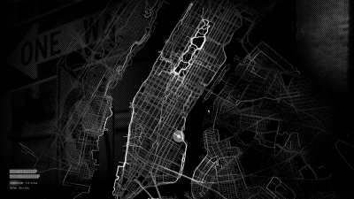
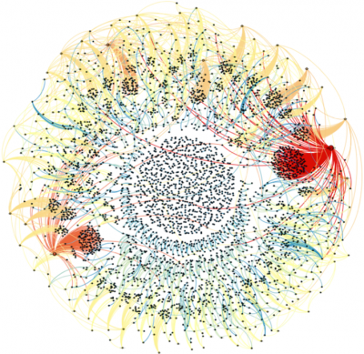

_Mobile devices such as smartphones and tablets is capable of wirelessly connect to other devices, track geographic position and capture audiovisual information. They become ubiquitous in the society, especially in the urban space, where the access to the Internet is densely offered, turn into a new form of spatial mediation. Locational media add a digital layer to the physical space, transforming the way that people explore, perceive and interact with the city._

## Introduction

The accelerated digitalization process of our culture marks the last decade. The Internet speed increased exponentially and spread beyond the industrialized countries, reaching different social classes in remote regions and impacting positively in the digital literacy. New forms of social relationship and collaborative work have been developed, affecting not only personal relations but also economic and political issues. Although, one of the more affecting changes is the shifting to mobile devices. By adding a virtual layer on the top of the real world, mobile media is affecting not only the social relationship but also the way society explore, perceive and interact with physical space.

Mobile technology allows both the user and the environment to communicate with each other. Web mapping services, such as Google Maps, provide very rich information about the user location, allowing them to navigate and explorer cities. Built-in cameras in conjunction with store-to-share services like Flickr, Picasa, and Instagram let the user imprint their own identity to the places where they live. Geo-locational services, like Yelp, Foursquare, and Saga, help people to browse for places of interest, such as restaurants, bars, and stores. Social network platforms, such as Facebook, Twitter, and Google+, allow people to interact with other and tell stories about their life.

Moreover, the technology is not only in the user's hands – and pocket. Always-connected devices are everywhere in the urban space. Cameras, sensors, and points of network access are the most common examples. They serve diverse purposes, but especially for social control and surveillance, altering, in many cases, the intentionality of places. In many occasions, people tend to favor or avoid these places, depending on the connectivity and privacy issues.

Locational media come to be a very important piece in the production of social spaces. Since it is technically capable of wirelessly connect to other devices, track geographic position and capture audiovisual information, they are able to extend our senses making people aware not only of the virtual and digital world but also of the physical environment. Furthermore, it conceives the enlace between them, creating hybrid spaces. As noted by Lemos (2010), mobile media is not seeking to overcome the real or to put an end to physical places. Instead, It “put the emphasis on control, territorialization \[and\] production of content bound to objects and places” (p. 409). Therefore, tracking, control, and surveillance are actions taking in the digital layer by both actors, ordinary people, and professionals, which affects physical places. The intensive use of mobile technology is creating a new meaning to places, spaces, and territories.

As Bolter and Grousin (1999) proposed in their remediation theory, new media reforms other forms of mediation. Lemos (2010) even suggests that it had already transformed the meaning of concepts like territory, place, mobility, community, temporality, and maps. This paper will use recent geo-locational experiences in order to investigate how the presence of networked wireless technology changes perceptions of place in order to create a better understanding of the transformations on the urban space.

## Space and places

Foucault (1984) as convinced that the anxiety of the contemporaneity is ultimately with space, as opposed to the great interest with time in the past. He argued that we are living in an epoch of simultaneity, in which everything is juxtaposed; the relations among sites became more important than the structured elements connect through time. As locative mobile affects the space and places in the city, it is indispensable that these terms are well defined.

Lefebvre was one of the major contributors to reinstall the body and space in the philosophy and social thought. For him, “space considered in isolation is an empty abstraction” (1992, p.12). He argued that “(social) space is a (social) product” (p.26). It is an abstraction but also ‘real,’ such as other concrete abstractions (commodity, money, etc.). One implication of this proposition is that each society – more precisely, “each mode of production, along with its specific relations of production” (p. 31) – produces a space. Another implication is that space is a historic process, which means that the forces of production and the relations of production play a part in the production of space. That is, “each mode of production has its own space, the shift from one mode to another must entail the production of a new space” (p. 46).

According to Lefebvre, Spatial space contains three interrelated levels that must be taken in account: (1) **Space practice** embraces productions and the particular locations and spatial sets of each social formation, (2) **Representation of space** tied to the relations of production, and (3) **Representational space** “embodying complex symbolism, sometimes coded \[...\] linked to the clandestine or underground side of social life, as also to art” (p. 33).

Space then, is not a prior, neutral or passive canvas for social relations, but an active force in defining them. It reflects values, ideologies and power structures of society as it reinscribes and legitimizes them. Moreover, by treating social space as space of production, Lefebvre argued that each person creates its own space in which it belongs and owns at the same time. People experience the world in a practical-sensorial way, it perceived through smells, tastes, touch, hearing, and sight. “It produces a place which is both biomorphic and anthropological” (Simonsen 2005, p. 4).

De Certeau (2002) distinguishes space and place. A place is where the elements are in relation to each other. They do not overlap, instead relay beside one another, which the rules of the proper use is applied and the location is defined. In contrast, space is a geographic location with coordinates – it is “when one takes into consideration vectors of direction, velocities, and time variables” (De Certeau 2002, p.117). A street defined by town planners as a place becomes a space through human activity such as walking.

Lippard (1998) defines place as the union of spaces, physical or experimental, and culture. It is the combinations between nature, historic moments and different human affairs that create a hybrid and social space. As she exemplifies, when “we enter a new place, we become one of the ingredients of an existing hybridity, which is really what all ‘local places’ consists of” (p. 6).

Lippard added another element to the discussion: the local. As place is a hybrid construction made by those who lived inside, different people having different feelings and connections with the local: it could be a dream, or the cruel reality, or even never been acknowledged at all. She argues that the local contains the concept of place: a portion of space that is known and familiar when seen from inside, connecting personal memory and histories.

Community is another notion that is relevant to the concept of place. According to Lippard, community is the relationship between people in a certain place. They are a mix, hybrid and layered interconnection of stories that cannot be seen in a linear fashion.  The very transient population and weaken relationship lead to a lack of substantial meaning of the place, on the other hand, the strong connections between individuals could lead to cultural confinement. This is more easily observable in big cities, where the financial district brings together a very disperse and heterogeneous business community, in opposed to Chinatowns in North America where the presence of the Chinese culture is excessively strong at the point that some people do not even have to learn to speak English.

In sum, place and space are distinct concepts with both material and social aspects. Lefebvre (1992) identifies two kinds of space – social and physical. Social space is defined as a set of relations between things that “overlays physical space, making symbolic use of its objects” (p. 39) and includes human activities. Physical space is geographic and material and exists within a place. Places have spaces and spaces can exist in places or spaces.

De Certeau (2002) went further and defines space as the intersection of places (locations) by the operations of the movement. In other words, space is the ‘practiced space,’ where the walkers appropriate on the urban geometrics (places) transforming it into space. Everyday social activities and practices, then, help define space.

Lippard (1998) increments the notion of place by adding the particular experience that person has a specific place. The local is “the intersections of nature, culture, history and ideology” (p. 7). Moreover, by sharing experience community is formed giving a collective meaning to a place.

## Mobile Technology

Over the past several years the digital world is expanding beyond the wired computer. As we are producing information as never before, mobile technologies seem to be the natural evolution of computers. Mobile devices embedding computers processing power spread out in the society. Smartphones are the most visible part of this technology that ranges from micro-gadgets capable to track different organic signals to T-shirts that change colors depending on the mood of the person.

The focus this paper is locative digital media accessed on personal devices, namely smartphones and tablets, which are having an unprecedented fast penetration in the society. Since 2007, when smartphones started to be adopted, the audience jump from a few hundred thousand to hundreds of millions in just 4 years. In the end of 2011, comScore (2012) reported 104 million users in Europe and 98 million in the US, reaching around 50% of the population (p.7). Tablets were introduced in 2010 and have sales are brisk. According to comScore, tablets reached 40 million users in the U.S. in two years; smartphones took 7 years to reach the same number of sales (p.5). In March 2012, Apple launched its new iPad selling 3 million worldwide in the first 3 days (Apple 2012). It demonstrates the public interest for this new medium and shows how mobile media is becoming ubiquitous in the society.

Beyond many features offered by mobile devices, three of them are very important in the context of mobile media: (1) **Wireless connection to a digital network**, which means constant access to the Internet via Wi-Fi or 3G/4G system allowing users to consume or produce information. (2) **Global Positioning System (GPS)**, enabling the device to locate the user wherever they are. (3) **Tangible User Interface (TUI)**, like multi-touch surface. It affords different gestures on the screen such as pinch, tap, swipe, and drag elements to trigger actions. With the assistance of this apparatus, mobile devices can create a sense of immediacy bringing back the physicality lost in the transition from print to web.

## Remediation

The novelty of mobile technology and its quick adoption by the public is causing absorption of the content that once belonged to older media. This process, called _remediation_ by Bolter and Grusin (2000), happens when a new medium tries to improve upon the flaw of its predecessors. For Bolter and Grusin remediation is a process of representation of one medium in another. They claim that whenever a new medium emerges, it tries to reform or refashion not only the content belonging to its predecessors but also the entire previous media. Manovich (2001) has a similar theory, demonstrating that the digital new media reforms cinema.

The genealogy of the media made by Bolter and Grusin reveals the dual logic of the remediation concept: immediacy and hypermediacy. The end goal of each is the same: “the desire to get past the limits of representation and to achieve the real” (p. 53). Hypermediacy attempts to reproduce and multiply mediation to create a feeling of fullness; immediacy strives to erase the media itself. That is to say that digital media uses hypermediacy to remediate previous media in a digital space with the intention to reform or refashion it. At the same time, digital media pursues transparency, seeking to achieve the authenticity of a real experience, remediating older media to achieve immediacy.

If we look at new mobile digital technology, we see that it is not just a technical apparatus to facilitate access to the Internet or communication between people. It becomes more than that when both actors, producers, and consumers push and stretch the initial purpose of these devices. Moreover, the shift toward the mobile platform and the tools embedded inside them are creating new opportunities not only for the expansion of the cyberspace but also to produce new experiences in the physical world. The producer can now explore different approaches to storytelling blending the digital and the physical space. Similarly, users can find new places and discover new meaningful experiences in the same space that they live. It is remediating mass media, giving new opportunities for consumers, and also remediating of the physical space.

## Locative media

Locative Media is defined by a set o technologies that enable wireless info-communication process based on networks, where the content is tight to a specific place. It expresses the exact location or the surroundings of the moment of action. The term was proposed in 2003 by Karlis Kalnins as an attempt to differentiate the corporation use of locational services and artist purposes. Projects involving locative media have diverse adjectives, including tangible, mobile, ubiquitous, pervasive, invisible, embedded, physical, environmental and ambient.

As noted by Berry (2008), Locative media art goes back to the Situationist movement of the 1960s "where artists intervened in the urban landscape to provide alternate visions and readings of urban spaces" (p. 103). Instead of work in the physical space, locative media use mobile media to create contemporary commentaries of urban spaces. Thus, locative media create new forms of representation and social experiences in place, allowing new kinds of writing and reading of the urban space by reappropriation and production of new meanings.

Nonetheless, locative media uses mobile devices, which are communication technology the remediates previous media. So, it is central to distinguish between mass media, the logic in which old media operates, and post-mass media. Lemos (2010) defines mass media as “a centralize flow of information with an editorial control by big companies in the process of competition founded by advertising” (p. 403). McCullough (2006) goes further and adds that mass media tent to imply disembodiment, causing distress for space and place as we conceived.

Post-mass media, on the other hand, use decentralized networks to enable anyone to produce and distribute information. It operates according to what Lemos calls three basic principles of cyberculture: release of emissions, bidirectional connection and reconfigurations of institutions and cultural industry. McCullough inquiries, “what happens when media become embodied in access, spatial in operations, and place-based in content? In particular, what happens when information technology moves out beyond the desktop into the sites and situations of everyday urban life? What does it mean to apply ‘locative’ media \[in the urban space\]?” (p. 26).

Lemos states, “we must understand city, urbanity a mobility within this new media framework” (p. 404). Thus, when he defines post-mass media he is connecting the decentralized networked formed by the Internet in conjunction with the mobile devices. The “total mobility,” produce and consume information on the go, move physically in the space at the same time jump through virtual information space is the main feature of locative media. It has the capability to deliver data based on the user location. The specific site affords to the user to reach particular information, binding the virtual world with the materiality. Thereby, It enables locational aware narratives – “stories that unfold in real space” (Karapanos et al., 2012). Moreover, McCullough claims that "the word ‘cyberspace’ now sounds dated,” as “all that information is now coming to you—with you, wherever you are; and is increasingly about where you are” (p.26).

For Farman (2011), the dichotomy between real and virtual makes the concept of locative media fuzzy. The problem is that we conceptualize virtual in opposed to physicality. Since the Internet was access mostly in a fixed place, virtual is understood as a simulation of another physical place: museum, chat room, home. Nevertheless, this approach fails because it does not address “the sensory-inscribed experience of virtuality as a multiplicity and tend to ignore the materiality of the virtual” (p. 37). The virtual do not erase the real, but layering in a persistent interaction that ties the virtual and the actual together. This notion of multiplicity become more perceptible in the shift from an immobilized personal computer (desktop) to pervasive computing (locative media), allowing the digital space to interact with the material space in a novel way; therefore changing affecting the production of space.

In the contemporary societies, a new form of territory takes place: the digital. Locative media creates Information territory (Lemos, 2010). Territory is a “cultural artifact,” molded and produced by social relations and the relationship with the material and symbolic world. Therefore, information territory is the digital information flow that intersects urban space and cyberspace. He pointed out that the digital layer (i.e. Wi-Fi network in parks) is in relations with others (regulation, subjectivity, law) in order to constitute a “new sense” of place. However, Lemos argues that it is not the end of the physical space – it is just a resignification. It creates what Foucault (1984) called _heterotopia_.

> “The information territory changes the place because all places are dependent on the synergy between imaginary, subjective, corporeal, legal territories” (Lemos 2010, p. 406).

To understand post-media functions and the new information territories Lemos proposed four categories of study with locational media: 1. **Urban Electronic Annotation**, which allows new ways of “write” the urban space in order to give a new sense of places by reappropriation; 2. **Mapping and Geo-Localization**, enabling tracking and customizations of spaces by use of multimedia content and share functions to reinforce communities and producing new meaningful experience; 3. **Location-Based Mobile Games**, which the ludic dimension makes create new ways of appropriation of the urban space and no rare producing new form of communities; 4. **Smart Mobs**, a new form of mobilization, not necessarily political, that take advantage of the decentralized network to spread information in order to temporary refashion places and territories.

## Analysis

What do we supposed to do when we are waiting in public transportation stop? Stare the subway tracks? Count the number of cars passing on the street? Interact with other people? For a few minutes we indubitably, and unconscious, scan the environment, but we get bored too quickly. We also certainly avoid getting in contact with ‘strange’ people. According to Simmel (1903), the metropolitan man cultivates an appearance of indifferent in order to psychologically and socially protect the self from the masses of strangers – the blasé attitude.

We do not know what to do because of train stations, bus stops, and airports terminals are transient places. They have no particular meaning to us – they are non-places. The transitory condition of transportation nodes in the modern life can be considered _heterotopia_ (Foucault 1984). _Heterotopia_ is a particular space that relates to all the other, but at the same time contradicts these relations and is very different from all other sites that they reflect. It is a place that encompasses other meanings (cultural, historical, emotional) than the present physical space – a virtual place.

> Mobile media transforms and add another layer to theses places. Lemos (2010) noted that by adding a digital layer to the physical, an informational territory takes form. It blends with the physical space, giving new meaning to that site. “Mobile technologies and networks create new urban ecologies that redefine place and our sense of the city, changing our everyday experience of places” (p. 412).

Informational territories are very transient and unstable – it can abruptly shift very easily. In the case of transportation nodes, we cannot help ourselves in our blasé attitude, so we turn our attention. We immerse ourselves in the digital territory seeking for a familiar face, a friendly environment that means something. In doing so, we attempt to give new meanings to the place where we are in a never-ending process.

It is important to understand that when we use technologies to develop implement – a term used by Farman (2011), media interface and materiality is central. He noted that embodied content is not transferable to other media or situations. For example, retrieving information from Wikipedia using a desktop computer is very different from access the same information using a mobile device. Hence, the real landscape becomes an interface to access information. Nonetheless, the locale, which is the practice and contextualized location, has always served as an interface. For instance, we can perceive information through graffiti and billboards on the streets. However, whereas locale information is very limited and based on materiality only, mobile media interactions can reveal hidden elements in a digital layer, unlocking unknown information about the place.

> Farman argues that “our experience of place through mobile technologies is at once a phenomenological engagement with this particular medium and a mode of reading the significance of that mode of engagement.” (p. 45).

These resignifications can be observed in the categories suggested by Lemos. This section intends to be a brief survey on locational media projects in order to observe the transformation in our sense of space, place, and community, using three categories suggested by Lemos: Mapping, Urban Annotation, and Smart Mob.

### Mapping and Geo-localization

The core of locational media experience is the digital mapping. Today we experience the space also through mobile devices – pervasive computing space and locational media affect the way that people move in the physical space. By binding virtual to real objects, the interactions with the digital interfaces offer a very real experience, challenging the perception of what is the “real” space. “How we represent space has everything to do with how we embody that space” (Farman 2011, p. 35).

Differently than Lemos, instead of implying new forms of “writing” in space by means of attaching information to maps, or create new ones, I consider mapping as the representation of traditional maps into to digital form and the experience provided by them. Mobile maps rely on culturally situated maps offering a different sense of implacement with the place around us. In every day use it ranges from a situated subject using “street view” to disembodied voyeur with an aerial view, implying in a very distinct perception of space and different ideological status of the observer. Farman noted that maps are so commonsensical that they are almost transparent to critiques – nobody expects that a map that uses photograph could be wrong. Whereas photograph has been issued about its authenticity due to easy manipulation, satellites maps and aerial photography has not been questioned yet. Further, space only becomes meaningful with the human movement through the mapped space (De Certeau, 2002; Farman, 2011) and not by means of disembodied technologies. The act of walk in the urban space using a mobile device implies in a sensorial engagement with space. The mobile device gets the locational data using GPS signals and responds with specifically locational information the connection with the Internet, increasing the levels of implacement and signification.

Despite the fact that the technology is very new, digital mobile maps became very attractive (intrusive would be a better word). We start to rely – blinding – on them for every movement, forgetting how to navigate without an assistant. GPS navigation system became available to the public in the last 20 years. However, they were very expensive and mostly used as route assistant for drivers. In 2004 Google introduced Google Maps for desktops, and in 2006 launched version for mobile platforms, enabling users to navigate, explore and discover new places by overlapping digital and physical layer. We are transferring our sense of directions to the digital. More important, we are changing the way that we relate to physical space since all we can want to see now is a representation, a simulation of the real. But what happens when the simulation is not good enough?

Nonetheless, sporadically and serendipitously use of digital map turn into dependency. When Apple decided to remove Google Maps from the iPhone in 2012, favoring its own map services, Apple Maps, the mobile map experience of iPhone user collapsed. Suddenly, buildings disappeared, roads vanished, no public transportation information was available, and whole cities appeared to be melted (See “[The Amazing iOS 6 Maps](http://theamazingios6maps.tumblr.com/)”, website dedicated to showing Apple Maps' mistakes). Apple disrupted mobile map experience and left the user lost in space – a Dérive, but without the playful described in Debord’s theory (1899).

### Urban Annotations and Social Network

As defined by Lemos, electronic annotations are new ways to “write” the urban space with mobile devices. As they are capable of aggregate information from different sources, including user-generated content, multiple views of the city can be perceived now. This is possible by attaching multimedia information, such as photos, text, video, and sound, to maps as well as to create new maps.

Experiences of location awareness narratives, as described by Karapanos et al. (2012), take advantage mobile device affordances. He produced a series of historical videos to be experienced at a particular location. Here, here just used custom-made maps and GPS to guide the visitor. Each piece of the story was trigger by a physical tag put in a specific location. The goal was to see if the visitor were able to engage with the place by matching the digital video and the physical location.

Further, mobile devices help the creations of new meanings by tracking mapping and tracking of movements in urban space. Many web services allow users to upload this information including the geolocation position, creating new notions of spatial mapping. Although Sutko and Silva (2011) question the assumptions that people communicate and coordination better using mobile devices, they noted that "indirect forms of communication do not rupture the co-present, but may rather connect us to surrounding spaces and people; however, location-aware technologies also connect us to places" (p. 809). According to Sutko and Silva, Locational Media Social Network has two main attributes: location awareness, avoiding self-reporting position and real-time map. It produces interplay between the social network and the place – one influences the other.

Foursquare, for example, is a locational social network that encourages people “to repeatedly ‘check-in’ in different places in order to accumulate points and badges. Players also win travel bonus points if they check in two or more different places during the same day" (Sutko and Silva 2011, p. 817). By locating the user in space, using GPS coordinates, Foursquare shows a list of places nearby: restaurants, airports, school, public buildings, parks, etc. Users can share their location by choosing one or, alternatively, creating a new place. The list of places is crowd-sourced; consequently, people are free to add places that are meaningful to them. Moreover, it is also possible to comment and share pictures using the service. It not only helps people to explore the city but also created a new community with 20 million users (Belic 2012).

 Figure 1: Mapping showing one year of running using Nike+ in New York, USA (Kuang, 2011).

Similarly, Nike+, a smartphone application developed by Nike, enables runners to track their routes. Nike+ collects data GPS signals at short intervals to calculates runner speed and draw a route map. The combination of many users using Nike+ produces new maps, a form of crowd digital annotation (Figure 1).

Urban annotation leads to a contestation of the structured power. For Farman, maps signify a specific look – an ideology produced to fits in the current hegemonic culture. Thus, with the community participation, maps can represent the variety of experiences; moreover; mobile technologies enable other ways to represent space – a lived space.

### Smart Mob

Smart mobs are defined by Lemos as “political and/or aesthetic mobilizations coordinated by mobile devices, usually cell phone and SMS texts. These actions bring people together to perform an action (artistically or politically) and disperse rapidly” (p. 408). This form of mobilization redefines, even for a moment, public spaces using mobile devices. The logic of smart mobs is the same as social network platforms: the rapid information replication through individual connections. As Farman states, this is a form of contestation, where the community produces new territories (Lemos, 2010).

On 25 January 2011, a protest against Egypt leader took place at Tahrir Square, Cairo. They used mobile devices not only to mobilize and organize the occupation but also to produce their own view of the event. Whereas poor information arrived from mass media agents, social network platforms, mainly Twitter, was the most reliable medium. They coordinated the protest from the square, reappropriating the public space transforming them into a territory of resistance. Moreover, the movement cannot be fully understood without the visualization (See “[The Egyptian Revolution on Twitter](gephi.org/2011/the-egyptian-revolution-on-twitter/)”) created by André Panisson. By capturing the tweets created in the epicenter, he revealed how an articulated community spreads the around the world in the moment that the Mubarak resigns the power (figure 2).

 Figure 2: The Egyptian Revolution on Twitter, captured by André Panisson, shows a network of tweets and retweets, from the center of the movement, in the Tahrir Square, to rest of the world.

Similarly, the movement Occupy organizes smart mobs to protest against the schizophrenic logic of capitalism. The goal is to occupy public places, mainly squares and plazas, in order “speak” with governs and the economic power. It is a movement organized using decentralized networks on the web, taking advantage of mobile media to mobilize people. They also use mobile media as surveillance instrument in order to catch excessive violence and government censorship – in a sense, it is guerrilla tactics. In fact, McCollough noted: "Before raising the usual Orwellian red flag, consider how much more likely than Big Brother are ten thousand pesky ‘little brothers’" (p. 27), reversing in some sense Foucault's panopticon.

Despite the peaceful character of the movement, it was disproportional reprehend by the enforcement power of the state. The police were instructed to remove the protesters from the public space, where they have the constitutional right to be. In some cases, the violence used by the police resulted in death.

Political oriented smart mobs, such as Occupy Wall Street and the Egypt demonstration, put in evidence a question about the legitimacy to be in a public place. In a constant privatization of the public space, these movements are trying to rescue the space of socialization, where the democracy can be practiced freely. Locative media becomes a tactic of resistance and performance in postmodern urban public spaces.

## Conclusion

I have suggested that new mobile digital media is using technologic affordances to add new informational layers to the physical worlds, extending notions of space and place. Undoubtedly, it raises anxiety as the “world embraces ubiquitous computing despite its unintended consequences” (McCollough, p. 27), questioning the legitimacy and authenticity of the newly created hybrid spaces. McCollough observed, "If you can do anything, anytime, anyplace, then in a sense you are nowhere’ (p. 17).

Nonetheless, Lemos asserts that locative media is not seeking to overcome the real or to put an end to physical places. Instead, It “put the emphasis on control, territorialization \[and\] production of content bound to objects and places” (2010, p. 409). According to him, this movement is transforming the meaning of concepts like territory, place, mobility, community, temporality, and maps. Indeed, mapping with digital devices is given new tools for reinforcing communities, the appropriation of places and new territorialities. Mapping, tags, and localization can be seen as a new way of creating meaningful experiences in the actual cities.

To conclude, whatever our desire for a sense of place, we seem destined to get places with sense. The more we found ourselves immerse in the mobile media,

> “place has become less about our origins on some singular piece of blood soil, and more about forming connections with the many sites in our lives. Place become less an absolute location fraught with tribal bonds or nostalgia, and more a relative state of mind that one gets into by playing one’s boundaries and networks. We belong to several places and communities, partially by degree, and in ways that are mediated" (McCollough 2006, p. 29).

## Bibliography

Apple. “New iPad Tops Three Million.” Apple Press Info 19 Mar. 2012. Web.

Belic, Dusan. “Foursquare Surpasses 20 Million Users, 2 Billion Check-ins.” IntoMobile. Web. [http://www.intomobile.com/2012/04/21/foursquare-surpasses-20-million-users-2-billion-checkins/](http://www.intomobile.com/2012/04/21/foursquare-surpasses-20-million-users-2-billion-checkins/)

Berry, Marsha. “Locative Media: Geoplaced Tactics of Resistance.” International Journal of Performance Arts and Digital Media 4 (2008): n. pag. Web.

Bolter, Jay David, and Richard Grusin. Remediation: Understanding New Media. Cambridge: MIT Press, 2000. Print.

De Certeau, Michel. The Practice of Everyday Life. University of California Press, 2002. Print.

comScore. 2012 Mobile - Future in Focus. comScore, 2012. Print.

Debord, Guy, and I. Chetglov. Theory Of The Derive. Ed. A. Jorn. Actar/Museum of Contemporary Art, Barcelona, 1899. Print.

Farman, Jason. Mobile Interface Theory: Embodied Space and Locative Media. 1st ed. Routledge, 2011. Print.

Foucault, Michel. “Of Other Spaces.” Architecture /Mouvement/ Continuité (1984): n. pag. Web. 22 Sept. 2012.

Karapanos, Evangelos et al. “Does Locality Make a Difference? Assessing the Effectiveness of Location-aware Narratives.” Interacting with Computers 24.4 (2012): 273–279. Web.

Kuang, Cliff. “Infographic Of The Day: Using Nike+ To Map A Year Of Running.” Co.Design. 15 2011. Web.

Lefebvre, Henri. The Production of Space. John Wiley & Sons, 1992. Print.

Lemos, André. “Post-Mass Media Functions, Locative Media, and Informational Territories: New Ways of Thinking About Territory, Place, and Mobility in Contemporary Society.” Space and Culture 13.4 (2010): 403–420. Web.

Lippard, Lucy R. The Lure of the Local: Senses of Place in a Multicentered Society. New Press, The, 1998. Print.

Manovich, Lev. The Language of New Media. MIT Press, 2001.

McCullough, Malcolm. “On the Urbanism of Locative Media.” Places: Forum of Design for the Public Realm 18.2 (2006): 26–29. Print.

Simmel, Georg. “The Metropolis and Mental Life.” The urban sociology reader (1903): 23–31. Print.

Simonsen, Kirsten. “Bodies, Sensations, Space and Time: The Contribution from Henri Lefebvre.” Geografiska Annaler. Series B, Human Geography 87.1 (2005): 1–14. Print.

Sutko, Daniel M., and Adriana de Souza e Silva. “Location-aware Mobile Media and Urban Sociability.” New Media & Society 13.5 (2011): 807–823.

“The Amazing iOS 6 Maps.” The Amazing iOS 6 Maps. Tumblr. Web.

Williams, Amanda, Erica Robles, and Paul Dourish. “Urbane-ing The City: Examining and Refining The Assumptions Behind Urban Informatics.” Handbook of Research on Urban Informatics: The Practice and Promise of the Real-Time City (2009): 1–20. Print.

—————

_This work was produced as an assignment in the Built Environments class (SOC 503), supervised by professor Rob Shields, as part of my at Humanities Computing Masters degree at the University of Alberta._
