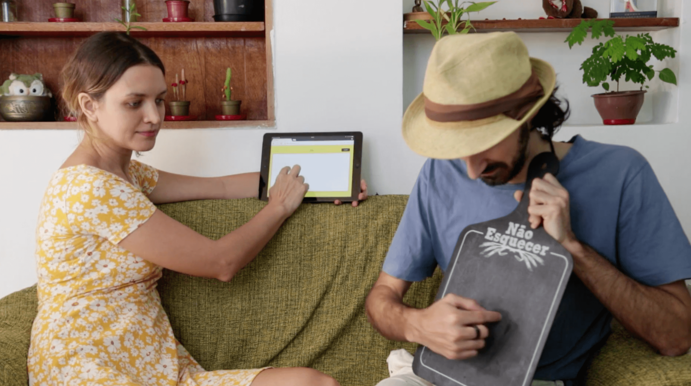
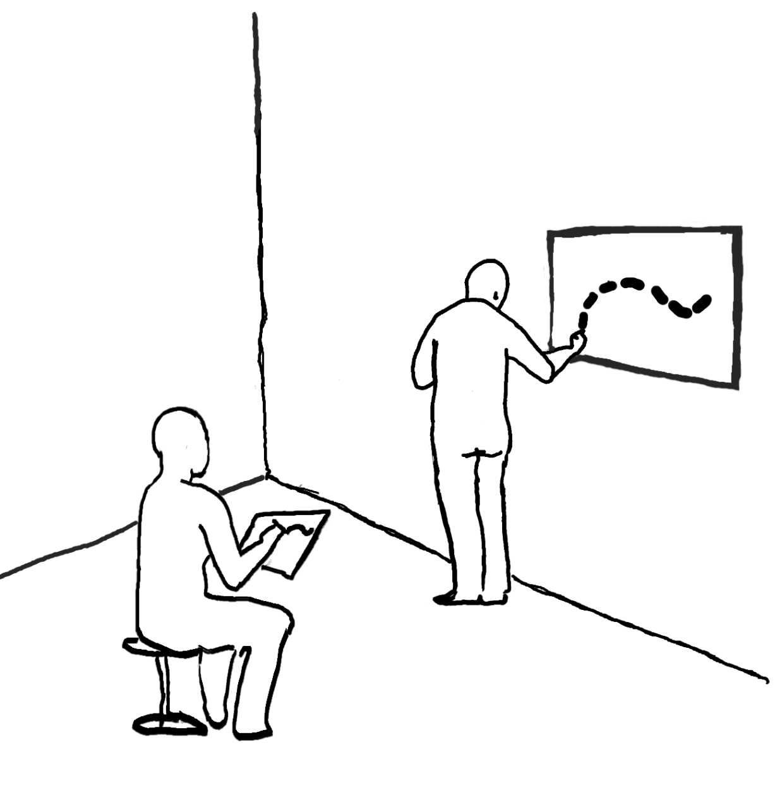
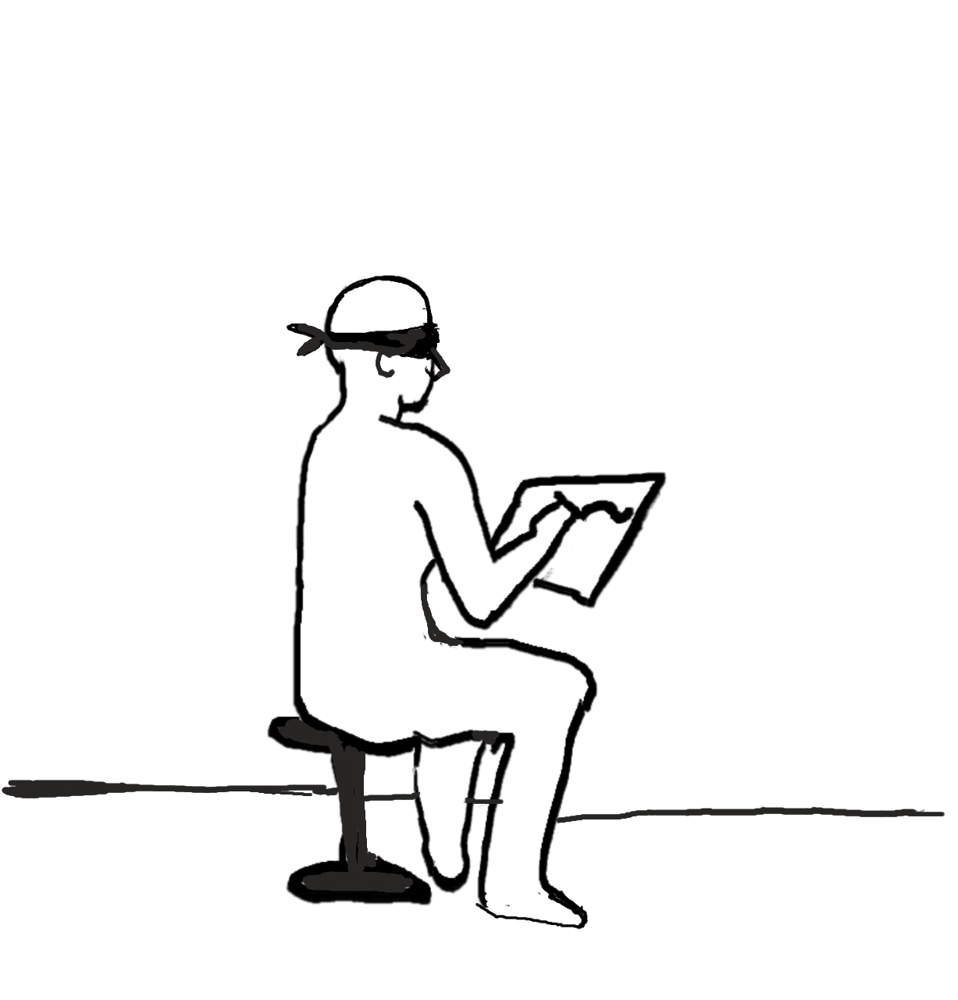

Try now: [gamepictio.com](https://gamepictio.com)

<iframe width="560" height="315" src="https://www.youtube.com/embed/ffwH93X_pKg?si=mCHF2rCzMnsZF6bR" title="YouTube video player" frameborder="0" allow="accelerometer; autoplay; clipboard-write; encrypted-media; gyroscope; picture-in-picture; web-share" referrerpolicy="strict-origin-when-cross-origin" allowfullscreen></iframe>

PICT.IO is a hybrid digital and board game inspired by _Pictionary_ that makes human and machines work together. The game is played by two teams, Yellow and Red. Each team is composed of two humans and one machine. The machine players are composed of one drawing robotic arm (Line-us robots), connected to a speaker and a tablet.

The goal of the game is making the team's pawn be the first to go all the way through the board’s path. The players throw dice to advance, and each square leads to one drawing challenge. There are three categories of challenges:

## Drawing on the Wall

In this challenge, the two human players work together to produce one sketch representing the word given by the tablet. The player who saw the word must draw on a wall, using just their fingers, without leaving any visible mark. The second human acts as a proxy, following the trajectory of the finger and trying to reproduce it on the screen of the tablet. The AI program has one minute to guess what is being drawn.

## Blind Drawing with Left/ Right Hand

This is an individual challenge, where the drawer sketch representations for the word selected without looking at the screen and using her/his non-dominant hand. While the human player draws, the machine has 30 seconds to guess what is being drawn.

## Verbal Description

In this challenge, the two human players work together to produce one sketch representing the word selected. The player who saw the word must verbally describe it, using only geometrical figures and spatial orientation. The second human acts as a proxy, following the instructions and trying to reproduce it on the screen of the tablets. The AI program has one minute to guess what is being drawn.

The team players alternate the drawer at each round. When it is time for the machine to draw, it has its challenge, where the PICT-IO interface tells a human player what she must draw. The human draws it on the tablet which guesses (silently). When the machine guesses, it chooses a drawing of that category and sends to the robot to draw it on a piece of paper. The second person on the team has a limited amount of time to guess the robot's drawing. The players cannot use other means of communication rather than those indicated for each challenge. The game continues this way until one of the pawns completes the entire course.

