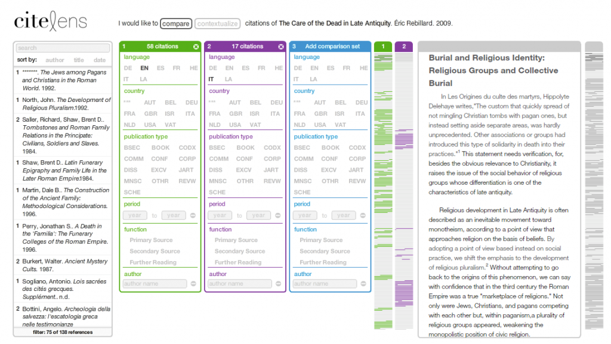
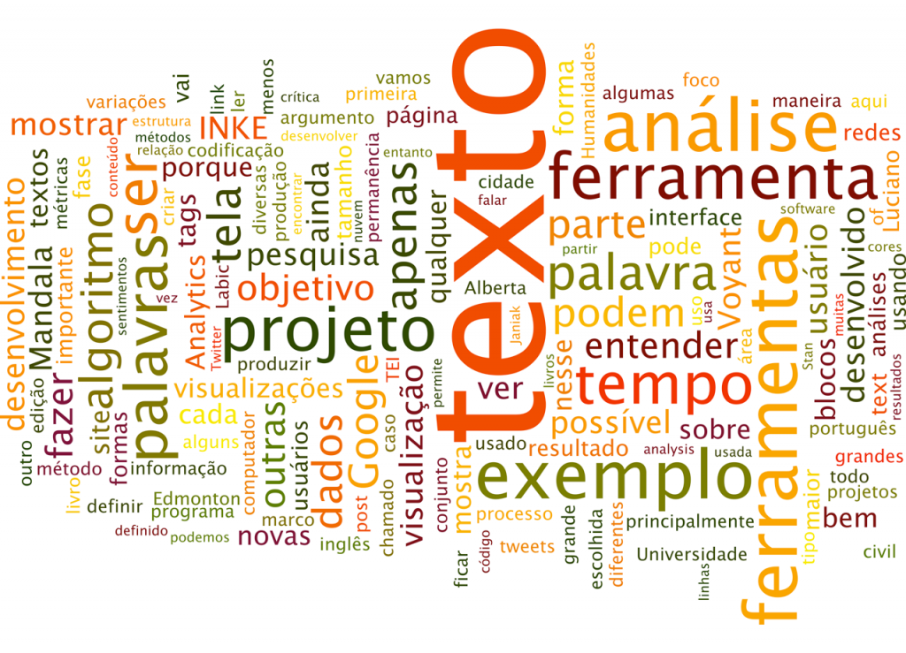

The Implementing New knowledge Environments research project, or just [INKE](http://inke.ca/), aims to study new ways of dealing with text documents, especially academic books, and literary texts. Led by Ray Siemens (University of Victoria), the project is multidisciplinary, involving 35 researchers and more than 53 research assistants across a number of Canadian universities. INKE is split into thematic groups; each one specialized in examining specific features, such as Textual Studies (TS), Modeling and Prototyping (MP), Interface Design (ID) and User Experience (UX). The group based at the University of Alberta focus in Interface Design and is led by Geoffrey Rockwell (University of Alberta) and Stan Ruecker (ITT - Institute of Design).

[INKE-ID](http://research.artsrn.ualberta.ca/inke/) is geared more into the interface study and development of new tools and less toward final products or the analysis of their outcome results. The research uses the development of prototypes as a form of argument. The goal is to experiment new ways of display the content and visualize results in order to produce new insights into the data.

We have adopted the Agile method in order to develop these new tools. This process emphasizes the minimum viable product and works in concentric circles of development, testing, and analysis. If a project has weekly cycles, for example, small parts of the project is developed and tested each week aiming to discover whether something needs to be improved or changed. This method allows for greater flexibility when compared to other methods, especially those top-down oriented, in which the project is all set in advance leaving no room for any kind of change. By keeping us working at the prototype level, Agile gives us the possibility to answer academic questions without having to develop at a full scale, which would raise the cost and the time spent in the project. Furthermore, considering the speed of technological transformation nowadays, a project that has no flexibility might quickly become obsolete.

I am going to show you some other projects that we are developing at INKE, and also other tools for text analysis that I have been collecting during this time that I am studying at the University of Alberta.

## CiteLens

**CiteLens** is a tool for citation visualization in Humanities monograph. We started this project in 2011, as part of Mihaela Ilovan’s Master's thesis, with the purpose to understand the structure of bibliographic references in these texts, trying to answer questions like: Why and how we cite other authors? There are already some studies in this direction, but the construction of the argument is very different between fields of study. In the Sciences, for instance, a research is generally produced on top of previous research results, creating linearity and patterns in the arguments. On the other hand, the structure of arguments in the Humanities is much more complex. A series of references, both primary and secondary, are used either to support the author’s argument or to reject any other information. Different readings can be made from the same text, and the content of the arguments can be very subjective.

During the first tests, we started to question our own algorithm, since we discovered that there was something wrong with the filtering parameters. It is important to note that, due to this early issue, we were able to refine the way that we were structuring the encoding scheme. This saved lot of time, since we were developing the code at the same time that we were encoding the text. Otherwise, we would end up with a complete tool that does not work properly.

## MtV

The Multitouch Variorum project, or as we like to call it, MtV, started in 2012 aiming to examine the use of a multitouch surface as a platform for reading complicated texts, such as the New Variorum Shakespeare version of Comedy of Errors produced by the Modern Language Association (MLA).

Well, first of all, what is a "Variorum"? Variorum editions are, in the simplest terms, collections of all the notable scholarship on a literary work. There are three general components: the text of the work itself as selected by an editor; a list of variations between this ‘base-text’ and other versions; and a comprehensive anthology of previous scholarly annotations. In the case of Comedy of Errors, the variorum brings together 69 different versions of the play.

Studies of variations in the text are essential in Literature, Theology, Philosophy, and for any type of research on the knowledge prior to the invention of the book, especially in the oral cultures. Think about the number of possible variations produced by dozens of translations and interpretations in the writings of Plato or even in the books in the Bible, for example. In more contemporary terms, this type of study can be used to analyze the controversies in Wikipedia articles, often edited by several people at the same time, or even the numerous versions of codes and algorithms post at repositories like Github.

The MtV project focus on creating a new interface for studying variorums using large multitouch displays, where at least two users can interact with the information in a social way at the same time, and at the same place. For this project, we are using a 52-inch high-resolution screen (4k x 2k pixels), which give us enough space to open many windows, or editions, at the same time. The big challenge is to understand how these new forms of interaction, especially using tangible interface, can help or improve learning and research development. You can check more information in a [paper that I presented at DH 2013](/blog/designing-interactive-reading-environments-for-the-online-scholarly-edition "Designing for Multi-Touch Surfaces as Social Reading Environments").

<iframe title="vimeo-player" src="https://player.vimeo.com/video/70527973?h=36e12598a6" width="640" height="360" frameborder="0" referrerpolicy="strict-origin-when-cross-origin" allow="autoplay; fullscreen; picture-in-picture; clipboard-write; encrypted-media; web-share"   allowfullscreen></iframe>

## Tools

Moving away from INKE prototypes let me show you other text analysis tools that can be useful for Labic/UFES and MediaLab/UFRJ.

### Mandala

[Mandala](http://mandala.humviz.org) was developed in 2005 by Stan Ruecker and it is similar to [Gephi](https://gephi.org/), in a more simplified way. It generates visualizations showing connections between keywords and the formation of networks between them. The input can be any text files, though it is more useful and more accurate if the text is structured in XML or CSV. Mandala recognizes elements of the text as entities: they may be words, actors, users, hashtags or any parameter defined in the document structure. For each entity, it creates a token on the screen. From then on, the user can filter and organize elements and see the relationship between them.

As a sample, Mandala comes with Romeo and Juliet play. You can use this documents to see the relationships between characters. In the same way, it is possible to open a collection of tweets about the civil rights on the Internet in Brazil and examine the relationship between users. Note that all the entities, or keyword, are present on the screen. Stan calls this feature as Rich Prospect Browser, which is a way to prevent the user to lost track of information: the user always sees the entire collection, even when he is focused on a small part of the data.

### TEI

The data structure is an important part of the process of analysis. One way to create such a structure is following TEI – Text Encoding Initiative – standards. It started in the late 80s aiming to create a human-readable encoded text for semantic analysis and future preservation. In fact, TEI is an attempt to create guidelines to standardize the use of these tags and make encoded texts more interchangeable.

TEI uses XML – eXtensible Markup Language, which allows custom tags creation and is much more flexible in comparison with HTML. Take this sentence, for instance: "Luciano lives in Edmonton". There is no indication that “Luciano” is a person and “Edmonton” is a city. Furthermore, a tool, such as Mandala, can tokenize (or separate) text elements, but cannot grasp the meaning of each one – they are just words. However, if you encode "Luciano" with the tag `<person>`, and “Edmonton” with the tag `<city>`, you can build an algorithm to interpret these tags. Thus, “Luciano” and “Edmonton” become not only words but also semantic entities with defined values. TEI encoding schema works in the same manner as in Twitter, which uses (@) to identify users, and hash (#) to identify trend topic.

### Voyant

[Voyant](http://voyant-tools.org) is a collection of tools for text analysis and visualization developed by Stefan Sinclair and Geoffrey Rockwell. Voyant is very easy to use: just paste a URL, upload a document or a collection of texts; it will process the data and show a series of information, such as word cloud, word frequency, and keyword in context. This last one, also known as KWIC, is very useful to make a qualitative analysis. When a word is selected, a panel shows all the occurrences of the selected word and also a couple of words that come before and after each occurrence.

Voyant also has an interesting feature called stop-words. It is nothing more than a dictionary, usually containing the most commonly used words, such as articles and prepositions. Once this feature is enabled, it removes these words from the results. Stop-words contains words in English and 6 more languages, but not Portuguese. Nevertheless, Voyant allows the users to create and edit their own customized stop-word lists.

As I said before, Voyant is a tool collection, but not all of them are present in the link mentioned above. You can find other tools on [Tapor](www.tapor.ca) website. There you can find [Bubblelines](http://voyant-tools.org/tool/Bubblelines/), for example. It is a tool to show occurrences of terms throughout the text or in collections of texts, very useful to find trends and ideas formation.

### Pipelines - Shaping the City

I also would like to mention **Shaping the City**, a digital mapping visualization. The project, supervised by the Edmonton Pipelines’ coordinator, Maureen Engel, aims to trace each block in the city using streets as boundaries, detaching these blocks from their original geographic location. In the first phase of the project, we have mapped 114 neighbourhoods in Edmonton, resulting in more than 4,000 blocks in total. The user can filter the block by neighbourhoods and time periods, and also have an option to “explode” the map and re-arrange the blocks in different ways: by size, district or period.

For the second phase, we are planning to map and display the entire city: more than 300 neighbourhoods built with approximately 10,000 blocks. We are also planning to add new organization options: population density, income, number of tweets or any other geolocated data that allows us to bind it to a specific block.

### Other tools

- There are many other tools, developed by small and large initiatives. I do not have time to show all of them here, but I would like to at least quote some:
- [ManyEyes](http://www-958.ibm.com/software/analytics/manyeyes) – A set of tools for data visualization developed by IBM. Very easy to use.
- [Google n-grams](http://books.google.com/ngrams) – Shows word frequency in Google’s book collection. The collection, available only with texts in English, starts from the nineteenth century.
- [ChronoZoom](http://www.chronozoomproject.org) – A fantastic zoomable timeline interface.
- There are several other tools to create timelines, such as [Dipity](http://www.dipity.com) and [Simile-Widget](http://www.simile-widgets.org).
- Finally, I also would like mention 2 initiatives focused on aggregating tools for Digital Humanities. Here you can find many other tools and also contribute to the DH community: [Tapor Portal](http://tapor.ca), and [Bamboo Project](http://dirt.projectbamboo.org).

 
## Algorithms

After this extensive, but not exhaustive, list of projects, I would like to highlight the process of production of these digital tools and the algorithm that describes them. Comprehend how to deal with algorithms and learn how they are built is essential for metric analysis. Simple variations in any visualization, such as color, size, quantity, variety, or even a small typing error, are enough to completely change the results. So, how do we know if what is being presented to us on the screen is in fact what we should see?

### Word Cloud

An interesting example to illustrate what I am saying is the Word Cloud. This tool is very used in blogs as a way to show the number of post in a given category. When used in a text the word cloud shows the most used words or the frequency of words. Usually, the words in this visualization have the following attributes: size, position, orientation, and color. So, let me ask a quick question: What attributes can be considered metric driven in this word cloud produced using [Wordle](http://www.wordle.net)?

Wordle set the colors automatically, though it gives the option to choose from different palettes. However, it has nothing to do with the text: it is only an aesthetic choice. Word orientation (vertical x horizontal) follows the same pattern; the user can choose how the words will be shown on the screen. The position also does not say much: words with different size, orientation, and color are everywhere. Thus, the only metric here is the size of the word: the size is proportional to the word frequency in the text - the larger the word, more often it has been used. This seems obvious today after more than a decade of use in blogs only.

What if we want to give meaning to color, position, and orientation? In a social network conversation, we could assign different colors to represent different users, for example. In the same way, the orientation could reflect positive and negative opinions; the position could stand for the distance between nodes in the network. What I mean is that if we do not know what the tool does, it can produce bad results, and induces errors.

### Google Analytics

That brings me to another example, and this one led me to an error for a long time. I am a web designer and I use Google Analytics to inform my clients about users’ activities on their website. One important metric in Google Analytics is the engagement time – the time that users spent on the website. This metric always intrigued me because it shows that most of the users spent only 0 to 10 seconds on these websites. I was unable to understand why is this happening. Is the websites bad design? People just do not care and have no interest in the content?

In fact, I have just discovered the answer to this problem two days ago, in [Pawel Janiak’s blog](http://paweljaniak.co.za/2013/05/12/0-second-visits/). Janiak explains that every time a user gets in a webpage tracked by Google Analytics, the time of access is recorded. Based on these data, Google Analytics compares the access time between two pages and defines the interval as time spent on the first opened page – this is the visit duration. Thus, if a user goes to a big newspaper portal, for instance, and spend exactly 1 minute reading the headlines and then follow a link to read more about any story, the visit time on the homepage is set to 1 minute. But then, here is what happen when the user spends about 5 minutes reading the material and then close the browser without clicking in any other link: By default, Google Analytics records the visit time as 0 seconds. The reason is that it does not have a second parameter to compare. Therefore, the result that you see does not reflect the reality. If you are interested in solutions for this particular issue, Janiak gives some answers to overcome and resolve this distortion.

## Criticizing the Algorithm

We must be aware of how algorithms work and how they are developed. I am not saying, though, that we have to go all the way back and study Assembly, electronic or mathematics to understand what is going on under the hood. But we should be more critical of the algorithm. Whereas we usually say that software are agnostic, we take them for granted. Algorithms are produced by humans and have strong arguments – they are culturally constructed objects.

Here is a culturally defined feature in algorithms: Language. Almost all programming languages are described in English; a few are in other languages. And this greatly affects the way in which the computer handles the information. Computers are good with numbers, but still not very clever with the subjectivity of the text. Take Google Translator as an example, which I frequently use to assist me when I am writing in other languages. It is not uncommon to lose the meaning or even reverses the sense of a sentence. This also happens with the translations of a software interface. If I am not mistaken, Twitter’s first translation for Brazilian users was in Portuguese from Portugal. In this case, it did not affect much the usability, since the difference is not an issue and the users were used to the English interface. However, what happens when we use text analysis tools produced in English to analyze content in another language? How these tools show the results and how we should interpret the outcomes?

A few weeks ago I had a lengthy comment exchange on Facebook with 3 researchers from Labic (UFES) about sentimental analysis on Twitter. A post from Alan Marquez about an app for sentimental analysis triggered the conversation. The problem was that the app is in English. Obviously, the tool will not correctly parse the words in a Portuguese text. So, I suggested that we should produce our own app, which creates excitement and curiosity among the participants. It should not be very difficult to start: We should begin by building a dictionary of feelings and assign values to them – positive and negative. With a little bit of knowledge in any programming language, we can produce a code to compare each word in a tweet to the dictionary and assess its subjectivity. We easily could expand and do the same with thousands of tweets, generating a sentimental visualization for future analysis.

Nonetheless, we probably will discover very soon that the results are not a good reflection of the reality. Positive or negative values are not enough. We need to look at the context of each word in each tweet. For example, how to evaluate the following tweets: "I support civil rights on the Internet", "I do not support civil rights on the Internet", and "I support civil rights on the Internet #not". I do not want to dive deep into these questions or the algorithm development now. The point is that we should understand how these tools work and learn how to make the critique of this algorithm.

I would like to extend my arguments to network analysis tools, such as Gephi. While we do not comprehend the parameters that construct and control those super complex and colorful visualizations showing the connections in a digital network, we may be lost in their aesthetic beauty. It is important to define what is a node, what is a link, and what the node’s color, size, position, and grouping means. I am happy to see that there is some interesting work being developed by Labic in this area. Nevertheless, we must also grasp how to read and examine these graphics. More than just visual networks, showing quantitative distribution, network formation, hubs and authorities, we need qualitative content analysis of the corpus to be able to understand what the network really means.

Finally, I also would like to emphasize that this work should be interdisciplinary. This is a key point in the Digital Humanities. The collaboration among different areas, especially the Humanities, Social Sciences and Computer Science, is very important for the development of new methods of research. The projects in this area are starting to get very large, creating challenges that are not easily solved by one or another discipline alone, but feasible if we collaborate with each other.

## Conclusion

Mapping controversies, one of the focuses of this event, requires much more than the Social Communication can offers. Tools for text mining, text analysis, and visualization can help us. However, if we do not have a critical look at the code, or worse, if we do not comprehend how the results on the computer screen are constructed and what they mean, we are in the risk of being misleading to errors, making shallow analysis with little research value.

I am really grateful to have the opportunity to participate in this HackLabViz(x). I am available for any comments or questions. Feel free to comment and collaborate with this text.

Thank you very much.

\-----------

_This text was presented in Portuguese at Labic HackLabViz(x) on May 15, 2013. It was later edited, expanded and translated into English._
