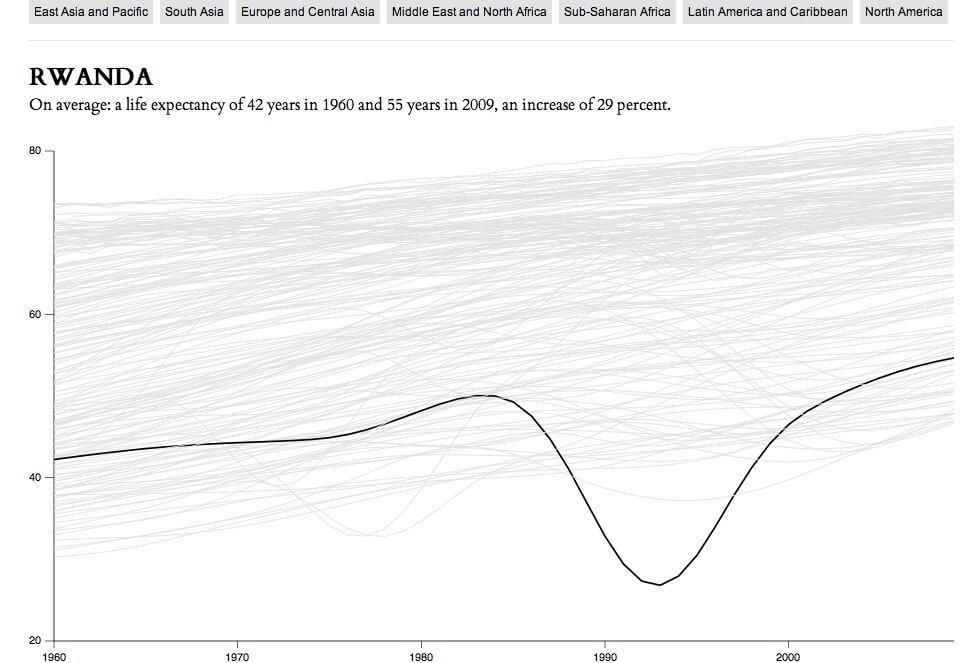
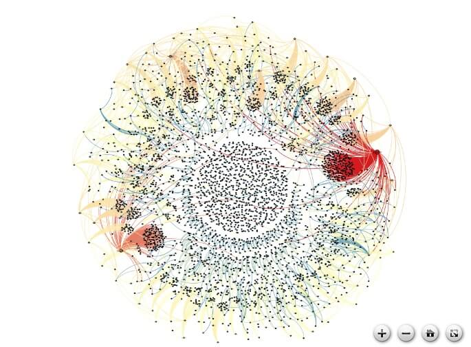

_With the new open source tools to analyze and produce visualization available to the everyone, people are able to create their own interpretation of the data. In this paper, I will discuss the role of the crowd in the construction of a counter-discourse in information visualization._

> “_We think we see the whole world, but we actually see a very particular part of it._” Cathy Davidson

## Introduction

Since 1980, the improvements of computing powers and the connectivity between computers using networks led to the ability to access, store and share information in large scale. According to Internet World Stats, in March 2011 more than 30% of the world was connected to the internet. Thus, more than 2 billion have access (except those living under restricting censorship governments) to tools for reading and create their own content, and using social network and blogs to share opinions. We are producing and storing more information than ever.

We are keeping records about almost every aspect of our society: demography, economy, health, education. In 2007 the total capacity to store information surpass 264 exabytes (Hilbert and López, 60). A large portion of it is organized in databases which are become massive and extremely complex.

Massive databases are best understood when we get a general view of the whole data and able to explore every bit inside it; therefore, the best way to do it is thru visualizations. Indeed, visualizations have been used in scientific fields such as biology, astronomy, statistics, and physic to manage large sets of data. In this paper, though, I use visualization in a more specific way: Information Visualization. It means a visual representation of semantic information (Chen, 12) and interactions techniques to allow people to see, explore and understand a large amount of data at once (Thomas and Cook, 12). Therefore, information visualization can help us understand abstract information using intuitive ways.

The visualizations have been produced by whom have access to databases and tools. Governments, big companies, and newspapers are tracking and analyzing data to produce information visualization. These are institutions with solid agendas; therefore, the results follow the same principles of the institution and imprint their point of view of a particular information.

Nevertheless, in the last years, we are watching an increasing number of visualizations created by ordinary people. They are using open source tools to access public data and create their own analysis and visualizations. Hence, the main question is: How it differentiate of those produced by governments and companies?

We have to share our perspectives to understand the whole picture (Davidson, 5). The crowd can do that by publishing their own Analysis and visualization. Different perspectives create a counter-discourse that reveal that the official voices can manipulate or omit some aspects of the information. Recent events in Egypt demonstrate how empowered crowd can broadcast their own interpretation, sharing different perspectives about it.

## Massive data to hyper-connected society

In general, a database is an organized collection of data for one or more purpose. It stores information in a way that supports processing of this data using queries. The data are typically organized to models relevant aspects of reality.

Today, with the huge store capacity and the rise of user-generated content, crowdsourcing websites, social networks and search engines it is very common databases surpass one terabyte of information. As noted by Manovich, It become massive. Contemporary media researchers have access to unparalleled information amount – more than they can possibly study, search or even watch (2).

Facebook, for instance, is the biggest social network with more than 800 millions users (“Facebook Statistics”). It allows people produce and share information about their lives. As a result, Facebook is storing posts, collect personal data, tracking users movement on the web to analyze what people like and discover patterns in their behaviors. Furthermore, this information can be used to sell advertisement and make and controls data flows. No doubt that Facebook need to have massive databases to handle with this amount of information.

## Visualization as a pair of glasses

As I said before, information visualization is a visual representation of semantic information. It helps peoples to see, explore and understand large amount of data at once. Much of the work in information visualization assumes that audience are experts and have knowledge and experience in analyze problems in specific domains. Indeed, many people from finances, government statistics and journalism use information visualization tools to process and study big databases, test hypotheses and eventually produce insights (Pousman, Stasko and Mateas, 1145).

Nevertheless, the audience of visualizations is much broader than just experts. As the visualizations are published by newspapers and governments and shared over the web, more people are exposed to it. Instead to see huge tables and databases, now users can look at visual representation of data and explore by themselves. As a result, information can be interpreted easily by popular audience, leading to possible insights.

Yet, visualizations clearly imprints ideologies. By select data, making queries and choose how to represent data, designers are obviously transmitting ideologies. Moreover, visualization is a like a pair of glass. It can reveal blur information, but also can distort the subject.

Therefore, whoever produces visualization are clearly focusing on the support of their own ideologies. Russell _at al._ (2008) put a question about the media: how the public will get information it need to participate as citizens, if the new-media environment will serve less to weave society together than to break it apart (67). I extend the same question to public institutions, such as governments and organization.

## Free tools for everybody

As state by Sorapure, with the development of free visualization tools, the field of information visualization is being opened to diverse users and uses, and particularly to novice users who want to visualize personally relevant information (59).

Famous companies, such as IBM and Google, having presently maintain projects that help people to create and share visualizations. [Many Eyes](http://www-958.ibm.com/software/data/cognos/manyeyes/), from IBM, let users create and share visualizations. As they describe, “You can explore data using your eyes! This site is set up to allow the entire internet community to upload data, visualize it, and talk about their discoveries with other people” (Many Eyes - FAQ). Similarly, [Google Charts](https://developers.google.com/chart/) do the same thing, with addiction that they also encourage programmers to extend the tool using APIs.

There are also several independent projects: [Flare](http://flare.prefuse.org/), an ActionScript library for design visualizations that run in the Adobe Flash Player; [D3.js](http://mbostock.github.com/d3/) , a Javascript library that take advantage of HTML 5 and CSS power; [Visualization Toolkit](http://www.vtk.org/), for 3D image processing and visualization; [Voyant](http://voyant-tools.org/), based on Java, for text analysis; [Exhibit](http://www.simile-widgets.org/exhibit/), to create web pages with interactive maps and timelines; [Gephi](http://gephi.org/), platform for explore and visualize networks and complex systems.

As a result, information visualization become easily to be created. Now, ordinary users can freely use several tool to explore and analyze data how they want, making their own queries and choosing how represent it.

## Raw data: the main ingredients

The tools themselves are useless; the data behind the visualizations are the main ingredient. Information visualization can use any kind of data. However, relevant data concerned about society is only partially accessible by the ordinary people. Generally these informations are sparse, fragmented, non-public, store in different places and different files type or even non-digital.

Recently, democrat countries began to allow the public access to raw data. In 2009, US government launched the portal [Data.gov](http://www.data.gov). As the White House states, “Data.gov catalog will allow the American people to find, use, and repackage data held and generated by the government, which we hope will result in citizen feedback and new ideas” (“Department of the US White House”, 1). The United States is not the only country that user can find public data. Governments of different levels, from federal to municipality; international and regional organization of all kinds; and even private companies are enabling free access to data. The main goal is not only to give more transparency but also use the power of the crowd to create new ways to explore and understand the information being produced. Just to cite a few open data projects: [City of Edmonton OpenGov](http://www.edmonton.ca/city_government/open-data.aspx), [Human Development Report data](http://hdr.undp.org/en/statistics/data/) release by UN, [The World Bank Open Data](http://data.worldbank.org/), [Europe's Public Data](http://publicdata.eu/).

Besides the public institutions, user can gather data from anywhere over the internet. There is many crow sourcing websites that allow users to access the whole database. The most famous is the Wikipedia. Social networks are another place to find interesting data. However, since most of those handle with private personal data, it need to have permission of the user to access information.

## The crowd

In The Savage Anomaly, Negri describes the multitude as an unmediated, revolutionary, immanent, and positive collective of social subjects (194). In addition, Hardt argued that

> the masses and mob are most often used to name an irrational and passive social force, dangerous and violent because so easily manipulated. The multitude, in contrast, is an active social agent—a multiplicity that acts. The multitude is not a unity but in contrast to the masses and the mob we can see that it is organized. It is an active, self-organizing agent (Hardt 18).

I use Negri and Hardt arguments to define the crowd as a collective of people that are now empowered by instruments and information to active perform actions. The crowd is amorphous, decentralize, unmediated and multiple. These characteristics let them act individuals or socially, gathering, as necessary, to reach a common intention and, as soon this objective is complete (not necessarily successful), they blend into the collective again.

The crowd use network not only to connect people and communicate, but also to appropriate, transform and create information. Bruns use the term “produser” to describe this phenomenon, emerged with web 2.0 environment. The crowd is collaborative and continues mixing, mashing up and extending existing content (2).

One of the best examples of crowdsourcing is Wikipedia. This huge, universal, multiple and decentralize encyclopedia united different people around one common interest: release the knowledge.

## Visualization made by the crowd

Using the available resources — open source visualizations tools and access to massive information database — the crowd is producing many different ways to explore and understand data using visualization. From financial data to transit traffic, natural disasters, world demography, entertainment business, text analysis and social network behavior; there are countless topics covered by the crowd.

There are communities like Visual.ly that put work together, encouraging people to create and share their visualizations, and curate the most interesting works. Visualizing.org, one of the biggest visualization community portal, also holds challenges, where they invite users to create visualization about a given subject. As result, there are galleries with representation of various point of views designed by the crowd about tons of themes available to anyone explore.

I selected an example to closer analysis how anyone can design visualization independently just using public data and open source software. [Life Expectancy](http://flowingdata.com/2011/10/13/life-expectancy-changes/) by Nathan Yau (figure 1), reveal the average life expectancy in the world from 1960 to 2009 using data from The World Bank and an open source javacript library D3.js. The [raw data](http://data.worldbank.org/indicator/SP.DYN.LE00.IN) can be freely downloaded in The World Bank website. It is available in 2 formats, XML and Excell file. D3.js is completely free; moreover, offers some examples and tutorial to guide novice users.

 Figure 1: Visualization Life Expectancy, created by Nathan Yau.

The data was in raw table format, exhibiting just the name of the country and the life expectancy by year, from 1960 to 2009. It means that the users are free to build visual representations in which way they want. Using the software, Yau load the data and choose horizontal lines to represent the countries. The Y-axis represent the life expectancy; the X-axis represent the year. When the mouse roll over the lines, it highlight and identify the country, showing the life expectancy in 1960 and 2009 and the difference in percentage. He also include a filter which you can highlight countries of one region of the world.

People can explorer and certainly have insights on this visualization. For example, they can ask themselves why the life expectancy in Rwanda drop to under 20 years in early 80’s. Civil War and poverty are the main reasons. They also can realize that, in general, life expectancy got better during past 50 years; although, in poor countries, power and economy instability led to more variation in it.

## Reflection of new ideas

The information flow of recent political movements, such as Egyptian Revolution and Occupy Wall Street, can only be fully understood with the help of visualizations. Since the powered institutions are not interest to spread the movement, few information about it is released. Thus, the only way to explore and follow the movements is using social network and crowdsourcing information.

On 25 January 2011, a big protest against Mubarak, leader of Egypt that time, was started. The objective was remove Mubarak from power. Thus, a very large number of people occupy Tahrir Square to protest. They stayed there until Mubarak resignation. Whereas, Poor information arrived from TV and media centers, social network, mainly Twitter, was the most reliable medium. Moreover, people used Twitter to communicate with other and send news about the protest to outside the country.

On 11 February, André Panisson, using an open source software called Gephi, collected real-time data from Twitter public timeline, filtered using hashtag #jan25, to create visualization revealing the moment when the Mubarak resigns the power and the news spreads around the world. [The Egyptian Revolution on Twitter](https://gephi.org/2011/the-egyptian-revolution-on-twitter/) (figure 2) shows a network of dot connected by lines. It means the tweets and retweets, from the center of the movement, in the Tahrir Square, to rest of the world.

This visualization help us to see the speed of the information emanate, how ideas flow around the world and how people are connected. It is important because it revealed to the world one event that was hidden and distorted by the media and governments (Bird, 11). When talking about GIS technology in humanist field, Bodenhamer write that “technology offers the potential for an alternate construction of history and culture that embraces multiplicity, simultaneity, complexity and subjectivity (11). The same idea can be applied for visualizations. When the crowd publish their own analysis, it is, in fact, build their own version of history.

## Conclusion

Our society spin around number. Everything is catalogued and stored in databases. It is no surprise that data visualization has become a central medium for communicate meaning about this data. However, we should not look at a visualization as we watch TV. The power behind the players that provide the data, the assets, the tools, and, even though the visualization, can contaminate the analysis. Every visualization should be comprehended as an ideological point of view and must be see-through critical eyes.

With the data and the tools available freely on the web, people are able to explore and analyze data for they own purpose, insights and new ideas can lead to better understanding of information.

I have been arguing that the empowered crowd are revealing a new point of views in terms of build and read data. Decentralized sources of information is the key to create new perspectives. With access to the data and the tools, the crowd can create a set of different visualizations, each one with a unique point of view. Therefore, ordinary people have more options to explore and analyze data. In addition, if the visualization available is not sufficient, they can create their own visualization.

Different that claim by Segel, successful data stories do not required experts skills (1). As state by Russell et al., the crowd can create new cultural forms by mashing up, remixing, playing out alternative narratives, and providing critical commentary on commercial culture (44). We are not stuck on one truth discourse any more. The crowdsourcing visualizations is a counter discourse of the masses, revealing locked information and produce insights that was never permit by institutionalized power.

## Work Cited

Bird, S. Elizabeth. “Are We All Produsers Now?” Cultural Studies 25.4/5 (Jul-Sep2011): 502-516.

Bodenhamer, David J. “Creating a Landscape of Memory: The Potential of Humanities GIS.” International Journal of Humanities & Arts Computing 1.2 (2007): 97-110.

Bruns, A. “Towards Produsage.” (2006): n. pag. Web. [http://eprints.qut.edu.au/4863/1/4863\_1.pdf.](http://eprints.qut.edu.au/4863/1/4863_1.pdf) 07 December 2011.

Chen, Chaomei. “Top 10 unsolved Information Visualization Problems.” IEEE Computer Graphics And Applications 25.4 (2005): Pages: 12-16. Print.

Davidson, Cathy N. Now you see it : how the brain science of attention will transform the way we live, work, and learn / Cathy N. Davidson. New York : Viking, 2011. Print.

Department of US White Hose, FDCH Regulatory Intelligence Database. “Democratizing Data.” 2009. “Facebook Statistics.” [https://www.facebook.com/press/info.php?statistics](https://www.facebook.com/press/info.php?statistics). nd. Web. December 6, 2011. Hardt, Michael. “Globalization and Democracy”. 2001.

Hilbert, Martin and López, Priscila. “The World’s Technological Capacity to Store, Communicate, and Compute Information.” Science 332.9025 (2011): 60-65. Print.

Manovich, L. “Media Visualization: Visual Techniques for Exploring Large Media Collections.” (2011): n. pag. Print.

“Many Eyes - FAQ.” [www-958.ibm.com/software/data/cognos/manyeyes/page/FAQ.html](http://www-958.ibm.com/software/data/cognos/manyeyes/page/FAQ.html) nd. Web. December 6, 2011.

Negri, Antonio. The Savage Anomaly: The Power of Spinoza's Metaphysics and Politics. Minneapolis: University of Minnesota Press, 1991.

“Occupy Wall Street.” [http://occupywallst.org/about/](http://occupywallst.org/about/). nd. Web. December 6, 2011.

Pousman, Zachary, Stasko, John T. and Mateas, Michael. “Casual Information Visualization: Depictions of Data in Everyday Life.” IEEE Transactions On Visualization And Computer Graphics 13.6 (2011). Pages: 1145-1152. Print.

Russell et al. “Culture: Media Convergence and Networked Participation.” Networked publics \[electronic resource\]. Edited by Kazys Varnelis; with contribution s by researchers in the Networked Publics Research Group, the Annenberg Center for Communication at the University of Southern California: Walter Baer ... \[et al.\]. Cambridge, MA : MIT Press, c2008., 2008. Print.

Segel, Edward, and Jeffrey Heer. “Narrative visualization: telling stories with data.” IEEE Transactions On Visualization And Computer Graphics 16.6 (2010): 1139-1148. Print.

Sorapure, Madeleine. “Information Visualization, Web 2.0, and the Teaching of Writing.“ Computers and Composition 27 (2010). Pages: 59-70. Print.

Thomas, James J. and Cook, Kristin A. Illuminating the Path: The Research and Development Agenda for Visual Analytics. National Visualization and Analytics Center. 2005.

“World Internet Usage and Population Statistics.” [www.internetworldstats.com/stats.htm](http://www.internetworldstats.com/stats.htm). Internet World Stats. March 31, 2011. Web. December 6, 2011.

\---------------

_This paper was written as a final assignment in Survey of Humanities Computing Course (Huco 500) at Huco MA program in University of Alberta._
