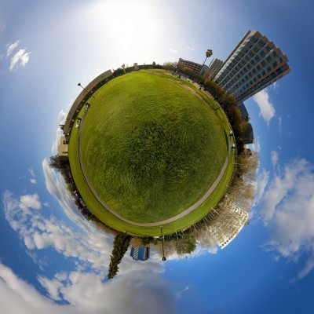
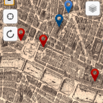
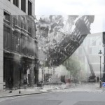
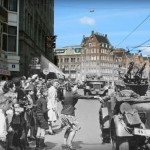

Up to now, this panel has been about multitouch surfaces and interactions with the text. We have discussed how our fingers almost “touch” digital objects through a thin layer on top of a screen. The response is so fast that we start to treat these immaterial objects as if made of real matter. However, in some ways, the interaction is unidimensional and superficial.

I would like to propose going beyond the tactile experience and extend the tangibility to other senses. Imagine a way to interact with an information environment and explore multiple layers of time and space. Spatial exploration is immersive and multidimensional. So, instead of using only a finger as input, the full body acts as a pivot point to produce augmented realities, blending the cyberspace in the physical world. To reach this level of immersive experience, we must take advantage of technologies that digitally embody our senses to bridge the gap between the virtual and the real (Ishii, 2008; Shaer & Hornecker, 2010).

This paper explores the role of Tangible User Interfaces (TUI) and Mobile Media in geolocative projects, especially those focused on mapping historical information at specific locations. Since mobile media offer different means of interaction with the physical space, we can re-appropriate the space to produce new methods of representation and social experiences. Moreover, it also opens new opportunities to more engaging scholarly editions and to explore history in different dimensions.

## Spatial Turn

The concept of space and place that I mention here goes far beyond the definitions used in cartography or geometry. Rather than see space as a neutral environment, it has to be understood as socially produced (Lefebvre, 1992). Thus, instead of just locating a point or shape in a map, space and place emphasizes and, in some way, connects the geographic location to culture and human psychological aspects.

> As Deleuze proposes: "the world is made up of superimposed surfaces, archives or strata" (cited in Mitchell, 2011, p. 71).

The interest of the Humanities in the study of space and place has already been paved down. The Spatial Turn, as some scholars have been calling it, is an interdisciplinary initiative that requires rethinking not only theoretical arguments but also research practices. Following Foucault and Deleuze, Prieto (2011) pointed out that such study must reveal social relations and “spatio-temporal multiplicity”. In order words, it has to emphasize the social representation of the space.

On the other hand, research practices have also been transformed by recent developments in geospatial technology. Since the 1990s, GIS has been used to capture, manage, analyze, and display all sorts of geographically referenced information. Whereas GIS has been criticized for its strong quantitative approach, “some humanities scholars have found that mapping phenomena and cultural objects provide additional insights not previously known” (Harris _et al._ 2011, p. 227). In the last 10 years, many other tools were also made available, enabling spatial exploration to the general public. If we ever thought that we had explored the whole planet, Google Maps showed us that there are many other ways to see and experience the space.

## Mobile Media

More recently, mapping tools were built into mobile devices, which have become ubiquitous in western society, especially in urban spaces, where access to the Internet is widely available. As a result, mobile media turn into a new form of spatial mediation: It adds an interactive digital layer to the physical space. To create this layer, mobile devices use three main features: data wireless connection, Tangible User Interfaces, such as GPS, accelerometer and multitouch screen, and audiovisual tools, like camera and microphone.

The use of mobile media produces an overlapping between physical space and cyberspace. This intersection, named by Lemos as “information territory”, is a new form of what Foucault calls “heterotopia” (Foucault, 1984). As a result, Lemos (2010) claims that “mobile technologies and networks create new urban ecologies that redefine place and our sense of the city, changing our everyday experience of places” (p. 412). Furthermore, the interactions with digital interfaces offer a very real experience, challenging the perception of what is the “real” space (Farman, 2011).

## Mobile Media Projects

Mobile Media and TUI can be used not only to explore the space around but also to study cultural artifacts strongly connected to a specific location. I will briefly talk about four mobile media projects that create an immersive experience by mapping historical information.

### WatsonWalk

Developed by the Editing Modernism in Canada research group at the University of Alberta, WatsonWalk proposes to the user to: “Let Canadian modernist writer Sheila Watson guide you on walks through Paris of the mid-1950s” (WatsonWalk, 2012). The application is a hybrid between a city guide and a scholarly edition, which uses journals, sketchbooks, and manuscripts to bringing the past and the city to life.

### Streetmuseum

Created by the Museum of London, Streetmuseum uses hundreds of images from its collection to create a unique perspective of the old and the new London. “From the Great Fire of 1666 to the swinging sixties” (Museum of London: Streetmuseum, 2010), the application takes advantage of the camera and GPS to create augmented realities, combining the present and the past in one single image.

### Anne’s Amsterdam

Similar to Streetmuseum, Anne’s Amsterdam, developed by Anne Frank House, allows people to explore the city of Amsterdam during World War II through photos, videos, and personal stories. The initiative is based on Anne Frank’s diary and aims to “connect the past to the present \[showing\] how the occupation during World War II left its mark on the city and its people” (Anne’s Amsterdam, 2012).

### fAR-Play

Developed at the University of Alberta, fAR-Play is a framework for the development of augmented reality games. It places virtual points of interests in real-world location aiming to teach users about physical objects near them (fAR-Play, 2013). The most recent game built using fAR-Play is The Intelliphone Challenge. This scavenger game let the user explore the history of the city of Edmonton on the Fort Edmonton Park historical site, making interaction with space a playful experience.

## New approaches

These projects illustrate the opportunities for scholars, especially from the Digital Humanities, interested in the study of space and cultural artifacts. However, up till now, the majority of scholarly geolocative projects are focusing in a small quantity of data to create guided map tours. They also tend to be used only for information consumption, denying to the user any form of an annotation or commenting, except for the use of social network in some cases. I would like to point out different approaches that could bring spatial humanities research to a higher level of experience.

### Annotation

Annotation is crucial for scholars. Therefore, mobile applications should encourage the users to records insights by taking notes, pictures, tagging and highlight information, enabling them to add new data to the system and collaborate with other users. Foursquare and SCVNGR are two example of geolocative applications that use this approach as a way to increase the engagement in spatial exploration.

### Crowdsource and Big Data

Crowdsourced data plays a big role in mobile and social media. So, by allowing multiple views of the same topic, not only can more information be available in the system, but it could also improve the overall experience and produce new insights. Google Maps and Yelp take advantage of user-generated content to explore the social dynamic and create personal recommendations.

### Use other forms of space Interactions

Space interaction is not an exclusive visual experience. We perceive the space using all our senses, including touch, smell, hearing, balance, kinesthetic, temperature, time and pain. For those who are interested in sacred texts and the culture of fifteen-century, for example, it would be possible to listen to old sermons and perceive the acoustic nuances of a longtime destroyed cathedral.

### Wearable devices

In order to create more immersive experiences, we should also look at the development of wearable devices. Google Glass, for instance, proposes hands-free interaction in space using a small projector to overlays digital information in front of the eyesight, making the experience of space more natural and intuitive.

## Conclusion

In short, the act of walking in an urban space implies in a sensorial engagement with space. Mobile media add a digital layer and create an information territory, enabling new ways of interaction with physical places. It also allows spatial re-appropriation, producing new forms of social representation.

This paper aims to highlight the potential offered by mobile media and TUI for Digital Humanities. I believe that scholars should use mobile media not only as a way to explore specific sites but also as a tool to enhance learning and have new insights about the object of study. It is the opportunity for spatial humanities to expand the horizons beyond GIS and bird’s eye mapping, to explore the human view at the street level experience where culture is practiced (De Certeau, 2002).

## Bibliography

Anne’s Amsterdam. (2012). Anne Frank House. Retrieved May 29, 2013, from [http://www.annefrank.org/en/News/News/2012/May/App-Anne-Franks-Amsterdam/](http://www.annefrank.org/en/News/News/2012/May/App-Anne-Franks-Amsterdam/). AppStore: [https://itunes.apple.com/us/app/annes-amsterdam/id520476666?mt=8](https://itunes.apple.com/us/app/annes-amsterdam/id520476666?mt=8)

De Certeau, M. (2002). The Practice of Everyday Life. University of California Press.

fAR-Play. (2013). fAR-Play. Retrieved from [http://farplay.ualberta.ca/far-play/index.php?page=leaderBoard.php](http://farplay.ualberta.ca/far-play/index.php?page=leaderBoard.php)

Farman, J. (2011). Mobile Interface Theory: Embodied Space and Locative Media (1st ed.). Routledge.

Foucault, M. (1984). Of Other Spaces. Architecture /Mouvement/ Continuité. Retrieved from [http://foucault.info/documents/heteroTopia/foucault.heteroTopia.en.html](http://foucault.info/documents/heteroTopia/foucault.heteroTopia.en.html)

Harris, T. M. (2011). Humanities GIS: place, spatial storytelling, and immersive visualization in the humanities. In GeoHumanities : Art, History, Text at the Edge of Place (pp. 226–240). London: Routledge.

Ishii, H. (2008). The Tangible User Interface and Its Evolution. Communications of the ACM, 51(6), 32–36.

Lefebvre, H. (1992). The Production of Space. John Wiley & Sons.

Lemos, A. (2010). Post-Mass Media Functions, Locative Media, and Informational Territories: New Ways of Thinking About Territory, Place, and Mobility in Contemporary Society. Space and Culture, 13(4), 403–420.

Mitchell, P. (2011). The stratified record upon which we set out feet: the spatial turn and the multilayering of history, geography, and geology. In Code/space : Software and Everyday Life (pp. 71–83). MIT Press.

Museum of London: Streetmuseum. (2010). Museum of London. Retrieved from [http://www.museumoflondon.org.uk/Resources/app/you-are-here-app/home.html](http://www.museumoflondon.org.uk/Resources/app/you-are-here-app/home.html). AppStore: [https://itunes.apple.com/ca/app/museum-london-streetmuseum/id369684330?mt=8](https://itunes.apple.com/ca/app/museum-london-streetmuseum/id369684330?mt=8)

Prieto, E. (2011). Geocriticism, Geopoetics, Geophilosophy, and Beyond. In Geocritical Explorations: Space, Place, and Mapping in Literary and Cultural Studies (pp. 13–27). Palgrave Macmillan. Retrieved from [http://www.academia.edu/1650430/Geocriticism\_Geopoetics\_Geophilosophy\_and\_Beyond](http://www.academia.edu/1650430/Geocriticism_Geopoetics_Geophilosophy_and_Beyond)

Shaer, O., & Hornecker, E. (2010). Tangible User Interfaces: Past, Present and Future Directions. Foundations and Trends in Human-Computer Interaction, 3(1-2), 1–137.

WatsonWalk. (2012). Editing Modernism in Canada. Retrieved from [http://emic.ualberta.ca/?page\_id=173](http://emic.ualberta.ca/?page_id=173). AppStore: [https://itunes.apple.com/ca/app/watsonwalk/id538477900?mt=8](https://itunes.apple.com/ca/app/watsonwalk/id538477900?mt=8)

—————

_This work was presented in a panel session at CSDH 2013 in Victoria, Canada._
