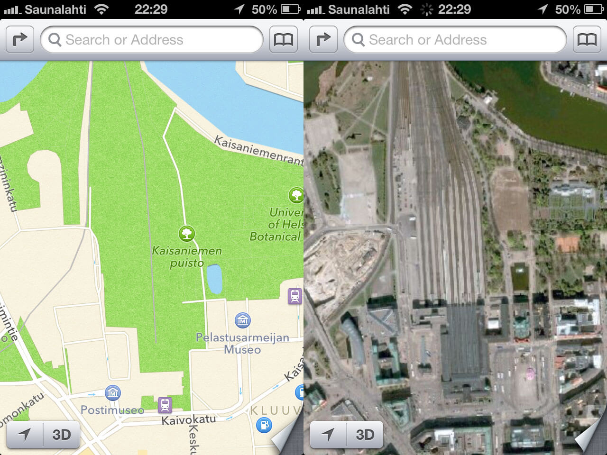

The thing with mobile maps is that once you start using, you don't want to go back. The new Apple Map App, which replaces Google Maps App in the new IOS 6 is very impressive. I am talking mainly about the algorithms behind the software and not about the content information. Apple Map has as many problems as Google Maps had in the beginning. However, Google was the first company to make them available publicly for free. They had their excuse because they were pioneers.

Please don't mess with my world! – A lot of people was pissed with the exchange. The problem is that we start to experience mobility mediated by our smartphone. We want to know exactly where is a specific place, how to get there and how long does it takes. We are transferring our sense of directions to the digital. More important, we are changing the way that we relate to physical space since all we can want to see now is a representation, a simulation of the real. And if this simulation is not perfect (or at least good enough), we lost ourselves in space.

Apple doesn't have all the data to launch a service like that. They probably made millions of user unsatisfied by launching a service that is half-baked and is very directed to the US costumers. If they cannot handle with information outside the US why don't they left Google maps available for consumers from other countries? The image below came from a website "[The Amazing iOS 6 Maps](http://theamazingios6maps.tumblr.com)", dedicated to show mistakes in the App.
