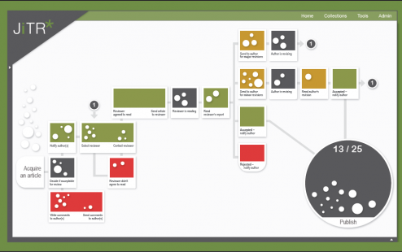
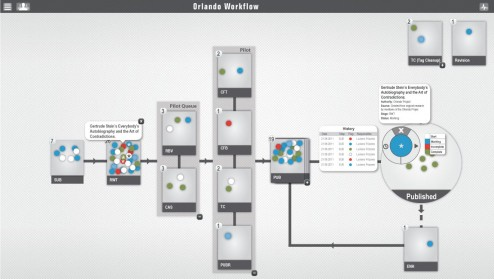
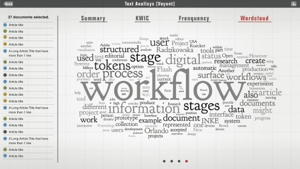
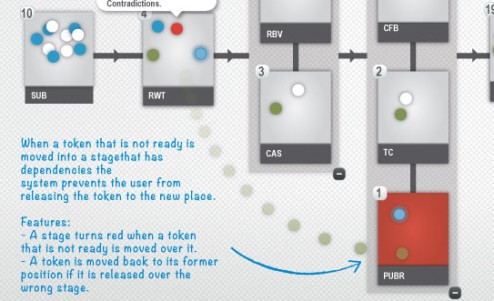
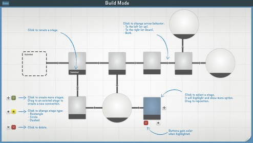
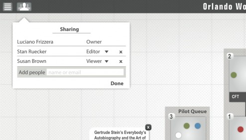
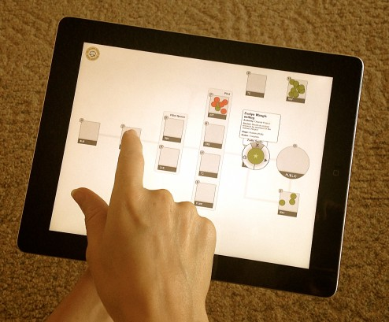

Scholars usually have to deal with many different types of documents spread in various stages, especially in the case of big projects. Piles and piles of documents scattered in many folders waiting for tagging, revision, approval or whatever it is that needs to be completed. There are workflow management tools available to help us, but they often are too specialized and somewhat complex to use. So, how can we make them easier and more flexible?

You can read the paper here, or check more information at INKE website: [http://inke.ca/2012/07/19/luciano-frizzera-presents-at-digital-humanities-2012/](http://inke.ca/2012/07/19/luciano-frizzera-presents-at-digital-humanities-2012/)

**Authors**: Luciano Frizzera, Stan Ruecker, Milena Radzikowska, Geoffrey Rockwell, Susan Brown, and the INKE Research Group

## Introduction

Scholars usually have to deal with many different types of documents spread in various stages, especially in the case of big projects. Piles and piles of documents scattered in many folders waiting for tagging, revision, approval or whatever it is that needs to be completed. There are workflow management tools available to help us, but they often are too specialized and somewhat complex to use. So, how can we make them easier and more flexible?

This research presents INKE’s recent work on supporting the creation of digital materials. We have been using the concept of structured surfaces to investigate both visual and interactive methods in order to make workflows more attractive, flexible, and useful for scholars.

This paper is structured to first give a brief description about INKE and what we do. A summary of workflows and how they have been used will be provided and I will also explain what structured surfaces are and how the concept can be applied to workflows. In the sequence, I will show you a prototype that we are working on, currently in the second version. And finally, I will point out some future directions for this project.

### INKE

Implementing New Knowledge Environments – or INKE – is a 7-year Canadian research project. Currently, in the end of year 3, INKE is led by Ray Siemens at the University of Victoria and has two long-term goals: 1.Contribute to the development of new digital knowledge environments that build on past textual practices and extend them into the digital age; 2.Understand how to combine the traditional strengths of print with the advantages of digital environments in order to produce integrated digital reading tools.

### **Workflows**

Many projects in the digital humanities involve either digitization or enrichment of existing digital materials. The process usually is very similar to editorial jobs and can be understood as a workflow. A researcher first enters the raw text, then encodes, proofs and tests the results. There is a process or workflow to be followed.

Tools for workflow management often take the form of a structured checklist, composed of a collection of stages with transitions, including occasional decision points between them. These tools are widely used in science and business to describe production process models. Recent work in computing science has focused both on workflow analysis (e.g. Schroeder, 2009) and on algorithms for automatic layout (e.g. Albrecht, 2010).

In the humanities, workflow management tools have been used in the context of digital text production. For example, there are workflows in the Public Knowledge Project for its Open Journal Systems and its Open Monograph Systems. However, they are built specifically for certain tasks, making them difficult to adapt and somewhat complex to operate.

There are different approaches to build a workflow. Some methodologies offer better expressibility using graph-based models; others focus more on the complexity of model checking (Lu and Sadiq, 2007). We are interested in producing a visual interface that combines workflow management with an analytics tool that could be used by scholars.

### Structured Surface

Based on our previous work, we began to consider a workflow manager as a kind of structured surface (Radzikowska et al.). According to Radzikowska, a structured surface is “a cognitive interface artifact that provides a layer of meaning that supports the data imposed upon it” (2011). In a workflow manager, the process could be represented by a structured surface, and the documents as tokens that move over the surface, similar to a casino roulette. This strategy could also be used to provide the user with a set of analytic tools in the form of a data visualization.

The interfaces here seek to retain the modularity and flexibility associated with workflow systems while offering a rich-prospect visualization of the collection being managed (Ruecker, Radzikowska, Sinclair, 2011). We proposed that workflow as structured surfaces would offer an easy tool to track information during the processes of production, providing means for people to gain insight into their material while also supporting them with some ways of formulating an argument about the data.

## Earlier Stage

### Target

In the earlier stage of this project, we used a generic workflow from the world of journal editorship. Although, there wasn’t any real content at that time – just placeholders.

### Technology

We chose to use web standards technologies such as HTML, CSS, and JavaScript. So, we started with D3.js, an open source JavaScript library for creating data visualizations. The goal was to launch the workflow from JiTR, a collection management tool developed for such experiments.

### Design

 Figure 1: First version of structured surface editorial workflow uses D3.js to build the interface.

The surface for organizing the status of documents is a pipe-and-flow type of workflow (figure 1). The process is read from the left side, where each document must be accepted before beginning its life within the workflow. Each stage of the process, represented by a rectangle, is a milestone such as decision points, in-progress work and standby moments. The colors reflect the status in the workflow: work in progress (dark grey); needs revision (yellow); rejected (red); accepted (green).

The articles are represented by tokens. The token’s position within the workflow indicates where, along with the process, the article is located; the size illustrates the length of the documents in words. A rollover on the token shows detailed information about the article: title, abstract, name and contact information of the reviewer, and the date when the article went to the reviewer.

### Development Results

What we found with this experiment was that too much information is contained in the structured surface, with very little in the tokens. In our next iteration, we explored placing more information in the tokens, which allowed us to de-clutter our surface.

In terms of technology, we also identified a limitation. Whereas D3.js is a good option to create visualizations using web standards, it was not a good fit to create a fully interactive environment for our experiment. The main limitation has to do with line breaks. As described on the W3C recommendation website, “SVG \[Scalable Vector Graphic\] performs no automatic line breaking or word wrapping” (W3C, SVG-Text 1.1). Since D3.js uses SVG to render graphics on the screen and we want to show multiple lines of information, we decided to look for other options.

## Orlando Workflow

### Technology

For our second version, we are experimenting with Adobe Flash. Some people might argue that Flash is not the best option since it is not supported by smartphones and tablets. Nevertheless, it is possible now to recompile Flash apps in order to create mobile apps for iPhone, iPad, Android and even Blackberry and Playbook. Adobe built-in this feature in Flash Professional and Flash Builder. Although, to create apps for Apple devices and put in the App Store, it necessary to be part of Apple’s developer community. Regardless of the technology used to develop the application, we found that Adobe Flash is a good option to create interactive interface prototypes, which is the main goal of our research, as we are not creating final products, but instead, we are doing experiments.

### Target

We also decided to produce an experiment with more meaningful data, so we partnered with Susan Brown and The Orlando Project. We used some of their editorial jobs, which include the writing of XML-encoded original material for Orlando biocritical entries on women writers. Fifty-four biographical entries were used as a sample for the purposes of this prototype.

### Design

Since we moved from a hypothetical workflow to a workflow predefined by Orlando Project, we had to redesign both the process and the structured surface. The workflow in the Orlando has some particularities. Some stages are non-sequential but required in order to let the document continue in the flow. To illustrate this characteristic we grouped these steps in clusters with a light grey background. Another peculiarity is the existence of optional stages, which can occur independently of the document’s stage. It is represented in the top of the screen, disconnected from the mainstream (figure 2).

 Figure 2: Orlando Workflow is the second version of a structured surface workflow.

The workflow loads the collection of documents and retrieves the metadata. Based on this information, the documents, represented by tokens, are positioned in the workflow. In order to save space, tokens’ position inside a stage is random, so they can stand one on the top of the other. They are color coded in order to show status information: Starting a stage (White); Work in progress (Blue); Incomplete (Red); Completed (Green). A counter box shows the number of documents held at each stage.

As in the first prototype, a balloon showing the title of the document pops up when the user clicks on it. However, what happens in the second prototype is that more details are available for each token. A double click makes the token bigger, revealing a circular control panel and general information such as title, collection and current stage and status of the document.

The control panel gives three options to the user: 1. Access the History Log, which shows the document's progress in the workflow. The logs are displayed in a reverse chronological order, showing when someone performed a modification and giving the name of the person; 2. Access the Status Switcher, enabling the user to change the status information of the document; 3. Tag Mark, which turns on a star icon, making it easier to follow a particular token through the workflow.

Another functionality is the possibility to drag the token around. In this version, the user can drag the token to any stage in the workflow regardless of the sequence. By doing that, the user automatically changes both the stage and the status of the document. Every modification performed in the workflow is auto-saved and generates a new log entry in the history. The system also prevents tokens to be released outside the stages by automatically moving it back to the former position, otherwise, it could disrupt the workflow and confuses the users.

### Development Results

Some issues arose during the process of development of this version. The most important is how to deal with the high density of tokens inside the stage. Whereas it is easy to access one document in a lightly populated stage, in those with a high density the fact that the tokens overlap each other can challenge the user to find or access the information.

Another issue is that the distribution of stages in a linear sequence seems to be a poor representation of workflows. In digital text production, it is common to have parallel actions occurring at the same time. That is, more than one person may be working on different stages of the same article. How to represent, for example, an article that has one person doing the literature review at the same time that another person is digitalizing the data for exploration?

 Figure 3: Connection between Voyant and workflows could help users identify issues during the editorial process.

## Future Directions

For the next versions, we are planning to implement features to enhance the user experience and the awareness of the system such as 1. Implementing Zooming User Interface using Semantic Zoom, which is a form of details on demand that lets the user see different amounts of information by zooming in and out. It could solve issues regarding the high density of the tokens and make room for other functionalities such as filters and sort options; 2. Collapsing Stages: Simplifying the flowchart and give the option to the user to hide some steps that might not concern them; 3. Notification Center: To help the users to keep track on updates.

 Figure 4: Stage’s dependency is a fundamental feature to control information through the workflow.

On the analytics side, we are planning to connect the workflow with Voyant, a collection of text analysis tools. An editor might decide, for example, to take a look at a KWIC concordance for a term in every accepted article in the current edition, or run a word cloud on all the articles that have been accepted or rejected (figure 3). The word cloud of acceptances might provide some guidance in writing an introductory editorial, for instance, while the latter might help the editor see whether there is a gap in reviewer expertise at work. Support for these sorts of curiosity-driven activities within the editorial process itself has the potential to change the nature of the task in a variety of ways.

 Figure 5: Sketch showing how to deal with workflow authoring and customization.

Comments and questions from collaborators also suggested some future directions for this project. One of the basic features in workflows is the dependencies between stages. For example, an article should just be published after a peer-review phase was done. Without rules to govern the workflow, the whole system ceases to be a guideline and could confuse the users. One way to solve this problem is to prevent the tokens from being reallocated to stages that have dependencies if the current stage is not done (Figure 4).

 Figure 6: Sharing feature could improve collaborative work by informing work progress.

Customization and automatic layouts could help users to produce and organize their own workflows (figure 5). In the current version, the workflow is prebuilt in the system. We want to let the users create workflows for dealing with their own data. A supervising professor, for instance, could create a workflow to manage papers, conference presentations and student thesis proposals in their different stages. Thus, the stages, status, and metadata could vary according to the use of the workflow. For this reason, automatic layouts may be useful to enhance the readability by organizing the stages and reducing crossover in the pathways.

Shared workflows could improve the collaborative work in digital humanities. By sharing workflows, partners and collaborators could follow the jobs’ progress and get a sense of how the projects are moving (figure 6). However, shared workflows pose questions about authority to move tokens around the workflow as well as the information synchronization.

 Figure 7: Multi-touch devices could help the project manager to keep workflows update.

At last, but not the least, we also intend to extend the experiment to different devices, in particular, multi-touch platforms such as smartphones, tablets, tables, and walls. On the one hand, the mobility of some of this devices could help project managers to keep up on projects and take actions whenever necessary (figure 7). On the other hand, big displays on multi-touch tables and walls may provide a better way to see and manipulate the documents.

However, we have yet to perform usability tests in order to confirm or refute our assumptions and the interface’s effectiveness, which we are planning to start during the next semester.

## Conclusion

In short, we have been using the concept of structured surfaces to investigate both visual and interactive methods in order to make workflows more attractive, flexible, and useful for scholars. It has resulted so far in a series of sketches and a prototype of a workflow interface for editorial process management, which the purpose is to offer an easy way to track information during the processes of production at the same time that provides means to gain insight about the data.

## REFERENCES

Albrecht, Benjamin, Philip Effinger, Markus Held, and Michael Kaufmann. 2010. An automatic layout algorithm for BPEL processes. In Proceedings of the 5th international symposium on Software visualization (SOFTVIS '10). ACM, New York, NY, USA, 173-182. [http://doi.acm.org.login.ezproxy.library.ualberta.ca/10.1145/1879211.1879237](http://doi.acm.org.login.ezproxy.library.ualberta.ca/10.1145/1879211.1879237)

Canadian Writing Research Collaboratory. [http://www.cwrc.ca](http://www.cwrc.ca)

Lu, Roupeng and Sadiq, Shazia. 2007. A survey of comparative business process modeling approaches. Business Information Systems (pp. 82–94).

Open Journal Systems Documentation. [http://pkp.sfu.ca/files/OJSinanHour.pdf](http://pkp.sfu.ca/files/OJSinanHour.pdf)

Open Monograph Project. [http://pkp.sfu.ca/omp](http://pkp.sfu.ca/omp)

Orlando Project. [http://www.ualberta.ca/orlando](http://www.ualberta.ca/orlando) - [http://orlando.cambridge.org](http://orlando.cambridge.org)

Radzikowska, Milena, Ruecker, Stan, Brown, Susan, Organisciak, Peter and the INKE Research Group. 2011. “Structured Surfaces for JiTR.” Paper presented at the Digital Humanities 2011 conference. Stanford, June 19-21, 2011.

Ruecker, Stan, Radzikowska, Milena and Sinclair, Stéfan. 2011. Visual Interface Design for Digital Cultural Heritage: A Guide to Rich-Prospect Browsing. Farnham, Surrey: Ashgate Publishing, 2011.

Schroeder, Will. 2009. “New tools for task workflow analysis.” In Proceedings of the 27th international conference extended abstracts on Human factors in computing systems (CHI EA '09). ACM, New York, NY, USA, 3877-3882. [http://doi.acm.org.login.ezproxy.library.ualberta.ca/10.1145/1520340.1520587](http://doi.acm.org.login.ezproxy.library.ualberta.ca/10.1145/1520340.1520587)

W3C. SVG-Text 1.1. [http://www.w3.org/TR/SVG/text.html](http://www.w3.org/TR/SVG/text.html)

Weaver, Chris. 2007. “Patterns of Coordination in Improvise Visualizations”. Visualization and Data Analysis (p. 12). Presented at the Proceedings of the IS&T/SPIE, São José, CA. USA. [http://www.cs.ou.edu/~weaver/improvise/architecture/architecture-patterns.html](http://www.cs.ou.edu/~weaver/improvise/architecture/architecture-patterns.html)

—————

_This work was presented in a long paper session at DH 2012 in Hamburg, Germany._
