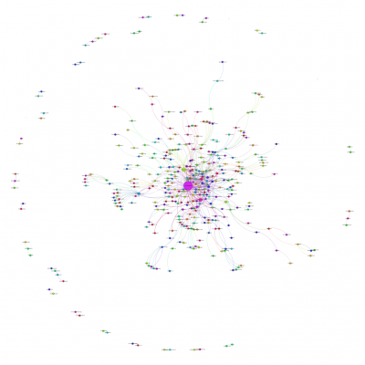

Throughout the last summer, I was volunteering to work with [Edmonton Pipelines](http://edmontonpipelines.org/), a research group based at the University of Alberta. I participated in an awesome experiment called [#yeglongday](http://edmontonpipelines.org/yeglongday/), in which during the longest day of the year, June 21st, we host an event on digital social media environments. We invited Edmontonians to submit tweets, narratives, pictures, videos, and posts that would illuminate what it means to live the longest day in one of the most northern cities in the world. What does the city look and feel like under all that sun?, we asked. How do you spend all that time?

Samia Pedraça and I worked mapping the network formed by the community ion the fay around the hashtag [#yeglongday](https://twitter.com/search?q=yeglongday%20&src=typd) on Twitter. It was our first experience with social network analysis using [Gephi](https://gephi.org/). Here is one of the results of our explorations:

