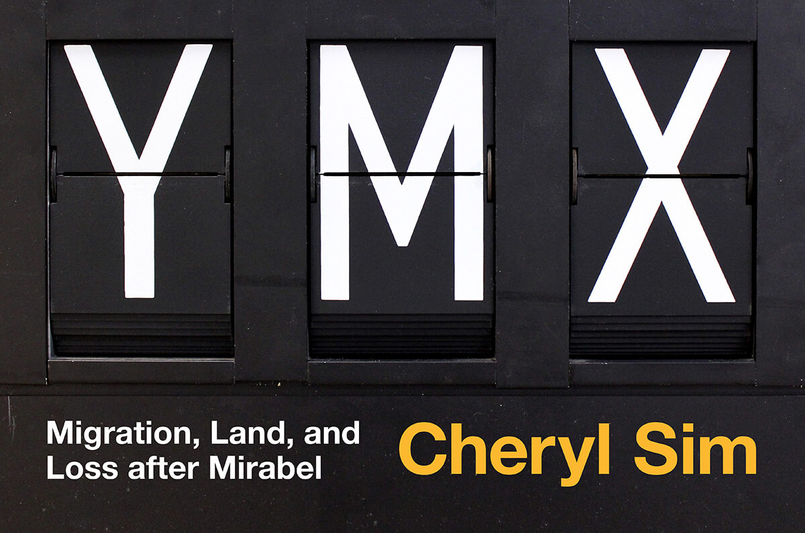

Inspired by the acquisition of two Solari split-flap information displays from Mirabel Airport by Matt Soar, Associate Professor of Communication Studies at Concordia University, the Montréal Signs Project put together the installation _YMX: Migration, Land, and Loss after Mirabel_ by Cheryl Sim. Sim’s exhibition speaks to the parallel stories of displacement and forced migration: those dispossessed of their land to build the airport and the thousands of people who arrived at Mirabel escaping war, disaster, or economic adversity.

Continuing her immersive installation practice and single-channel video work, Sim enlivens the intersecting narrative lines that run through the airport: of belonging and escape, the force of borders and the perpetuation of colonialism. A labyrinth of crowd control stanchions leads to the memories of Pierre Nepveu, Prem Sooriyakumar, and Kim Thuy: three experiences of Mirabel. Sim’s video work weaves together these voices—both _exproprié_ and refugee—together with archival footage of the airport and the protests that followed its creation. The installation also speaks to the governmental response to the Kanien'kéha:ka of Kanesatake’s claim to the land, whose unresolved petition dates back to 1718, 257 years before the airport opened. At the heart of the maze, the two bright yellow split-flap displays whisper to one another about land and home, resistance and politics, arrival and departure. Sim’s installation digs deep into layers of history to intricately address land, movement, and safety.

I had the opportunity to work with Matt Soar and Cheryl Sim on this project helping them to visualize the immigration data provided by the Canadian Government. Some of the visualizations were present in the exhibition.

_The exhibition took place at the Galerie POPOP (Belgo Building), Montreal, between March 29 and April 13, 2017._
