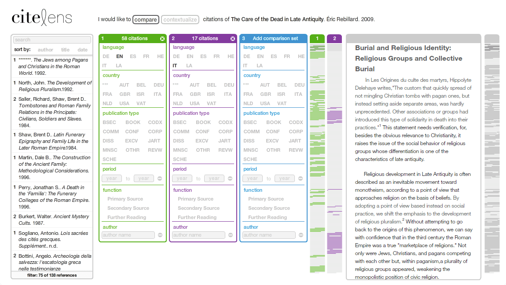
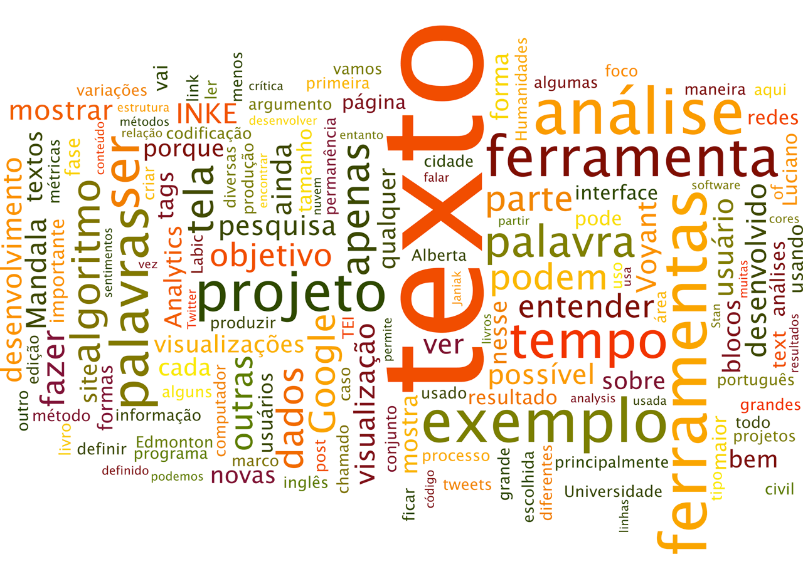
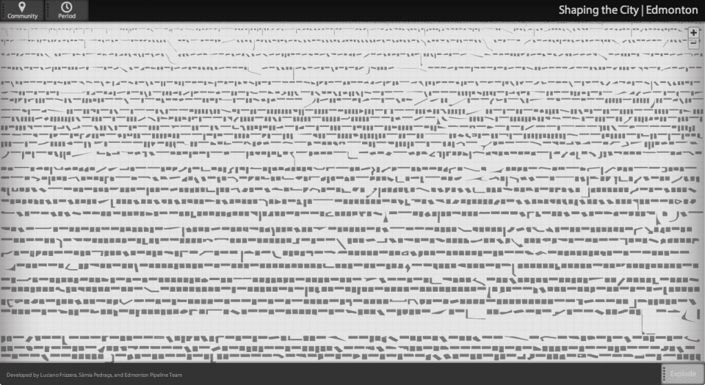

Faço parte de um grupo de pesquisa chamado [INKE](http://inke.ca/) (Implementing New Knowledge Environment - Implementado Novos Ambientes de Conhecimento). O principal objetivo do INKE é estudar novas formas de leitura do texto, principalmente livros e texto acadêmico, e é liderado por Ray Siemens (University of Victoria). O projeto é multidisciplinar e envolve mais de 60 pesquisadores em diversas áreas espalhados por diversas universidades no Canada e no exterior. O INKE é dividido em subgrupos temáticos. Na Universidade de Alberta o foco é em [design de interfaces](http://research.artsrn.ualberta.ca/inke/) e é coordenado por Geoffrey Rockwell (University of Alberta) e Stan Ruecker (Illinois Institute of Technology - Institute of Design – ITT ID).

O foco do INKE é voltado mais para processo e menos para o produto. Ou seja, o objetivo não é apenas a análise do resultado final da ferramenta, mas principalmente o desenvolvimento de novas formas de visualizar esses resultados para produzir novas análises e novos questionamentos. Por isso, a pesquisa usa o desenvolvimento de protótipos como forma de argumento. Isto é, ao desenvolver novas ferramentas, nós não apenas passamos a compreender como codificar as informações para que possa ser lido pelo computador, mas também aprendemos a construir o algoritmo que vai tratar esses dados.

Para desenvolver esses aplicativos, adotamos o método chamado [Agile](http://en.wikipedia.org/wiki/Agile_software_development), muito usado atualmente na ciência da computação. Esse processo funciona em círculos concêntricos de produção tendo em vista o menor produto viável, misturando desenvolvimento, teste e análise. Por exemplo, pode-se trabalhar em ciclos semanais, no qual a cada semana um parte do projeto é desenvolvido e testado com o intuito de descobrir se estamos no caminho certo, ou se algo precisa ser melhorado ou alterado. Esse método permite maior flexibilidade se comparado a outros métodos chamados top-down (de cima para baixo), em que o projeto é todo definido antecipadamente não deixando espaço para qualquer tipo de mudança. Por conta da rápida mudança tecnológica, por exemplo, um projeto que não tenha flexibilidade pode rapidamente ficar obsoleto.

Um dos projetos que estamos desenvolvendo e que usa essa metodologia se chama **CiteLens**, uma ferramenta para visualização de citações em textos acadêmicos da área de Humanas. Esse projeto é parte da tese de mestrado de Mihaela Ilovan, cujo objetivo é  entender a estrutura de referencias bibliográficas nesses textos: porque e como citamos outros autores? Já existem alguns estudos nesse sentindo na área de ciências exatas, mas a construção do argumento é muito diferente entre as áreas. Nas ciências exatas, as pesquisas são geralmente produzidas em cima de resultados de pesquisas anteriores, criando linearidade e sequêncialidade na ordem argumentativa. Por outro lado, nas Humanas, a argumentação é muito mais complexa. Diferentes leituras podem ser feitas de um mesmo texto e o teor dos argumentos podem ser muito subjetivos. Uma série de referências, tanto primárias e secundárias, são usadas, ou para dar suporte ao argumento do autor ou para rechaçar alguma informação.

O mais intrigante para mim, que nunca tinha feito uma análise de citações como essa, foi perceber que a maior parte do texto que estamos analisando é de alguma forma referenciado em outras obras. Menos da metade do corpo do texto é, digamos, autoral. Mas voltando ao foco principal que é a produção da ferramenta e o algoritmo que a descreve. Aprender a lidar com o algoritmo e entender como ele é construído, é fundamental para análises métricas. Basta uma mudança em qualquer dos parâmetros usados, seja ele cor, tamanho, quantidade, variedade ou mesmo um pequeno erro de digitação, é o suficiente para mudar completamente o resultado mostrado na tela do computador. Logo, como saber se o que nos é mostrado na tela é o que de fato deveríamos ver?

Um exemplo interessante e que ilustra bem o que estou querendo dizer é a Word cloud ou nuvem de palavras. Essa ferramenta foi bastante difundida nos blogs para mostrar o número de post em uma determinada categoria. Se usada em um texto, a nuvem mostra as palavras mais usadas no texto. Geralmente as palavras nesse gráfico tem os seguintes atributos: tamanho, posição, orientação e cor. Vamos a um pequeno questionamento: O que é métrica nessa nuvem de tags produzida no [Wordle](http://www.wordle.net)?

A cor é a automática ou escolhida em uma paleta de cores. Nada tem a ver com o texto: é apenas uma escolha estética. A orientação segue o mesmo padrão. A posição da palavra também não diz muito: há palavras grandes e pequenas em todos os espaços. A única métrica aqui é o tamanho da palavra: o tamanho é proporcional a frequência dela no texto – quanto maior a palavra, mais vezes ela foi usada. Isso parece óbvio hoje depois de mais de uma década de uso em blogs. Mas e se quisermos dar significados às cores? Se o texto fosse uma conversação nas redes sociais poderíamos atribuir diferentes cores a diferentes usuários, por exemplo. Da mesma maneira, a orientação poderia refletir opiniões positivas e negativas; e a posição, a relação de rede entre os envolvidos. O que quero dizer é que se não soubermos o que a ferramenta faz, elas podem nos induzir a erros de análise.

E isso me leva a outro exemplo. E esse me induziu ao erro por um bom tempo. Por algum tempo fui desenvolvedor de websites e usava Google Analytics para rastrear visitas e informar aos meus clientes sobre as atividades dos usuários no site. Uma das muitas métricas do Google Analytics é o tempo de permanência do usuário no site.  O que eu não conseguia entender era porque o tempo de permanência nos website que desenvolvi era na maior parte entre 0s e 10s. Será que meus sites eram tão ruins assim? Será que não interessavam a ninguém?

O fato é que descobri a resposta para esse problema apenas há dois dias, em um [post no blog de Pawel Janiak](http://paweljaniak.co.za/2013/05/12/0-second-visits/). Janiak explica que toda vez que um usuário entra em uma página em um site rastreado pelo Google Analytics, a hora do acesso é gravado. Quando o usuário clica em um link e passa para uma segunda página no site, a hora é novamente registrada. A partir desses dados o Google Analytics compara o tempo entre o acesso das duas páginas e define esse intervalo como permanência na primeira página aberta. Por exemplo, se você entrar na homepage de um grande portal de notícias, ficar um minuto lendo as manchetes e escolhe uma matéria para ler mais. O tempo de permanência na homepage será de um minuto. A seguir, você leva cinco minutos para ler a matéria, mas não clica em nenhum link e fecha o navegador. Por padrão o Google Analytics vai registrar o tempo de visita na segunda página como 0 segundos. O motivo é que ele não tem um segundo parâmetro para comparar. Dessa maneira, o resultado que vejo no Google Analytics não reflete a realidade. No post, Janiak da algumas dicas para contornar e resolver essa distorção.

Isso mostra que precisamos prestar mais atenção em como o programa foi desenvolvido e o que há por trás do código. Não estou dizendo que agora temos que fazer todo o caminho de volta e estudar linguagem de máquina ou eletrônica para poder entender o que se passa por trás dos programas que usamos. Mas concordo com o argumento de Stephen Ramsay, no livro Reading Machines, de que devemos fazer a crítica do algoritmo, uma vez que ele também é culturalmente construído.

A maior parte das linguagens de programação são descritas em inglês, por exemplo; poucas são em outras línguas. E isso afeta muito a forma com o que o computador lida com a informação. Sempre há uma perda na tradução. Computadores são bons com números, mas não muito espertos com a subjetividade do texto – ainda. Tome como exemplo o Google Translator, que venho usado com frenquência para tirar dúvidas de tradução. Muitas vezes as frases perdem ou mesmo invertem o sentido. Isso também acontece com as traduções da interface feitas para software. Se não me engano, a primeira tradução do Twitter para português foi em português de Portugal. Mas nesse caso, como era apenas na interface, não tinha muita diferença. Entendemos que Acção é ação. Mas e se estamos usando um programa de análise de texto e de conteúdo? Como saber se o que o programa mostra na tela é realmente o que esperávamos ver?

Há algumas semanas tive uma longa troca de comentários no Facebook com 3 pesquisadores do Labic sobre análise de sentimentos no Twitter. A conversa foi desencadeada por um post do Alan Marquez sobre um app para análise de sentimentos para Windows 8. O problema era que o app está em inglês. Obviamente ele não vai entender as palavras de um texto em português. Sugeri então produzir nosso próprio app, o que gerou empolgação e curiosidade. Não deve ser muito difícil: devemos primeiro construir um dicionário de sentimentos e atribuir valores, ao menos positivo e negativo, para as palavras. Com um pouquinho de conhecimento em alguma linguagem de programação podemos produzir um código para comparar as palavras de um tweet ao dicionário e avaliar a sua subjetividade. Podemos fazer isso com milhões de tweets e produzir visualizações para análise.

No entanto, logo vamos descobrir que o resultado não é bem reflexo da realidade. Apenas definir se uma palavra é positiva ou negativa não é suficiente. Temos que analisar o contexto de cada palavra em cada tweet. Por exemplo, como avaliar os seguintes tweets: “Eu apoio o marco civil da Internet”, “Eu não apoio o marco civil da internet”, e “Eu apoio o marco civil da internet #soquenao”. Não quero me aprofundar em como desenvolver esse algoritmo, mas mostrar que ao produzirmos, vamos definir exatamente o que vamos ver como resultado na tela. Vamos entender também como essas ferramentas funcionam e aprender a fazer a crítica desse algoritmo.

Estendo meus argumentos aos programas de métricas de redes, como o Gephi. Se não entendermos os parâmetros que constroem e controlam aqueles gráficos super complexos e coloridos mostrando as conexões da rede digital, podemos nos perder na beleza estética que eles carregam. É importante definir o que é nó, o que é link e o que significam os agrupamentos. Fico feliz de ver que há alguns trabalhos interessantes sendo desenvolvidos no Labic nesse sentido. Mas é preciso ainda aprofundar a leitura desses gráficos. Mais do que um gráfico quantitativo, mostrando distribuição, formação de redes, hubs e autoridades, precisamos de gráficos qualitativos, fazendo análises semânticas do conteúdo que se fala nas redes.

Para finalizar, gostaria de enfatizar que esse trabalho deve ser interdisciplinar. Esse é um ponto fundamental nas Humanidades Digitais. A colaboração entre diferentes áreas, principalmente entre as Humanidades, Ciências Sociais e Ciência da Computação é muito importante para o desenvolvimento de novos métodos de pesquisa. Os projetos nessa área começam a ficar muito grandes e produzem desafios que não são facilmente resolvidos por uma ou outra disciplina sozinha.

Cartografar controvérsias, um dos eixos deste evento, requer muito mais do que a área de comunicação nos oferece. Ferramentas de text mining, text analysis e visualizações podem nos ajudar. Mas se não olharmos criticamente para o código, ou pior, se não entendermos como o resultados na tela do computador foram construídos e o que eles significam, corremos o risco de ser induzidos a erros ou fazer análises rasas e de pouco valor.

Para não ficar só falando do método e da crítica, vou mostrar para vocês mais alguns projetos que estamos desenvolvendo no INKE, e também outras ferramentas para análise de texto que fui coletando durante esse tempo que estou aqui.

Ja falei do CiteLens, projeto que comecei a trabalhar em 2011. É apenas um protótipo para estudo, e que ainda está em desenvolvimento. Durante a produção das visualizações começamos a questionar nosso próprio algoritmo e descobrimos que havia algo errado na filtragem dos parâmetros. O algoritmo interpreta o texto como um todo, ou seja, a codificação deveria estar completa. Mas como ainda estamos trabalhando no tageamento do texto, tivemos que estacionar o projeto até que essa fase se complete. É importante notar que, por causa das visualizações preliminares, podemos refinar a forma que estávamos estruturando a codificação do texto.

Ano passado iniciamos um projeto chamado [MtV – Multitouch Variorum](https://vimeo.com/70527973) – usando uma das peças de William Shakespeare, a Comédia dos Erros. Bom, primeiro o que é um “Variorum”?. Variorum é uma edição para estudos acadêmicos que reúne diversas versões de um texto em um só livro. No caso da Comédia dos Erros, a edição mais recente editada por Standish Henning reúne 69 versões diferentes da peça. A obra é organizada em torno de um texto base, a edição definitiva escolhida pelo editor, de modo que se possa ler a peça inteira, mas que também mostre as variações em cada linha do texto. Cada página do livro mostra algumas poucas linhas da edição escolhida pelo editor, as variações encontradas nessas linhas, e notas de rodapé contendo comentários relativos ao trecho impresso.

<iframe
  allow="fullscreen; picture-in-picture; clipboard-write; encrypted-media; web-share"
  allowfullscreen
  class="rounded-lg w-full md:h-max aspect-video object-cover"
  loading="lazy"
  src="https://player.vimeo.com/video/70527973?h=36e12598a6"
  title="vimeo-player"
  referrerpolicy="strict-origin-when-cross-origin"
/>

Esse tipo de estudo é muito importante em estudos literários, onde o autor, nesse caso Shakespeare, não tinha intenção de publicar o texto, mas de utiliza-lo no teatro em conjunto com outras formas de expressão performáticas. Estudos das variações do texto também são essenciais para Teologia, Filosofia, e para qualquer tipo de investigação a cerca do conhecimento antes da invenção do livro, como também das culturas orais. Pensem na quantidade de possíveis variações produzidas pelas dezenas de traduções e interpretações nos textos de Platão ou mesmo nos livros da Bíblia, por exemplo. Em termos mais contemporâneos, esse tipo de estudo pode ser usado para analisar as controvérsias nos artigos da Wikipedia, muitas vezes editados por várias pessoas ao mesmo tempo, ou mesmo as várias versões de códigos e algoritmos.

Pois bem, o projeto MtV tem como objetivo pensar uma interface para estudar variorum usando tela multitouch de grandes proporções, onde pelo menos dois usuários possam interagir com a informação ao mesmo tempo. Para esse projeto está sendo usada uma tela de 52 polegadas de alta resolução (4k x 2k pixels), o que permite distribuir várias janelas, ou edições, pelo espaço digital. O grande desafio é entender como essas novas formas de interação, mais especificamente telas sensíveis ao toque, podem auxiliar ou até melhorar o aprendizado e o desenvolvimento da pesquisa. Veja aqui baixo o video do primeiro protótipo:

\[vimeo id="70527973" mode="normal" align="right"\]

Saindo dos projetos do INKE, vamos a outras ferramentas de análise de texto que podem ser úteis para o Labic e o MediaLab/UFRJ. Infelizmente não serei capaz de fazer um tutorial do Mandala como me foi pedido. Primeiro porque, como já disse, não sou usuário do Mandala. Meu foco está mais no processo de produção do que no uso do produto para análise. Segundo porque ele não abre mais no meu Mac desde que atualizei o Java. No entanto, posso falar rapidamente como ele funciona.

O [Mandala](http://mandala.humviz.or\)) é um projeto desenvolvido em 2005 por Stan Ruecker, um dos meus orientadores no INKE. Ele é parecido com o [Gephi](https://gephi.org/), só que mais simplificado. O Mandala também gera visualizações mostrando conexões entre palavras-chaves e a formação de redes entre elas. Ou seja, é uma ferramenta para visualização e análise de conteúdo, com capacidade de ler arquivos de texto comum, como TXT, embora seja mais útil e mais preciso se o texto estiver estruturado em XML ou CSV. O que a ferramenta faz é reconhecer os elementos do texto como entidades: podem ser palavras, atores, usuários, hashtags ou qualquer parâmetro definido na estrutura da informação. Para cada entidade, o software cria um elemento na tela, uma bolinha. A partir daí o usuário pode filtrar os elementos e ver a relação entre eles.

No texto da peça Romeu e Julieta, que vem como exemplo no Mandala, é possível ver as relações entre os personagens, por exemplo. Da mesma maneira, é possível abrir o banco de dados de tweets sobre o marco civil da Internet no Brasil e observar a relação entre usuários ou entre palavras-chaves. Observem que todas as entidades estão presentes na tela. Stan chama isso de Rich Prospect Browser, isto é, uma forma de visualização em que o usuário nunca perde o todo de vista, mesmo quando ele foca em uma parte dos dados. Notem também que os nós são definidos por palavras-chaves caso o arquivo não tenha nenhuma formatação. Entretanto, é possível definir os dados se o CSV estiver bem formatado ou usando XML.

Estruturar os dados é parte importante do processo de análise. Uma das maneiras de criar essa estrutura é seguindo as normas do TEI – Text Encoding Initiative. TEI é uma iniciativa do final dos anos 80 com o objetivo de criar um padrão de codificação do texto para análises semântica. HTML – HyperText Markup Language, por exemplo, é uma codificação estrutural e visual predefinida para interpretação do texto pelo navegador. Se você coloca uma palavra entre as tags `<b>`, por examplo, o navegador vai mostrar essa palavra em negrito. No entanto, ao invés de HTML, o TEI usa XML – Extensible Markup Language, o que o torna mais flexível, ou seja, você pode criar suas próprias tags. Pegue a frase: “Luciano mora em Edmonton”, por exemplo. Uma ferramenta como o Mandala consegue separar os elementos, mas não sabe que cada um deles significa. São apenas palavras. Porém, se você tagear “Luciano” com a tag <pessoa>, e Edmonton com a tag <cidade>, você pode construir um algoritmo para interpretar essas tags. Logo, Luciano não é apenas uma palavra, mas uma entidade semântica com valor definido.

O [TEI](http://www.tei-c.org/index.xml) é na verdade um guia que tenta normalizar o uso dessas tags com o objetivo de tornar as os textos tageados mais intercambiáveis. Funciona como as tags usadas no Twitter: (@) arroba, que identifica o usuário e o (#) hashtag, que identifica o tópico.

Voltando às ferramentas. [Voyant](http://voyant-tools.org) é um conjunto de ferramentas para fazer text analysis. Foi desenvolvido por Stéfan Sinclair e Geoffrey Rockwell, que é meu orientador. Essa é uma ferramenta muito simples de usar: basta entrar no site e carregar um texto ou uma coletânea de texto. O Voyant vai processar os dados e mostrar uma série de informações na tela: Nuvem de texto, freqüência de palavras, e palavra-chave em contexto. Essa última, também conhecida como Keyword in Context é muito útil para fazer análise qualitativa. Quando uma palavra é selecionada, esse painel mostra todas as ocorrências da palavra e um trecho do texto que vem antes e depois da palavra escolhida. O Voyant tem ainda um recurso interessante chamado stop-words. Nada mais é do que um dicionário de palavras, geralmente as de uso muito comuns, como artigos e preposições. Uma vez que esse recurso é ativado, o Voyant elimina essas palavras da análise. Stop-words contem dicionários em inglês e mais seis línguas, mas não o português. Contudo, o Voyant é bem aberto no qual é possível editar, além de montar sua própria lista.

Como disse, o Voyant é um conjunto de ferramentas. Nem todas estão presentes no link anteriormente mencionado. Vocês podem encontrar outras ferramentas no site do [Tapor](www.tapor.ca). [Bubblelines](http://voyant-tools.org/tool/Bubblelines/), por exemplo, é uma das ferramenta do Voyant cujo objetivo é visualizar ocorrências de termos ao longo do texto ou em coletâneas de texto. É muito útil para encontrar tendências e formação de ideias.

Gostaria ainda de apresentar uma última ferramenta de visualização, essa mais voltada para construção de mapas. Participei do desenvolvimento do **Shaping the City** em outro grupo de pesquisa, o Edmonton Pipelines. O objetivo da ferramenta é separar a cidade em blocos, usando as ruas como delimitadores, e descontextualizar esse bloco de sua localização geográfica. Na primeira fase do projeto mapeamos 114 bairros em Edmonton, em um total de mais de  quatro mil blocos. Com a ferramenta é possível filtrar o mapa da cidade por bairro, ou período. E mais, é possível explodir o mapa e organizar os blocos de outra forma. A versão mais recente permite organizar os blocos por tamanho, por bairro ou por período. A segunda fase do projeto apresentará o mapeamento da cidade inteira: serão mais de 300 bairros e estimamos cerca de 10 mil blocos. A intenção é também criar novas formas de organização dos blocos como: densidade populacional, renda, tweets ou qualquer outro dado que seja geolocalizado.

Há muitas outras ferramentas, desenvolvidas por pequenas e grandes iniciativas, que não terei oportunidade de mostrar agora, mas gostaria de ao menos citar:

- [ManyEyes](http://www-958.ibm.com/software/analytics/manyeyes), desenvolvido pela IBM, é um conjunto de ferramentas para visualizações de dados e é muito fácil de usar.
- [Google n-gram](http://books.google.com/ngrams), mostra a ocorrência de palavras na coleção de livros do Google. A coleção, disponível apenas com textos em inglês, começa a partir do século XIX.
- [ChronoZoom](http://www.chronozoomproject.org), uma ferramenta fantástica de visualização de linha do tempo em ZUI – Zooming User interface.
- Há varias outras ferramentas de timeline, como o [Dipity](http://www.dipity.com) e o [Simile-Widget](http://www.simile-widgets.org), que permitem a construção de linhas do tempo de maneira simples.

Para finalizar, quero indicar duas iniciativas de agregação de ferramentas para Humanidades Digitais, onde é possível encontrar muitos outros apps e também contribuir para o crescimento e melhoramento dessas ferramentas:

- [Tapor Portal](http://tapor.ca): Como já havia mencionado, é desenvolvido pela Universidade de Aberta. Não é muito grande, mas contém lista e review de ferramentas, principalmente as desenvolvidas localmente.
- [Bambo Project](http://dirt.projectbamboo.org): Esse é bem grande e com diversas categorias que vão além da análise de textos.

Agradeço a oportunidade de poder participar desse [HackLabViz(x)](http://www.labic.net/blog-2/noticias/hacklabvizx-cartografias-das-controversias-tecnopolitica-e-visualizacao-de-dados-de-redes-sociais-da-internet/), e me coloco à disposição para qualquer questionamento ou dúvida que possa ter surgido. Sinta-se a vontade para comentar e colaborar com esse texto.

\-----------------------

*Esse texto foi apresentado no HackLabViz(x) Labic 2013, em 15 de Maio de 2013 e posteriormente editado e expandido para ser publicado nesse blog.*
