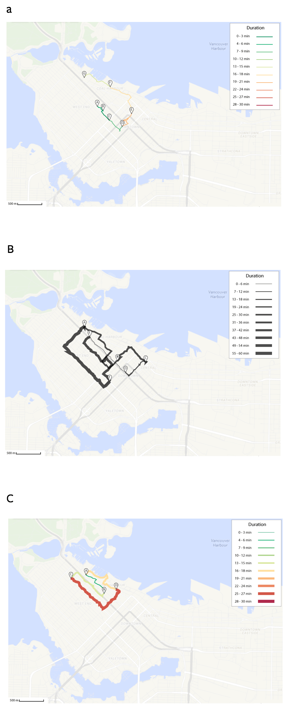
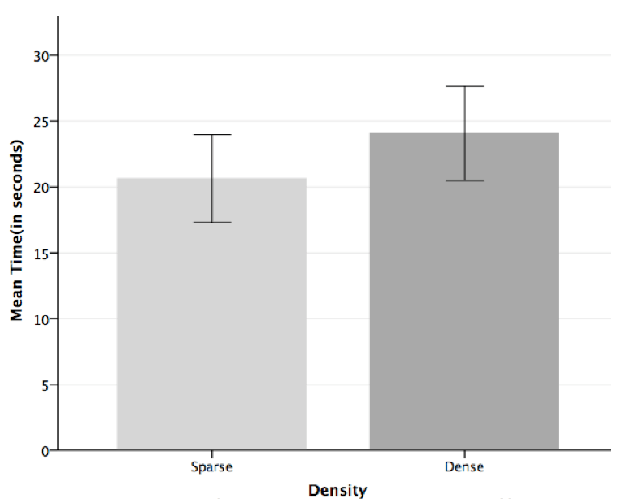
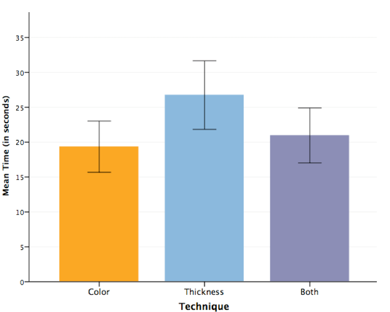
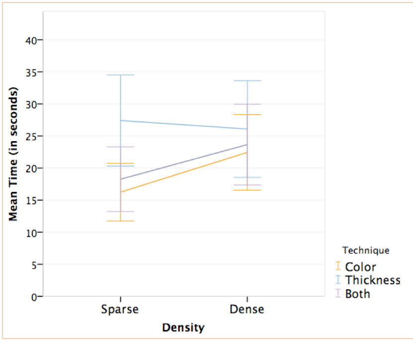
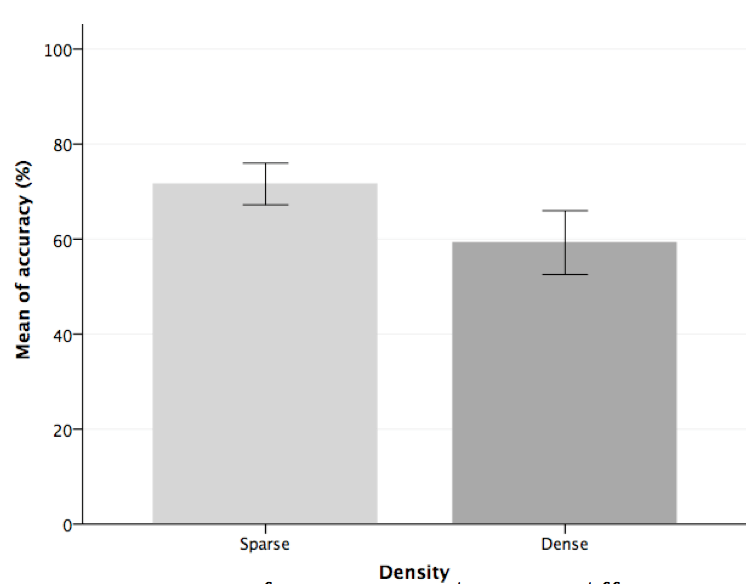
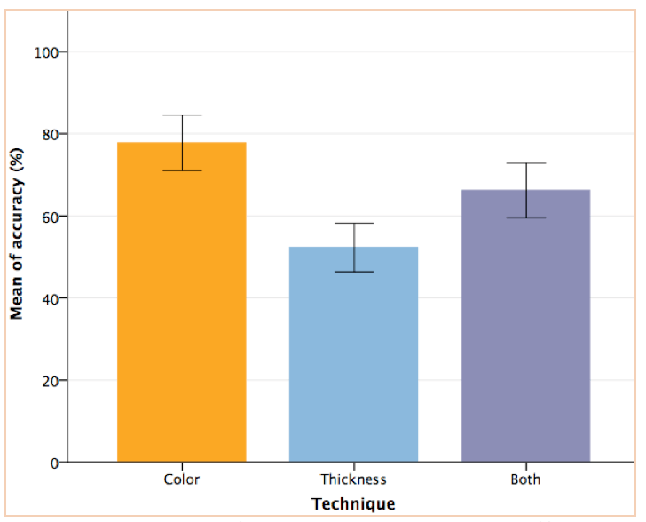
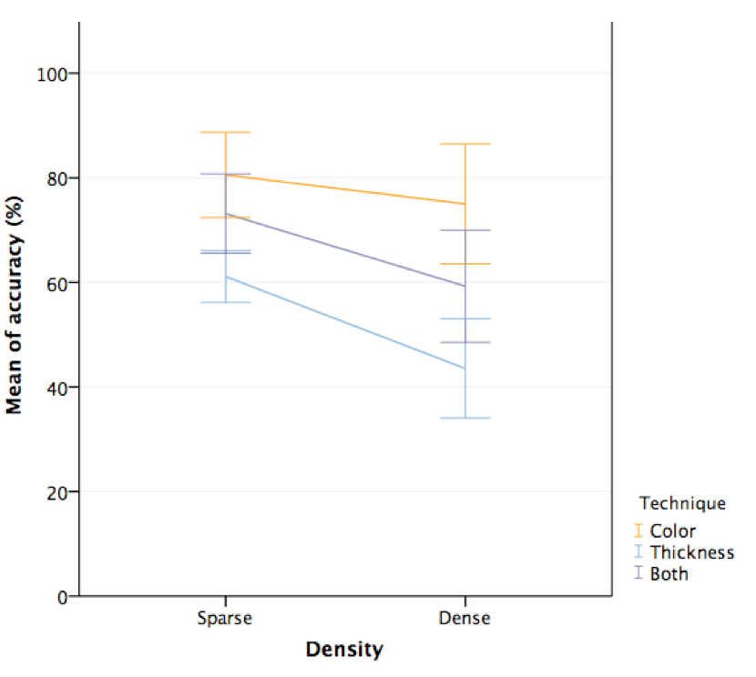

## 1. Introduction

Space becomes meaningful through human activities and agency, such as walking and the desire to move in any direction (De Certeau, 2002; Lippard, 1998). Therefore, the human spatial movement must leave some sort of trace behind, both immaterial, like nostalgia or desire (Shields, 2011), and concrete, such as marks on the sand, and built environments. At first glance, human spatial flow seems to be chaotic: endless vectors of movement coming and going to an infinite number of places. We drive from home to work; take public transportation to go to school; ride bikes in parks, walk on the streets, and fly to any place on the planet. Movements are transitory (space) and temporary (time), which makes it difficult to understand and analyze their nature and rules. But if we follow our trails, and track our position in space, we might be able to understand our interactions with the surrounding environment and with other people (Zhao et al., 2008).

Much has been made to improve ways to collect and store information of human flows: mobile trackers, movement sensors, and data mining and data aggregation algorithms. However, the visualization of such a corpus is still challenged by its rich and multidimensional data: combining space, time, and the categorical information is not an easy task. In other words, the effectiveness and efficiency of visual elements selected to represent the dataset is the key to the success of human spatial movement data visualization.

According to Munzner (2014), position is the most salient visual attribute: “attributes encoded with position will dominate the user’s mental model … compared with those encoded with any other visual channel” (p. 102). In the case of maps, position is already taken to represent space itself, leaving less salient channels to represent movement data. Yet a number of essential questions about the use of visual elements for the design of human spatial movement map still need to be addressed, such as: How to encode time and duration? How to assure that the design makes the representation effective and efficient? Should the encoding strategy change as the dataset increases in complexity, density, or size?

In this study, we focus on the representation of time, duration in particular, of a sequence of movements in a map, specifically on the difference between two techniques to encode the data: colour, and line thickness. According to Dong et al. (2012), these two variables “can effectively make the differences in users’ perception of different expressions of traffic map”(p. 99). We adopted a user perception-based empirical study to test the efficiency and effectiveness of these variables, and the combination of both together, for the representation of duration of paths traveled by a single person in a single day. Although multiple channels combination can be seen as redundant, Munzner (2014) asserts that encoding the same value with two or more channels could make them easier to be perceived.

We aim to answer the question of which technique is more effective and efficient to visualize duration in human spatial movement map visualization: colours, line thickness, or both together? Duration is a scaled dimension and should use a visual attribute that can represent its nature. Since colour, hue, in particular, does not have an inherent scaled order or sequence (Munzner, 2014), it is expected that line thickness will be more effective and efficient to represent duration in a map. In other words, people would quickly identify the right information in the visualization using line thickness. However, since colours have been commonly used to code transit and traffic information (e.g., traffic lights, traffic density), it is possible that people match colours with relative values more quickly and accurately than using line thickness.

The results of this research could give better parameters for build visualization maps focusing on human spatial movement data. Consequently, this could enhance pattern recognition, enabling new insights about human spatialization in urban areas.

## 2\. Methods

We designed a survey\[1\] with a sequence of six different maps showing paths made by a single person in a 24-hour period in the Vancouver  Downtown Area. These paths were divided into several sections in order to inform the duration of each section using either a 10-scale colour, 10-scale line thickness, or both scales combined (Fig. 1). For each technique, two different levels of path’s density were used: (1) sparse paths, with fewer subsections, usually far from each other in space, and (2) dense paths, with several subsections, sometimes overlapping each other. Thus, all participants did analyze a total of six unique paths.

### 2.1 Independent Variables

This experiment follows a within-subject design with two independent variables — (1) density of the map, with two levels: sparse and dense; and (2) visualization technique, with three levels: colour, thickness, and both.

### 2.2 Dependent Variables

There are two depended variables in our experiment: efficiency and effectiveness. The technique’s efficiency is measured using the mean of the participant’s response time on all questions in each map — the lower the time, the higher the efficiency. Effectiveness is measured by the participant’s accuracy rate, that is, the number of right answers divided by total questions in each map — the higher the participants’ accuracy rate, the higher the effectiveness.

### 2.3 Participants

A total of twenty participants (N = 20) from 4 countries (Canada, USA, Brazil, and India) completed the survey. Among them were 10 females, 9 males, and 1 person that preferred not to identify the gender. Whereas 90% of participants were very familiar with digital maps (e.g., Google Maps), only 30% had a good knowledge of Vancouver Area.

In order to balance the number of participants, two participants were removed from the experiment: the person that did not respond to the gender question was also an outlier in the time spent on one of the questions (spending more than 200 times more than the other participants); and a female participant that saw maps in a different order compare to the others. Thus, the results of the remaining eighteen participants (N=18), 9 were male and 9 female, was used in this experiment.

### 2.4 Dataset

The visualizations used in this experiment were manually produced using a mix of a snapshot of Vancouver Area’s maps from Google Maps, and real data collected by Moves\[2\] using an iPhone 5C smartphone. The dataset contains the spatial movement data of a single person, including geolocation (latitude and longitude), timestamps (start and end times), duration, distance, and mode of transportation used in each movement.

#### 2.5 Procedure

Prior to the actual test, participants of this experiment were presented to the different encoding techniques we are testing — colour, thickness, and both. For training purposes, participants saw three different routes, each with one of the techniques, and were asked two questions — no measurements were taken at this time.

After the training phase, participants went through a sequence of six maps: three sparse, and three dense, each map in each group encoded with a different technique. Participants were asked to answer six multiple-choice questions in each map— three about duration, and three about distance (Table 1). For each question, two measures were recorded: response time, which determines the efficiency; and the answer itself, which will be used to check the correct rate in order to measure effectiveness. When participants finished the experiment, they were asked to respond a quick exit questionnaire.

**Table 1: Multiple-choice questions asked in each map, in the ordered they were shown to participants**

| Duration                                                | Distance                                   |
| ------------------------------------------------------- | ------------------------------------------ |
| 1) Which section has the longer duration?               | 2) Which section has the longer distance?  |
| 3) Which section has the shorter duration?              | 4) Which section has the shorter distance? |
| 5) How long does it take to go from point C to point D? | 6) How far is point C to point D?          |

### 2.6 Confound

The experiment was originally designed to show the density condition in a fixed order (sparse first, dense after), and counterbalance the encoding technique condition among participants, that is, the map sequence would be different for each group of six participants. However, even after a successful pilot test, Fluid Survey did not assign a different sequence of conditions among participants. Instead, they all viewed the maps in the same order.

### 3\. Results

### 3.1 Efficiency

The results show that independent of the technique used to code the information, participants were faster in the sparse routes map (M = 20.64, SE = 2.47) than in the dense map (M = 23.07, SE = 2.82) (Fig. 2). If we ignore the density, participants were faster at answering questions using colours (M = 19.35, SE = 2.32) than thickness (M = 26.75, SE = 3.00) and both techniques together (M = 20.96, SE = 2.58) (Fig. 3).

As all participants passed through all conditions, we used a two-way repeated measures Analysis of Variance (ANOVA) to examine the data. However, Shapiro-Wilk test of normality shows that the data is not normally distributed, D(108) = 0.82, p < 0.05, which violates one of the ANOVA’s assumptions. To correct this, we made a log10 transformation, which results in a normally distribution data, D(108) = 0.98, p = 0.06. Mauchly’s test indicates that the assumption of sphericity was met by all main effects (ps > 0.01).

The ANOVA results show a significant difference in time response in each level of density, in which participants were faster at analyzing sparse routes comparing with more dense maps F(1,17) = 10.81, p = 0,04, r = 0.39.

The main effect of different techniques in the time response was also significant F(2,34) = 23.53, p < 0,01, r = .58. This indicates that when density is ignored, the time response differs according to the encoding technique used in the map. Specifically, pairwise comparisons reveal that there is a significant difference in time response between colour and thickness encoding techniques (p <0.01). Time response was also significantly different when comparing the use of both techniques together to the thickness (p = 0.01), but not significant when comparing to colour encoding (p = .18).

The interaction between density and technique was significant, F(2,34) = 6.87, p = 0,03, r = .29, indicating that the effect of the type of encoding on the response time differs when the routes are sparse or dense (Fig. 4). Contrasts on this interaction term reveal that when the difference in time response between sparse and dense maps was compared with the use of colour or thickness encoding there was a significant difference, F(1,17) = 7.97, p = 0.01. Similarly, the difference between sparse and dense maps for thickness or both technique together was also significant, F(1,17) = 9.52, p < 0.01. However, when comparing the difference sparse and dense maps using either colour or both techniques together no significant was found, F(1,17) = 0.04, p = 0.85.

Thus, it seems that colour was a significantly more efficient technique to encode duration of a movement regardless of the density of the route.

### 3.2 Effectiveness

The results show that independent of the technique used to code the information, participants had a higher accuracy rate in the sparse routes map (M = 71.6, SE = 2.19) than in the dense map (M = 59.26, SE = 3.35) (Fig. 5). If we ignore the density, participants had more accuracy to answer the questions using colours (M = 77.78, SE = 3.32) than thickness (M = 52.31, SE = 2.91) and both techniques together (M = 66.20, SE = 3.29) (Fig. 6).

Figure 5: Means of accuracy rate between different route densities (errors Bar: 95% CI).

Figure 6: Means of accuracy rate between different encoding techniques (errors Bar: 95% CI).

Again, as all participants passed through all conditions, we used two-way repeated measures ANOVA to examine the data. Shapiro-Wilk test of normality shows that the data is not normally distributed, D(108) = 0.92, p < 0.05, which violated one of the ANOVA’s assumptions. After various unsuccessful attempts to transform the data, we could not correct the data for normality. Nonetheless, a two-way repeated measures ANOVA only requires approximately normal data (Schmider, 2010), that is, even with the assumption of normality violated, it still can provide valid results if the residuals are normally distributed.

We decided to do a linear regression model of this dataset in order to check if the residual of this dependent variable (accuracy) is normally distributed. Even though the model is not well fitted (R2 = 0.13), it shows that the interaction between density and technique is significant, F (2,105) = 7.91, p < 0.01, and can influence accuracy scores. In fact, both density (p < 0.01) and technique (p < 0.02) are significant to explain accuracy scores. Shapiro-Wilk test of normality shows that both studentized and standardized residuals of this model are normally distributed (ps = 0.06). Hence, we can now assume that the ANOVA’s assumption of normality is met by the normally distributed residuals.

Mauchly’s test indicates that the assumption of sphericity was also violated for technique (p = 0.80), and the interaction between density and technique (p = 0.37). To correct this, we used Huynh-Feldt estimates of sphericity for technique and for the interaction between density and technique (𝞮s = 1.00).

The ANOVA results show a significant difference in accuracy in each level of density, in which participants had a higher corrected rate in analyzing sparse routes comparing with more dense maps F(1,17) = 20.12, p < 0,01, r = 0.54.

The main effect of different techniques in the accuracy rate was also significant F(2,34) = 20.73, p < 0,01, r = 0.55. This indicates that when density is ignored, the accuracy rate differs according to the encoding technique used in the map. Specifically, pairwise comparisons revealed that there is a significant difference in accuracy rate between colour and thickness encoding techniques (p < 0.01). Accuracy was also significantly different when comparing the use of both techniques together to thickness encoding (p = 0.01), also significant when comparing to colour encoding (p = 0.02).

Figure 7: Means of accuracy rate between different encoding techniques in sparse and dense maps (errors Bar: 95% CI).

The interaction between density and technique was not significant, F(1.99, 33.82) = 2.30, p = 0,15, r = 0.12, indicating that the effect of the type of encoding on the response time did not differ when the routes are sparse or dense (Fig. 7). Contrasts on this interaction term reveal that when the difference in time response between sparse and dense maps was compared with the use of colour or thickness encoding there was a significant difference, F(1,17) = 6.23, p = 0.02. However, the difference between sparse and dense maps for thickness or both techniques together was not significant, F(1,17) = 0.32, p = 0.58. Similarly, no significant was found when comparing the difference between sparse and dense maps using either colour or both techniques together, F(1,17) = 2.10, p = 0.17.

Thus, our results suggest that colour was a significantly more effective technique to encode duration of a movement regardless of the difficulty of the route. Further, it looks like as the density of the route increases, thickness, and both techniques together deteriorate the participant performance.

## 4\. Limitations

Though the experiment produced significant statistical results, a number of limitations have to be taken in consideration. As I mentioned before, the fixed order in which the different techniques were shown to participants produce a confounding result, where the outcomes could be biased toward this specific sequence: (1) sparse (thickness - both - colour), (2) dense (both - colour - thickness). Thus, more participants are necessary to counterbalance the conditions.

Another limitation is related to the familiarity of the mapped region: only 30% of participants have a good knowledge about Vancouver Area. It might happen that these people had a better performance in the experiment, distorting the results. Future tests should examine this issue and only select participants that have the same level of knowledge of the surveyed area.

Finally, the screen resolution, or window’s size, may have interfered with the results. If the screen was not big enough, some element (i.e., question, answer, or part of the map) could have stayed out of the participants’ sight, making them lost track of these elements, consequently spending more time in each question.

## 5\. Discussion

While thickness is a more suitable encoding technique for scaled dimensions (Munzner, 2014), the experiment demonstrates that colour is both more efficient and effective to encode duration information in route maps. Indeed, participants spent less time to answer the questions and did fewer mistakes using a coloured scale. Nevertheless, it is possible to see a trend as the map increases density: from sparse to dense participants spent more time, while time response decrease for the use of thickness. The use of colours also made participants reach a higher accuracy rate compared to the use of thickness. As expected, the increase in density results in more mistakes, which was pronounced with the thickness technique. Combining both channels to code time duration did not enhance efficiency and effectiveness. In fact, it seems that regarding response time, the use of both techniques together follow the same trend as colours, while the opposite occurs if we analyze accuracy rate.

The use of line thickness can be problematic. As position channel is already taken to display the map, every spatial attribute (e.g., length, size, thickness) could quickly be associated with the distance in the map, unless otherwise explicitly stated. Participant 1 notes:

the thickness of lines representing time/duration in the maps does not make much sense to me. I can understand that the distance in the maps represents the actual distance by the length of lines. But I’m not sure I get the meaning of line thickness, which represents duration time. (Participant 1)

Further, as the route increases in complexity, overlapping path’s sections, line thickness produce a cluttered map. While participant 15 notes “more lines, shorter lines, and overlapping lines make it harder to pull out meaningful information,” participant 2 comments “if the line is always black, is harder to read when it crosses over other black lines. Coloured lines are a bit easier to discern from one another.”

In fact, participants responded that they prefer colour (78%) instead of thickness (22%), because: it is “easier to tell them apart” (Participant 3), “It’s easier to see multiple routes” (Participant 5), and “the thicker lines make streets less visible and bends in roads more clunky” (Participant 8). Nonetheless, it is possible that the legend attached to the colour-scale helped participants to have a better perception of the encoded values.

## 6\. Conclusion

This research was motivated by the difficulties to set human flow visualization on top of a map, which is already a representation of the space. The goal was to compare the efficiency and effectiveness of two encoding strategies to show time duration in human spatial movement visualization. Our experiment shows that colour is a better option, with faster and better accuracy rate from the participants. However, more tests are needed to eliminate confounds in our experiment and assure the results.

With a better tool to visualize our movements, we might be able to comprehend our interactions with the surrounding environment and with other people. The results of this research could help data analysts, as well as occasional users, to enhance pattern recognition, enabling new insights about human spatialization in urban areas. Such knowledge is valuable for explaining people’s behaviour and needs and can be converted into valuable public policies, as well as engaging people in visualizing their own spatial rhetoric through the urban fabric.

## Notes

### Note 1

We used Fluid Surveys to build an online survey: [http://fluidsurveys.com](http://fluidsurveys.com)

### Note 2

Moves is a mobile application for track and categorize user’s movements into a number of activities, such as walk, run, and transportation. It can be downloaded at [https://www.moves-app.com](https://www.moves-app.com)

## Acknowledge

Thanks to Lyn Bartram for the supervision and the thinking process. Many thanks to Abhisekh Patra, Arefin Mohiuddin, and Dinara Moura for sharing their knowledge and expertise on statistics. Thank you to Bernhard Riecke and Liaqat Ali for their support in developing the experiment. Thank you to all volunteers for sharing their time.

## References

Andrienko, N., & Andrienko, G. (2007). Designing Visual Analytics Methods for Massive Collections of Movement Data. Cartographica: The International Journal for Geographic Information and Geovisualization, 42(2), 117–138. [doi:10.3138/carto.42.2.117](doi:10.3138/carto.42.2.117)

De Certeau, M. (2002). The Practice of Everyday Life. University of California Press.

Dong, W., Ran, J., & Wang, J. (2012). Effectiveness and Efficiency of Map Symbols for Dynamic Geographic Information Visualization. Cartography and Geographic Information Science, 39(2), 98–106. [doi:10.1559/1523040639298](doi:10.1559/1523040639298)

Lippard, L. R. (1998). The Lure of the Local: Senses of Place in a Multicentered Society. New Press.

Munzner, T. (2014). Visualization Analysis and Design (1 edition.). Boca Raton: A K Peters/CRC Press.

Schmider, E., Ziegler, M., Danay, E., Beyer, L., & Bühner, M. (2010). Is it really robust? Reinvestigating the robustness of ANOVA against violations of the normal distribution assumption. Methodology: European Journal of Research Methods for the Behavioral and Social Sciences, 6(4), 147–151. [doi:10.1027/1614-2241/a000016](doi:10.1027/1614-2241/a000016)

Shields, R. (2011). The Tourist Affect: Escape and Syncresis on the Las Vegas Strip. In T. K. Davidson, O. Park, & R. Shields (Eds.), Ecologies of Affect: Placing Nostalgia, Desire, and Hope (pp. 105–126). Waterloo, ON, Canada.: Wilfrid Laurier University Press.

Tiessen, M. (2008). Uneven Mobilities and Urban Theory: The Power of Fast and Slow. In P. Steinberg & R. Shields (Eds.), What Is a City?: Rethinking the Urban after Hurricane Katrina (pp. 112–128). Athens, Georgia, USA: University of Georgia Press.

Zhang, Q., Slingsby, A., Dykes, J., Wood, J., Kraak, M.-J., Blok, C. A., & Ahas, R. (2014). Visual analysis design to support research into movement and use of space in Tallinn: A case study. Information Visualization, 13(3), 213–231. [doi:10.1177/1473871613480062](doi:10.1177/1473871613480062)

Zhao, J., Forer, P., & Harvey, A. S. (2008). Activities, Ringmaps and Geovisualization of Large Human Movement Fields. Information Visualization, 7(3-4), 198–209. [doi:10.1057/palgrave.ivs.9500184](doi:10.1057/palgrave.ivs.9500184)

* * *

_This paper was written as an assigment for the course Quantitative Methods in the SIAT PhD prorgam._
