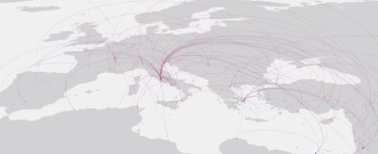
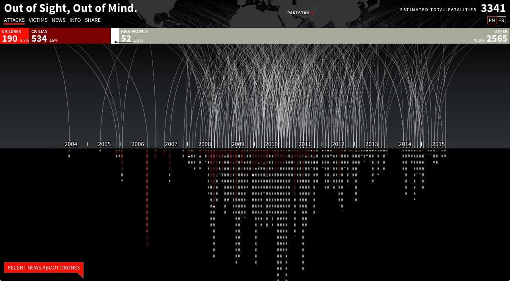
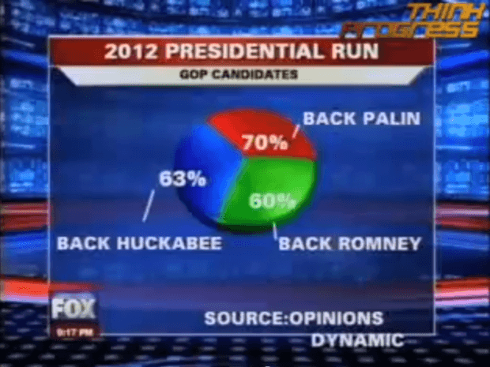
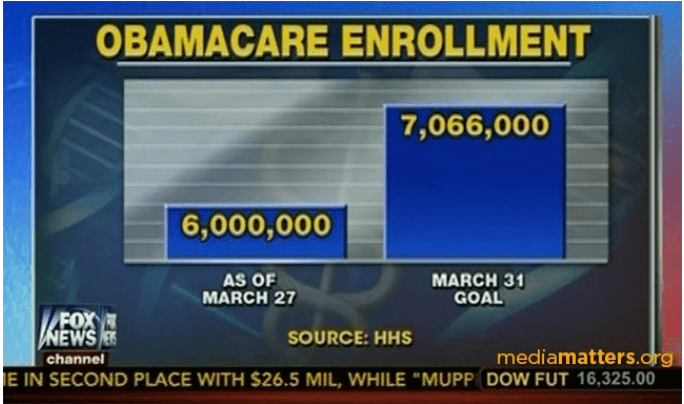
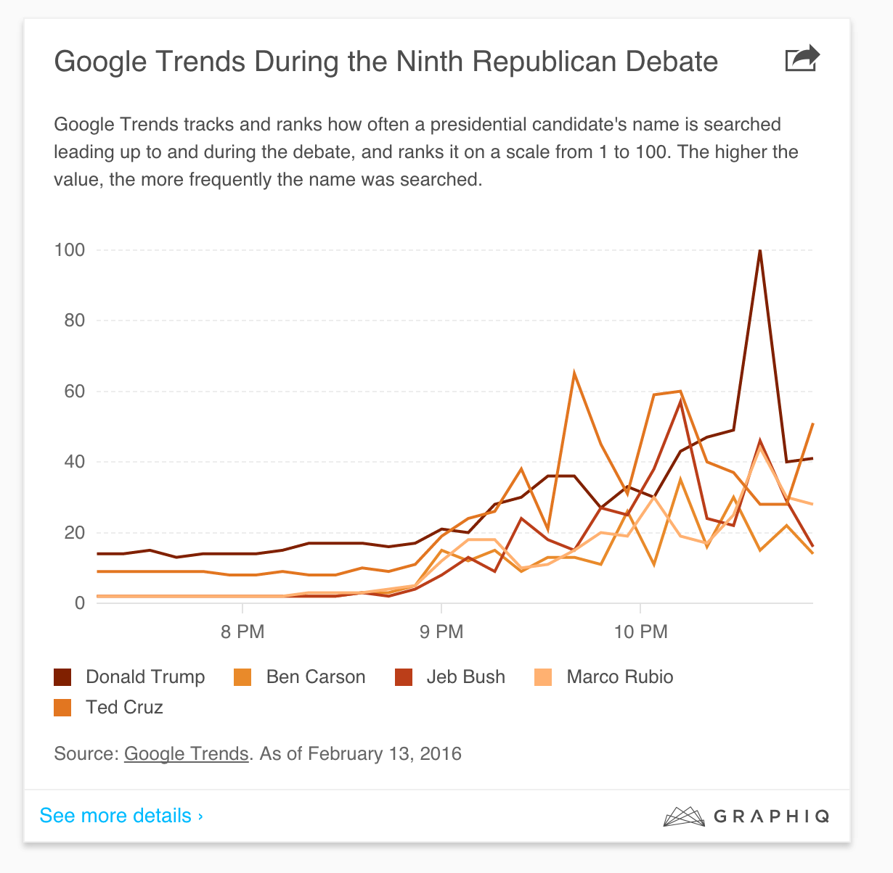
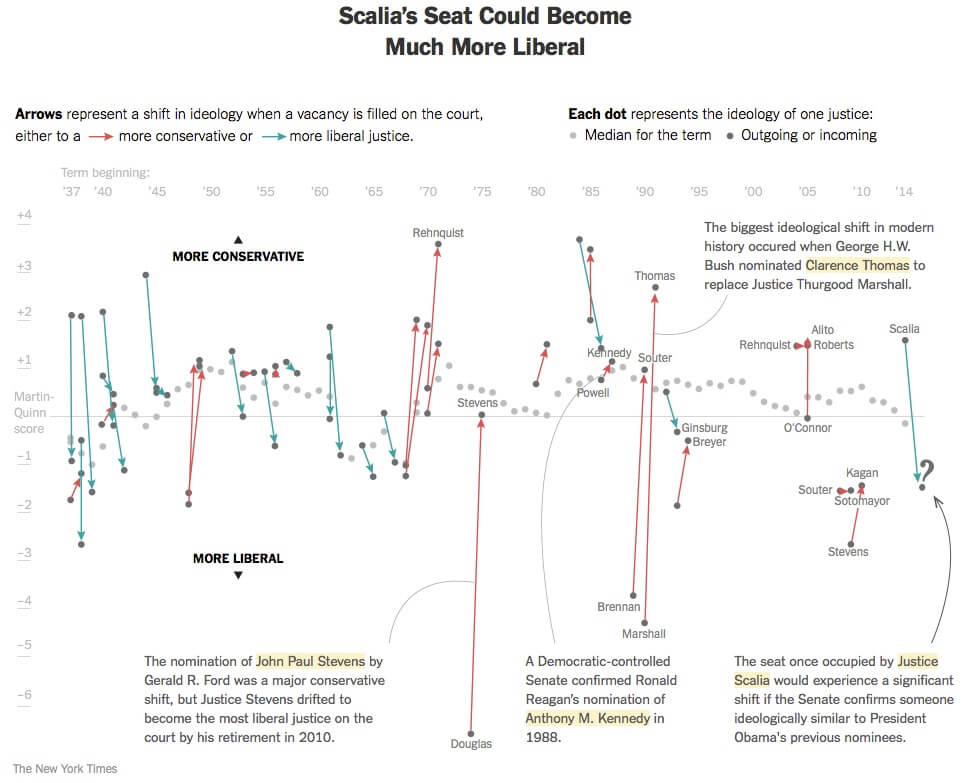

I have always experienced and pursued journalism beyond the written text that fills the newspaper’s columns. The text, the written language, that dominates the pages is only part of the story. The shape and form, empty spaces, size and hierarchical relationships, visual attributes that we usually take for granted, are also elements used by journalists to tell a story. They are present in the font face, headings and subheadings, font size, position and location of blocks of text and images, colour palettes and geometric shapes, guiding the reader’s eyes through the story. These visual cues give the _form_ to the newspaper and are so powerful that can tell a different story than the one described in plain text.

Data visualization, or information visualization (InfoVis) — a more appropriated term to be used in the journalism context, use similar strategies to produce “data-driven stories.” The goal is to provide accurate visual representations of datasets in a way that helps the audience understand the content, structuring it so that it is easy to comprehend and explore (Munzner, 2014). It makes use of design principles, particularly pre-attentive processing (preconscious effect of visuals) and Gestalt to guide the audience to find patterns through the dataset. That is, visualizations map visual attributes (size, length, shapes, colours, etc.) to dataset’s variables to generate meaningful images. It transforms data into information and facilitates awareness and understanding; helps to raise new questions and supply answers generating insights and hypotheses; and tells a story and makes a point. As in the case of a text-based story, InfoVis storytelling is not just about the data being shown, but about all the visual attributes selected by the designers to give the _form_ to a visualization.

In this probe, I want to briefly consider the immediacy of two aspects of visualizations: the design practices used for storytelling, and the assumption that “data” is equal to “truth.”

As Frost and Sturt (2015) argue there is not such a thing as a story-free vis. Whenever you select and emphasize data, whether you choose a simple bar chart or complex network graphs to represent the data, the elements in the visualization will always tell a story. Good design _facilitate awareness_ and _understanding_, such as in this video map of births and deaths shows [rise and fall of cultural centres](http://www.apple.com); raise new questions and supply answers, such as in Manovich's [Selfiecity](http://selfiecity.net) project, a visual exploration through thousands of selfies; tells a story and make a point, such as in [Out of Sight, Out of Mind](http://drones.pitchinteractive.com) that shows the “casual deaths” made by American’s drone strike since 2004 in Pakistan.

Bad design, on the other hand, _distorts information_ and _manipulate the audience_, such as in this chart produced by Fox News showing the number of enrolment for Affordable Care Act. The graph is skewed and the proportions are wrong. Note that the first bar (6 million) appears to be a third of the second bar (7,066 million). The graph’s scale is omitted, so in a first glance, one thinks that the number of enrolment were very low compared to the goal: a third of 7 million would be 2.3 million — meaning a gap of 4.6 million. However, the real gap is of about 1 million.

As Fox News’ political ideological position is very well known, so perhaps its bad design purposely brings a political statement and actually tries to make a point. But what about this second chart — a pie chart representing percentages that sum more than 100%. Not only the number is skewed, the _graph is impossible_.

Consider also this [line chart](http://viz.wtf/image/139612933084) showing Google Trends in relations to presidential candidate’s name search. The poorly colour choice creates _confusion_ and makes it harder to distinguish which line corresponds to which candidate (especially for colour-blind people).

The second issue I want to touch on is the assumption that “data” is equal to “truth.” Frost and Sturt (2015) argue that “data suggests objectivity, evidence, facts. Storytelling suggests subjectivity, bias, lies” (p. 39). However, we tend to mistake numeric data as a fact without considering the source, its purposes and intentions, and the assumptions they carry. Statistical data are presented to us in a very transparent way, but in fact, most of the time, we have no clue how they are calculated and what is the base comparison. For instance, Greeley’s example (Hurrell & Walton, 2015, p. 55) used the shortest route (based on US mail routes) to stipulate the “optimum” value paid for US congressman travel expenses. What are the assumptions behind this baseline? Is it only about cost efficiency?

Similarly, in “[The Potential for the Most Liberal Supreme Court in Decades](http://www.nytimes.com/interactive/2016/02/18/upshot/potential-for-the-most-liberal-supreme-court-in-decades.html?_r=1),” New York Times produced a visualization to show the ideological stands of the US Supreme Court. The piece, very well-designed (though a bit complex), emphasizes and contextualizes important shift moments, and reveals patterns and ideological strategies of the Supreme Court composition. But how to measure ideology? How to quantify subjective decisions? Note that the y-axis is a divergent scale based on [Martin-Quinn score](http://mqscores.berkeley.edu). This measure was developed by Andrew D. Martin (University of Michigan) and Kevin M. Quinn (UC Berkeley School of Law) to understand the relative location of U.S. Supreme Court justices on an ideological continuum. What are the assumptions of this scale? What is considered liberal, and what is conservative?

The “[Fallen of World War II](http://www.fallen.io)” is another example of a very attractive and well-designed visualization based on biased (and disputed) data. It compares the number of deaths (both civilians and militaries) by country in the World War II and makes strong claims about “peace,” or what “peace” means for Western society.

Some visualizations are so compelling, so beautiful, that we do not even question the design choices, the data source, or the intentions of the piece. Because of our incredible appetite for pattern recognition and aesthetic pleasant images, numerical data and visualizations can lead us to believe in anything, even in the craziest correlations.

## Bibliography

Frost, A., & Sturt, T. (2015). To visualise is to dramatise: storytelling with data. In Data journalism: inside the global future (pp. 39–53).

Healey, C. G., & Enns, J. T. (2012). Attention and Visual Memory in Visualization and Computer Graphics. IEEE Transactions on Visualization and Computer Graphics, 18(7), 1170–1188. [http://doi.org/10.1109/TVCG.2011.127](http://doi.org/10.1109/TVCG.2011.127)

Hurrell, B., & Walton, J. (2015). The future of data journalism is its past. In Data journalism: inside the global future (pp. 54–61).

Munzner, T. (2014). Visualization Analysis and Design (1 edition). Boca Raton: A K Peters/CRC Press.

* * *

_This essay was written as an assignment for the course Changing News Form in the Communication Studies Phd program._
