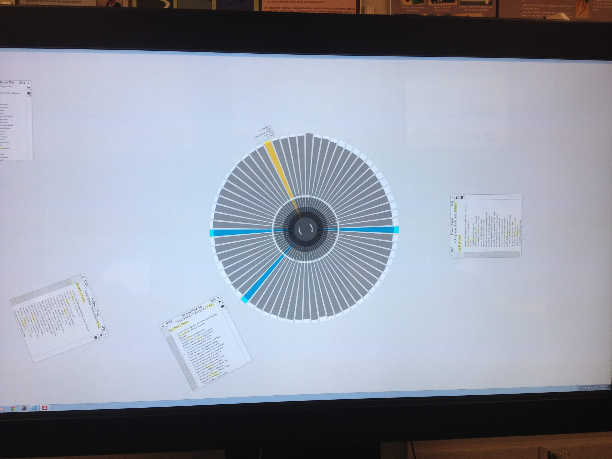
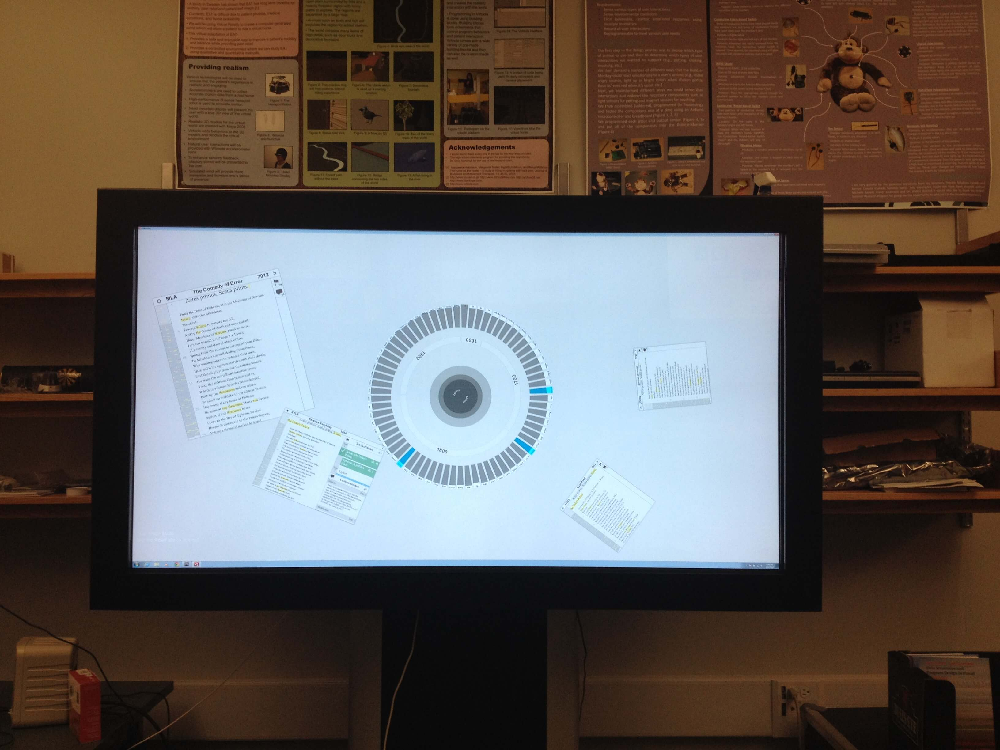
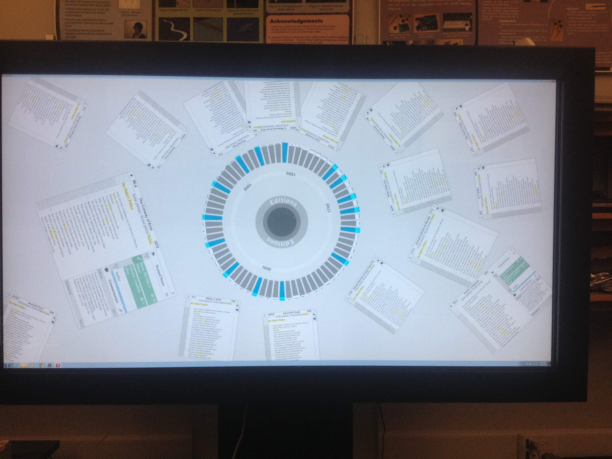
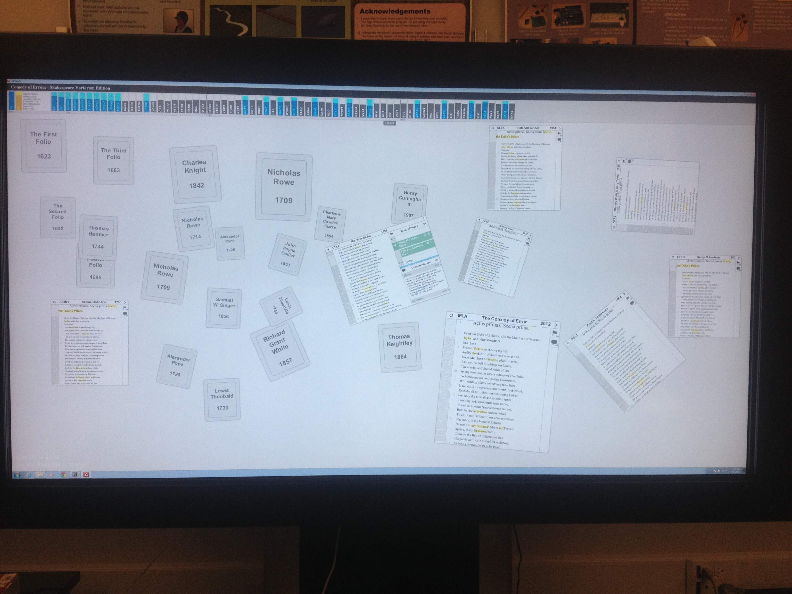
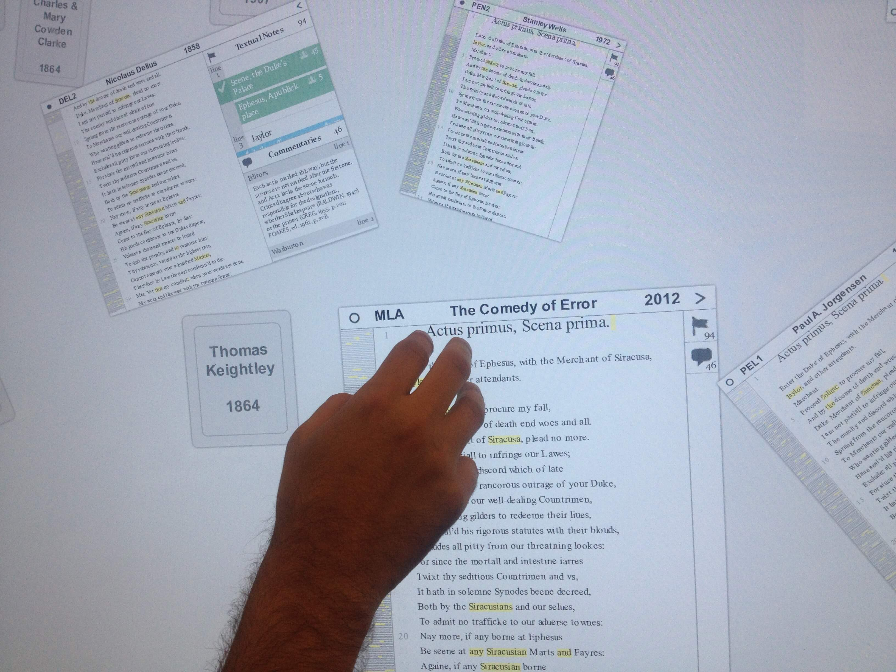
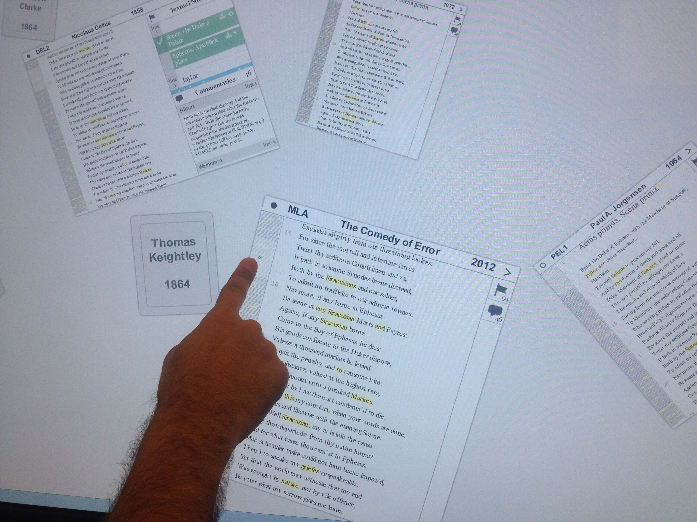
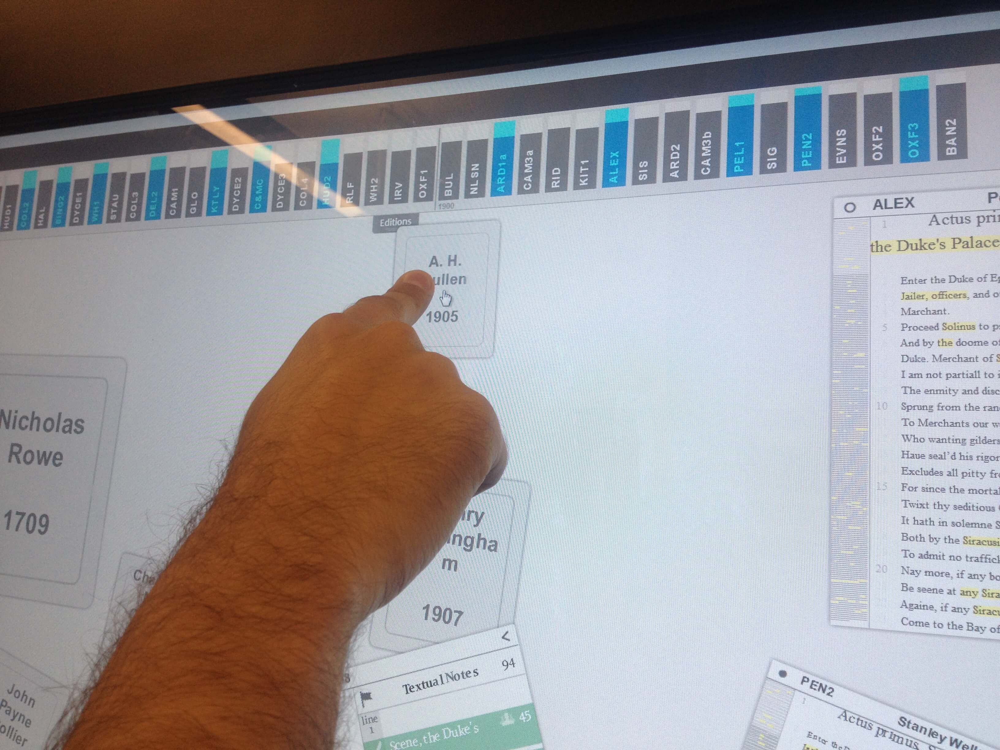

<iframe
  allow="fullscreen; picture-in-picture; clipboard-write; encrypted-media; web-share"
  allowfullscreen
  class="rounded-lg w-full md:h-max aspect-video object-cover"
  loading="lazy"
  src="https://player.vimeo.com/video/70527973?h=36e12598a6"
  title="vimeo-player"
  referrerpolicy="strict-origin-when-cross-origin"
/>

We started this project in 2012 aiming to examine the use of a multitouch surface as a platform for reading complicated texts, such as the New Variorum Shakespeare version of _Comedy of Errors_ produced by the Modern Language Association (MLA). The first phase of the project, as has been presented at another conference, focused on touch and gesture controls and their influence on reader engagement. The in-progress second phase, which will be discussed here, assesses such devices for their potential as social reading environments. This research is, as we learned, interesting not only in its results but also in the design process, and this presentation will relate the challenges faced while trying to envision a communal reading surface, as well as the implications of the results.

Variorum editions are, in the simplest terms, collections of all the notable scholarship on a literary work. Printed variorums have existed since the seventeenth century, and the genre has since been well established. There are three general components: the text of the work itself as selected by an editor; a list of variations between this ‘base-text’ and other versions; and a comprehensive anthology of previous scholarly annotations. In print form the volumes are very dense, using sectioned pages and systems of abbreviations to fit the mass of information onto a limited page size. Still, as Paul Werstine discusses in his 2011 article ‘Variorum Commentary’, it remains a challenge to provide “…simultaneous access to text and relevant commentary” in print.

Web-based versions, which began appearing in the mid-1990s, alleviated much of this crowding by using hyperlinks and flexible page sizes to expand the information space, but this medium is not without its own limitations. Navigating away from the main text to the commentary section, for example, still fragments the information, and the number of panes that can be displayed simultaneously is determined by the screen size. In addition, user input is restricted to the repetitive push, click and scroll of a relative mouse. Most importantly for this presentation, though, desktops and laptops are, by their nature, independent workstations not conducive to social use. While some digital variorums have thus attempted to incorporate sharing and group-study features, these are inevitably sequential rather than collaborative systems; one user might add a note and share it publicly, and another user might then amend or add to it, but they cannot interact concurrently.

Using multi-touch technology the current research of the MtV project seeks to overcome this restriction and allow social reading and annotation. A multi-touch interface is just what it sounds like: a touchscreen called a tangible user interface (TUI) that can interpret multiple points of contact at the same time. A library of touches and gestures are programmed into the software that tells it how to respond to these inputs. Smartphones and tablets are common modern examples. The Multi-touch Variorum project, however, is being developed to run on a multi-touch table, which has the same characteristics but on a device the size of a flat-screen television. In addition to allowing more information to fit on the display and accepting numerous forms of user inputs, from taps to flicks to rotations, these devices can accommodate multiple users at the same time standing in a circle about the screen. The potential of this arrangement to provide a more social atmosphere than several independent desktops is fairly clear, and on this basis, our group began testing how the _Comedy of Errors Variorum_ interface we had designed could be used communally.

The original interface, seen here, unconsciously drew on the conventions of traditional computer designs; there is a set top and bottom, the panels are static, and the variants and commentary appear only once. In large part, these choices arose because the device was envisioned hanging on a wall like a flat-screen television. Early tests within the group, however, with two readers standing side-by-side, brought out the social possibilities of the technology and inspired a complete redesign.

The initial step of flipping the device into a tabletop will allow it to comfortably accommodate four people standing along the edges. Designing for a screen in this position, however, proved challenging, and raised questions about what was meant by ‘social’ in a Humanities context. Great efforts have been made in recent years to increase collaboration among Humanists, but this collaboration usually takes the form of a division of labour with limited social interaction. This is perhaps an inevitable product of the nature of our work, but with the right encouragement, a more interactive collaboration may be possible. We, therefore, defined ‘social’ as scholars working simultaneously on the same project, with active conversation, deliberation and negotiation occurring. We then conceived of two tasks that might be conducive to this type of collaboration: examining and discussing the variations and comments in three or four editions and using existing editions to create a new one.

With these ideas in mind, several modifications were made to the design. Each edition is now its own reading panel, with pop-out variant and commentary sections so users can read independently. In addition, the panels move and rotate, removing text-directionality obstacles but requiring a lock function that switches between the two modes, as our touch library is unable to distinguish between those gestures meant to move the entire panel and those meant to affect the text within it. A larger issue and a source of much debate within the INKE interface design group was what to do with the list of available editions. The bookshelf design along the top of the screen became defunct in a roundtable setting where there is no top. Instead, following the advice of William Stubblefield in his 1998 article regarding design metaphors, our group developed two interfaces, each with its own merits and limitations.

The first design draws on the metaphor of a lazy susan, with a rotatable ring of editions in the centre of the screen, making them a shared resource. A spiral arrangement, meant to fit the 69 editions more comfortably, proved too distracting and difficult to use, but on a 50-inch screen, a circle was large enough to hold the volumes anyways. The corners are also viable space for menus such as annotation tools. The design encourages conversation and a general awareness of what other users are doing, perhaps resulting in a more collaborative environment, but also potentially hampers a person’s individual work by making it more difficult to locate and access a particular edition.

The second interface takes a different route by acknowledging that, while there is no absolute top or bottom, there are respective ones from each user’s perspective. The four sides of the screen are thus given their own slide out drawer of witnesses that function independently of the other sides. The corners remain available for other features, as in the circle model, but the center is also now empty and might hold a new version being edited by users. **•** There are concerns, however, that the design may create four independent workstations that just happen to be located on the same device. If the experience is no more social than is a Google Doc the added expense and non-portable nature of the table make its benefit questionable.

Ultimately, too little is known at this point about how Humanists will want to work socially, and if they will do so naturally or need to be encouraged. Thus the next step of this research, once programming is complete, is to put the two designs through user testing to see which results in a more productive and more collaborative experience. The intended task may be the deciding factor, and if so then a flexible interface, which can switch from independent to group design, maybe the best course. But as efforts are made to increase collaboration in the Humanities, and this type of technology becomes more prominent, having a theoretical framework for creating social interfaces will become fundamental, and as this project has proven, breaking away from the classic desktop and web-based design can be a genuine challenge.

If you are interested in the code: [https://github.com/lucaju/Multitouch-Variorum](https://github.com/lucaju/Multitouch-Variorum)

## References

Stubblefield, William A. Patterns of Change in Design Metaphor: A Case Study (1998). [wmstubblefield.com/professional/publications/designMetaphor.pdf](wmstubblefield.com/professional/publications/designMetaphor.pdf) (accessed July 14, 2013).

Werstine, Paul. “Past is Prologue: Electronic New Variorum Shakespeares”. Shakespeare: The Journal of the British Shakespeare Association 4, issue 3: 208-220 (2008).

\------------

_This work was presented in a panel session at DH 2013 in Lincoln, USA._

_Authors: Luciano Frizzera, Sarah Vela, Mihaela Ilovan, Piotr Michura, Daniel Sondheim, Geoffrey Rockwell, Stan Ruecker, and the INKE Research Group_
