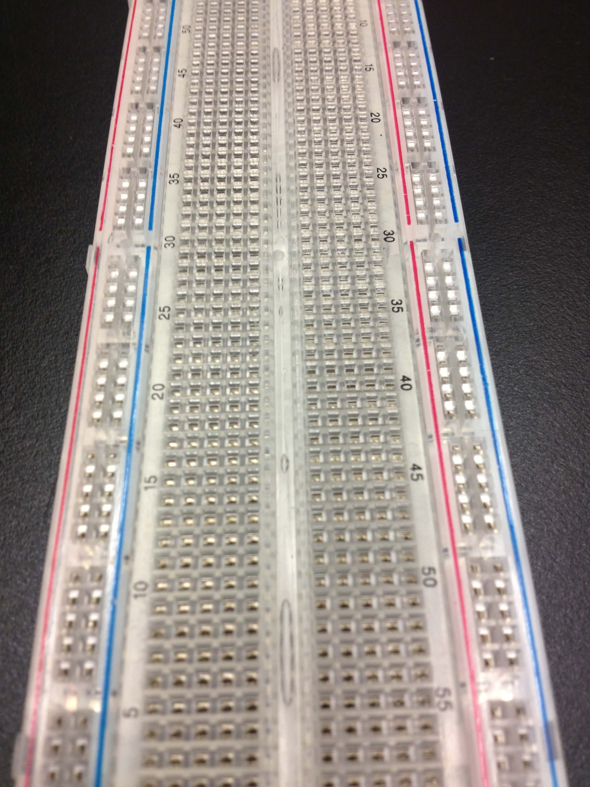
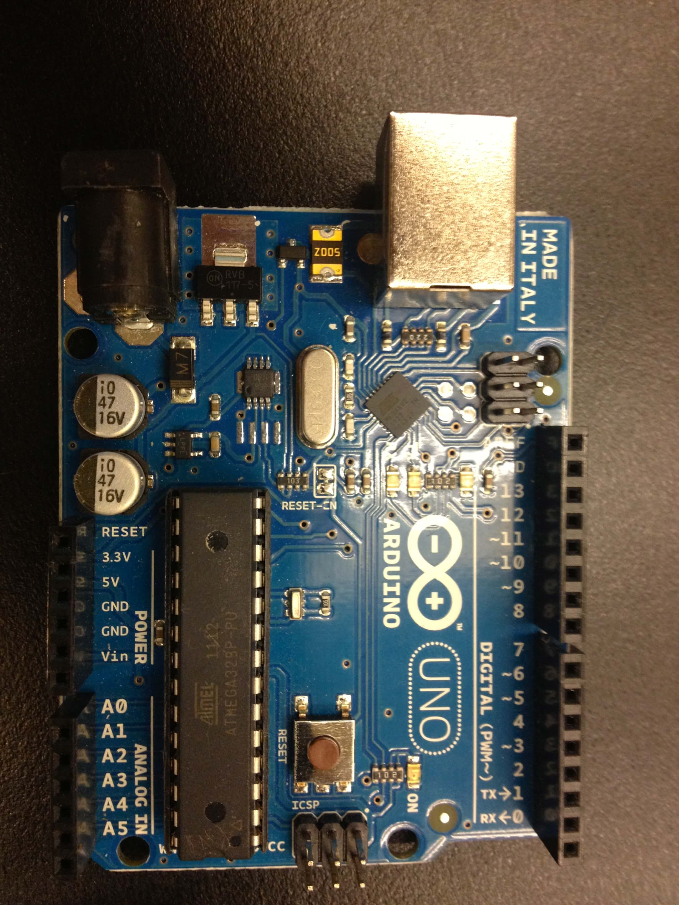
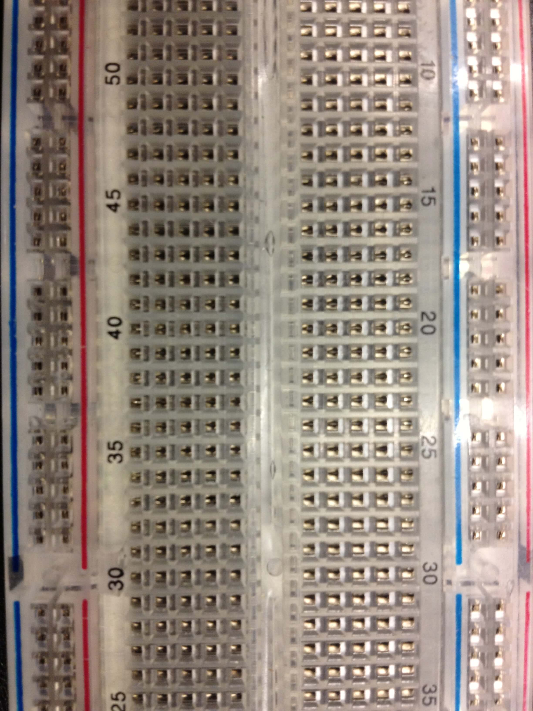
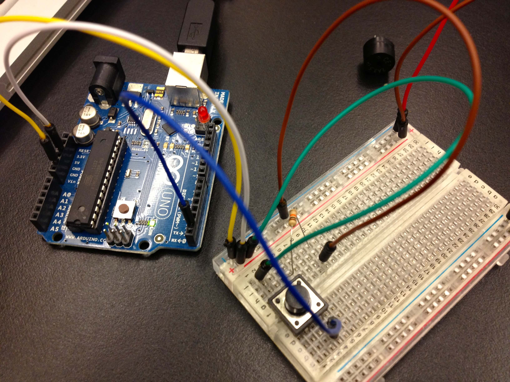
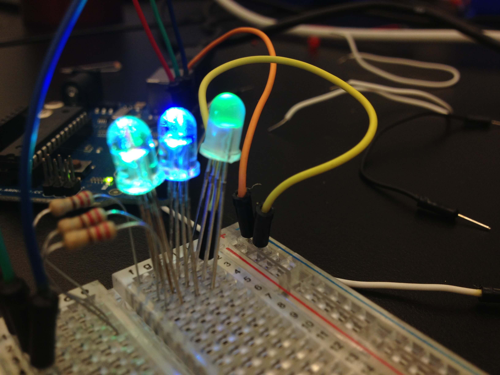
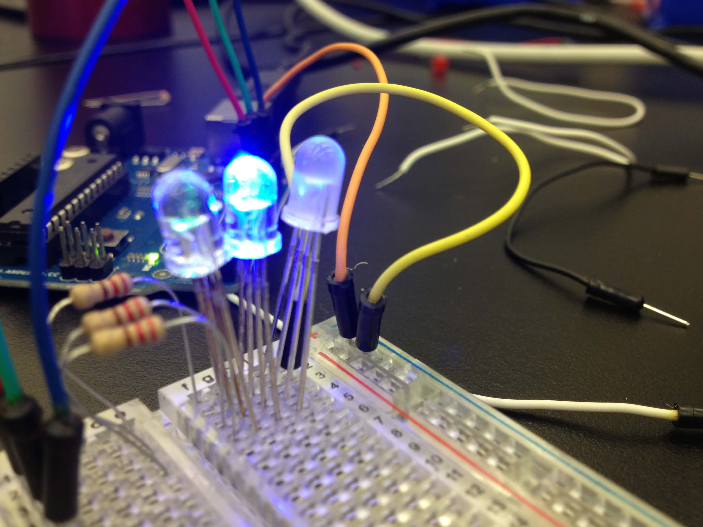
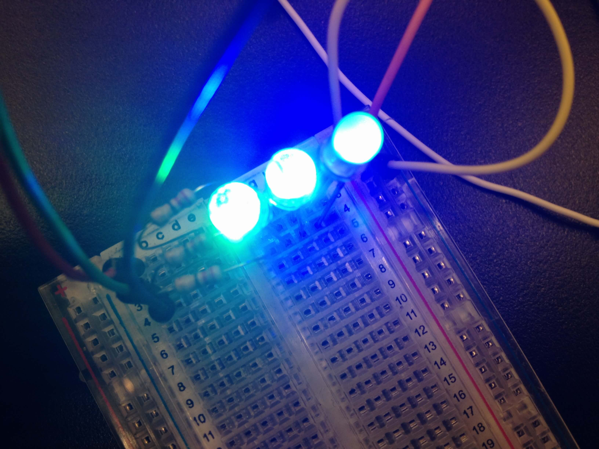
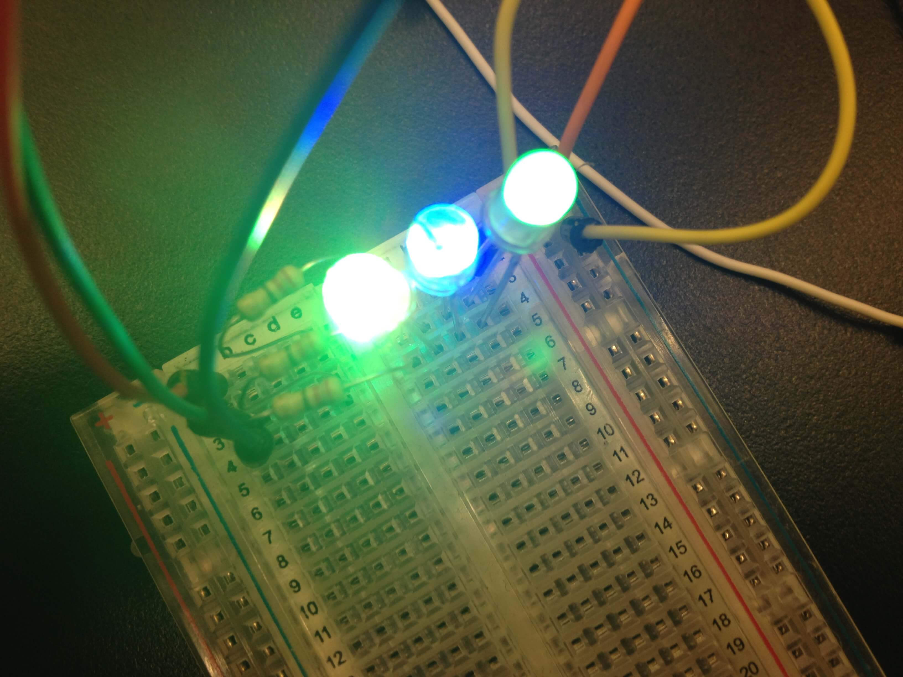

I am pretty happy with the course I attended at DHSI 2013. For the first time, I was building the circuits and make hardware works. Even though the course was also focused on 3D printing, I spent all my time playing with Arduino. Most of the time I was trying to figure out how to assemble electronic connections in order to make an LED blink. My final project involved a photocell and coloured LEDS. The goal was to make the LEDs turn on when the light captured by the photocell is close to zero, then make them turn off again when the light is to strong. Here are some pictures of my circuit:

Here is the syllabus of the course:

_This course is a hands-on introduction to desktop rapid fabrication and physical computing for humanists. It is appropriate for undergraduate and graduate students as well as faculty. The first part of the course will involve digitizing three-dimensional objects to create computer models, then printing them in plastic with a 3D printer. The second part of the course will involve learning to build simple interactive and tangible devices that use the open source Arduino microcontroller, the Kinect scanner and basic electronic sensors and actuators. Students will need to provide their own laptops. Curiosity aside, there are no prerequisites for this course._
