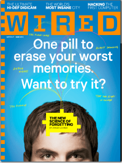
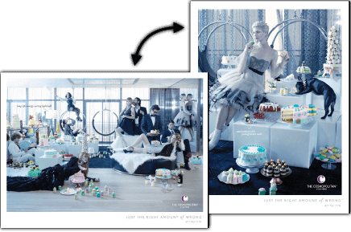
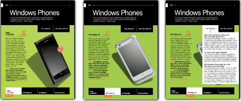
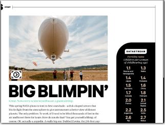
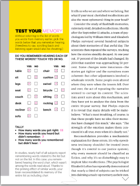

In the age of the information, we are producing data as never before and mobile technology seems to be the natural evolution of media consumption. The tablet computer was introduced in 2010 and has sales are brisk. Public interest for this new medium has been demonstrated by the number released by comScore in the beginning of 2012: tablets reached 40 million users in the U.S. in two years; smartphones took 7 years to reach the same number of sales (comScore 2012, p.5). In March 2012, Apple launched its new iPad selling 3 million worldwide in the first 3 days (Apple Press Release).

Not only the shift toward the mobile platform but also the tools embedded inside them is creating new opportunities for media producers to explorer different approaches to storytelling. A key feature of current mobile devices is the Tangible User Interface (TUI). TUI tools include an Accelerometers and Global Positional Systems (GPS), but Its most noticeable component is the multitouch screen, where the readers can pinch, tap, swipe and drag elements to trigger actions. With the assistance of this apparatus, mobile devices try to create a sense of immediacy, interacting happen directly with digital information rendered on the screen and bringing back the physicality lost in the transition from print to web.

The novelty of this technology and its quick adoption by the public is causing mobile platforms to absorb and refashion the content that once belonged to older media. This process, called remediation by Bolter and Grusin (2000), happens when a new medium tries to improve upon the flaw of its predecessors. In this paper, I will examine the affordances and opportunities of tablet’s TUIs for the digital editions of magazines. Wired Magazine, one of the first magazines for iPad, will be used as a case study to demonstrate how tablet editions can improve the user experience over the print version.

## TUI - Tangible User Interface

TUI is not a novelty as one can think looking at the technology behind the current smartphones. The concept, closely tied to Augmented Reality and Ubiquitous Computing, has been around since the early 90’s when Hiroshi Ishii began studying it in his lab at MIT. As stated by Ishii (2008), the key idea of TUI is to give physical form to digital elements, performing as both representation and control in order to make the digital directly and easily accessible to human perception (p. 34).

TUI is part of a bigger research endeavor in Human-Computer Interaction (HCI), combining the fields of Tangible Augmented Reality, Tangible Tabletop Interaction, Ambient Displays and Embodied Interaction (Shaer and Hornecker, 2010. p.14). However, TUI is not exclusive to technology and design labs. According to Shaer and Hornecker, many fields of study such as education, entertainment, the arts, music and social communication are taking advantage of TUI frameworks and applying it to their own objects of study (p. 22).

The main focus of this paper is the technology employed by tablets to create tangible environments. There are two ways that tablets can explore it: using tracking instruments built-in the devices and the multi-touch screen. The first take advantages of accelerometers, digital compasses, and GPS allowing users to manually interact with devices by shaking, tilting and flicking in order to manipulate digital data. As suggested by Shaer and Hornecker, the ideas are explored by Embodied User Interface field (p.16).

The second way that tablets are exploring tangible interactions is employing the concepts presents in the field of Tangible Tabletop Interaction, especially one that users can use the fingers of both hands to manipulate virtual data on a flat screen, or what we now call multi-touch surfaces. These systems generally consist of a display that functions as output screen while at the same time utilizes touch input. That is, the object shown on the screen is at the same time the representation and the controller of the digital content. According to Shaer and Hornecker, one of the core properties explored is the space-multiplexing allowing the simultaneous and independent action in the digital object; in opposed to the idea of time-multiplexing, where the user has just one point of input and has to repeatedly select and deselect object and function (p. 47). Using both hands provides more than just a time saving, it also “can impact performance at the cognitive level by changing how users think about a task”, as suggested by Hinckly et al. (cited by Shaer and Hornecker, 2010. p. 70).

Since the widespread use of the multi-touch interface is still very recent, it still lacks fundamental standards and at the same time that offers new opportunities for designers and software developers (Luderschmidt, 2010. p.1). Accordingly, it was and still is, an object of conjecture in science fiction. A memorable scene from the movie Minority Report (2002) shows Tom Cruise's character using physical gestures to collect, select and manipulate multimedia data on a large screen. The TV show Three Rivers (2009) used similar technology in the medical field. In the real world, scholars and communities interested in this theme are proposing a new paradigm for human-machine interaction by going beyond the Window, Icon, Menu and Pointer (WIMP) interface created by Xerox in the 70's and adopted as a standard by the main software manufactures in the 80's (Hiroshi Ishii, 2008. p.32).

## Remediation

For Bolter and Grusin (2000) remediation is a process of representation of one medium in another. They claim that whenever a new medium emerges, it tries to reform or refashion not only the content belonging to its predecessors but also the entire previous media (p.45). For Bolter and Grusin, this is the main characteristic of the new digital media.

The genealogy of the media made by Bolter and Grusin reveals the dual logic of the remediation concept: immediacy and hypermediacy. The end goal of each is the same: pass the limits of representation and achieve an authentic experience of the real. Hypermediacy attempts to reproduce and multiply mediation to create a feeling of fullness; immediacy strives to erase the media itself (p.53). That is to say that digital media uses hypermediacy to remediate previous media in a digital space with the intention to reform or refashion it. At the same time, digital media pursues transparency, seeking to achieve the authenticity of a real experience, remediating older media to achieve immediacy.

Bolter and Grusin identified three ways remediation can function. The first way is remediation as mediation of mediation, where the new media annotates, comments, reproduces and replaces another form of media. It implies that every medium needs another in order to function as media. The second way is remediation as inseparability of mediation from reality, which means that all media remediates not only other media but also the relationship between humans and reality. The last way is remediation as a reform, that is, that remediation seeks to rehabilitate other media (p.55).

It is expected that the new medium improves upon the flaws of the preceding media, assuming transparent immediacy at the same time as it absorbs and hypermediates older media. However, according to Dobson (2006), the presence of the previous media cannot be totally effaced and the transparency depends on different degrees of immediacy and hypermediacy (p.4), which also leads to the fact that remediation is not exclusive to newer media, and older media can also borrow and use strategies applied by new media.

If we look at new mobile digital technology, we see that it is not just a technical apparatus to facilitate access to the internet or communication between people. It becomes more than that when both actors, producers, and consumers push and stretch the initial purpose of these devices. The features present in digital mobile technology creates new opportunities for those actors, remediating older media to a new mobile medium.

Three functions identified by Bolter and Grusin are present in tablet usage. First, tablets mediate the media before it, mainly the web and print. For example, tablets reproduce web content refashioning the presentation on the screen. Second, because the very act of experiencing media is an act of mediation, tablets as real physical products remediate reality as well. Moreover, the use of TUI seeks to bridge the digital and the real, remediating the relationship between human and machine. Finally, by trying to remediate books, for example, tablets also seek to reform and bring back an older form of media.

TUI is one of the features to study in order to explore how content once belonged to print medium has been reformed and refashioned by tablets. By allowing direct manipulation on the screen, tablets mimic reality by delivering the authentic feel of a real object. The pages in a book, for example, turn by the swipe of a finger. The user can touch and drag a page's corner to turn it, showing the next page under the current one. Touch features allow users to highlight text and make annotations on the page, hypermediating the act of commenting on the content.

## Wired Magazine - Print to Tablet

 Figure 1: Wired Magazine Print Cover - March 2012.

Wired Magazine launched its tablet version for iPad in May 2010, presenting how the editorial industry envisions the future of magazines. I used the March 2012 edition (Figure 1) in both print and tablet version, to compare content and see how Wired explored the tangible capabilities of the iPad. The digital edition for tablets differed from the web version by preserving the graphic design concepts present in the print version. On the web, the magazine acts like a blog, with every story on a separate page linked by hyperlink without any linearity. Unlike the web version which is updated every day, the content on the tablet edition is the same as the print, enclosed in a monthly issue with exclusive interactive extras.

On the cover page, an animation calls viewers attention to the main stories in the issue. When the animation finishes, it reveals a scrollable index at the bottom of the cover with highlighted stories where the user can slide his fingers horizontally to show other stories. The cover is also vertical scrollable, revealing the full issue index. With just a touch, the user can jump to the selected article without flipping any pages. In the print version, the index is spread through pages 9 to 11 after four full-page advertisements.

Where some e-readers (e.g. iBooks) try to mimic the feel of turning a page, Wired Magazine responds to a swipe action to move to the next page. A horizontal swipe brings the next story; a vertical swipe shows the next page in the article if there is one. Two navigation tools are available in the tablet version: a simple index of all stories with a representative image of the main page, title, and section, and a complete summary with a full (multi) page preview of each story, title, section, author, and tags. Again, with just a touch, the selected article opens.

 Figure 2: Portrait and landscape view in tablet Edition.

Using the accelerometer, the tablet version is capable of rotating page views. Users can read from either a portrait or landscape orientation (Figure 2). All the content presented on the screen adjusts to the new orientation. Advertisers can take advantage of this feature to show different versions of an advertisement (e.g. Cosmopolitan Ad - page 21 in print version).

 Figure 3: One page with different states changed by the user.

“Touch to show” is another strategy used in the digital edition. In the test section, the magazine shows products and presents the pros and cons of each. In the print version, a Windows Phone Test takes two pages (48 and 50); in the tablet version, it shows the same products on just one page (Figure 3). The user selects a product and the page changes the picture and the description, saving page real estate. Another example is in Grog for Landlubbers (page 60 in print version) which shows five different bottles of rum. Instead of showing all the information at once as in the print version, the tablet version allows users to touch to read about each drink.

Video is available in the tablet edition. The Big Blimpin’ story shows a picture of the blimp in the print version (page 28). In the tablet edition the picture is touchable (Figure 4), showing a short video about the blimp on a video player. Similarly, in the test section, the tablet edition use stop motion, controlled by sliding fingers on top of the picture, to show different angles and parts of a digital camera. In contrast, the print edition shows just one picture (page 45).

Audio is also important in storytelling. Arrrrr is a short article about pirates’ accents and interjections in the larger pirate story. There is a ten question quiz that the reader has to answer using a pirate’s accent. In the print version, a URL is provided where you can go to listen to the answers (page 58). The tablet edition has embed sound files and the user can listen to the answer right on the device by touching on a question.

 Figure 4: Digital Edition presents clues to extra content. The playicon suggests an embed video.

Interactivity is not only a part of the interface but is also used to engage the user in the story. The Forgetting Pill story in the tablet version has a memory test not present in the print version (page 64). The first part of the test consists of listening to 15 words and writing them down on a piece of paper. Later on in the story, the reader is asked to answer a short questionnaire, without the help of the notes, regarding the spoken words. The questionnaire (Figure 5) is a form listing 15 words and asking if the reader remembers each one. The user has two options: “yes” or “no”. The results are shown right after the user completes the challenge. Similarly, in a Toyota Camry Ad (page 71 in the print version) it is possible to drag the background to change it and show the car in different situations. The user can also change the car’s color by touching the color spot to see what the car of their dreams looks like. In another example of interactivity, a Scion Ad lets the user explorer the interior of a car by manipulating a 360º picture. There are short videos, a 3D model of the car which the user can rotate to see from different angles, and a gallery of pictures. In the print edition, the approach was just to show a photo of one angle of the car (page 27 in the print version).

## Conclusion

New mobile digital technologies are transforming the way we produce and consume information. The use of TUI is creating many new opportunities for both editorial producers and users to improve social communication. Wired Magazine is taking advantage of the affordances of tablets to create a better user experience, hypermediating its print version, add extra content and at the same time that it tries to make the tablet transparent to the user, creating the sensation that the reader is reading a print version.

It seems that the framework used by Wired Magazine is not too broad and still lacks a variety of functions. For instance, it does not benefit from the built-in GPS. It could be utilized to deliver local advertisements to the user or make articles more engaging. It does not let the user select highlight text, copy or add notes - an essential feature for users to be able to share and comment, but it does allow users tap hyperlinks to see Twitter feeds, websites, send emails or share stories on social networks.

In the movement from print and web to mobile devices, it is very important to pay careful attention to the user interface, especially because it employs TUI, a concept that is still in development. As argued by Norman (1990):

> people learn better and feel more comfortable when the knowledge required for a task is available externally – either explicit in the world or readily delivered through constrains. But knowledge in the world is useful only if there is a natural, easily interpreted relationship between that knowledge and the information it is intend to convey about possible actions and outcomes. (p.189)

It is important to make a connection between the new way of dealing with content on tablets and the older ways of flipping pages in print versions. For Bolder and Grusin the act of taking from elsewhere and reforming it is the key to remediation concept. Digital media not only improves older media but also the mediation of the reality (p. 55).

Perhaps with the success of the digital mobile technology, we are witnessing an important transformation in the field of social communication. It seems that these devices are not only changing the way we communicate and relate to each other but also leading to a transformation in the process of producing and consuming information. However, tablets are still very new and lack a real definition. Will they replace PCs? Are they just another option for smartphones? Whatever the answer, both smartphones, and tablets are becoming extremely popular and are already being called post-PCs.

More studies need to be done in order to understand how mobile digital technology is remediating older media. Perhaps there are other tablets and magazines that are applying other TUI methods, and research comparing different approaches might provide more information. Another interesting study would be to analyze consumer habits to discover how they are using TUI. Finally, a genealogy analysis, extending Bolder and Grusin’s work, could help us understand how the mobile devices are appropriating content from print and web and reforming and reinterpreting the way we communicate in a networked society.

## **Bibliography**

Apple. (2012, March 19). New iPad Tops Three Million. Apple Press Info. Press Release. Retrieved from [http://www.apple.com/pr/library/2012/03/19New-iPad-Tops-Three-Million.html]( http://www.apple.com/pr/library/2012/03/19New-iPad-Tops-Three-Million.html)

Bolter, J. D., & Grusin, R. A. (2000). Remediation : understanding new media. Cambridge, Mass. : MIT Press, 1999.

comScore. (2012). 2012 Mobile - Future in Focus (p. 49). comScore.

Dobson, S. (2006). Remediation. Understanding New Media – Revisiting a Classic. Seminar. net: International journal of media, technology and lifelong learning (Vol. 2).

Ishii, H. (2008). The Tangible User Interface and Its Evolution. Communications of the ACM, 51(6), 32–36.

Luderschmidt, J., Bauer, I., Haubner, N., Lehmann, S., Dörner, R., & Schwanecke, U. (2010). TUIO AS3: A Multi-Touch and Tangible User Interface Rapid Prototyping Toolkit for Tabletop Interaction. ITG/GI Workshop on Self-Integrating Systems for Better Living Environments.

O’Malley, C., Stanton Fraser, D. (2004). Literature review in learning with tangible technologies.

Norman, D. (1990). Design of Everyday Things. Doubleday.

Shaer, O., & Hornecker, E. (2010). Tangible User Interfaces: Past, Present and Future Directions. Foundations and Trends in Human-Computer Interaction, 3(1-2), 1–137.

Spielberg, S. (2002). Minority Report.

Three Rivers. (2009).

Wired Magazine. (2012, March). (20.03), 128. Print Edition.

Wired Magazine. (2012, March). (20.03). Tablet Edition.

—————

_This work was produced as an assignment in the Communication Design for Interactive Media II class (DES 596) at Huco MA program in University of Alberta._
