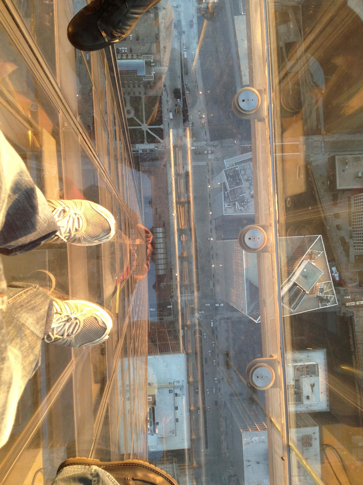
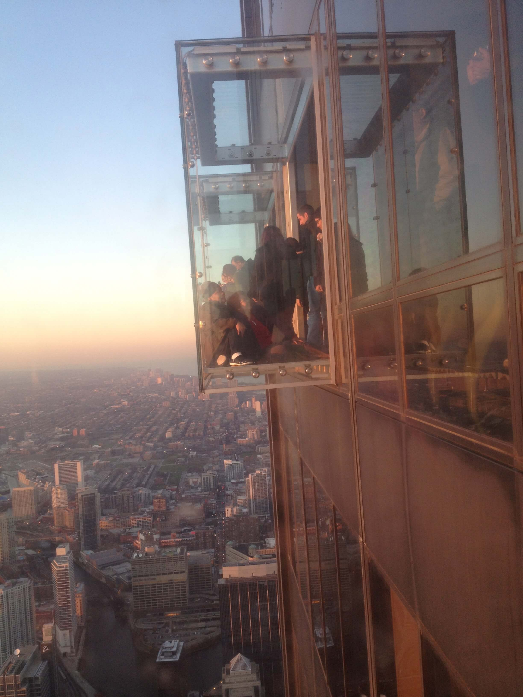
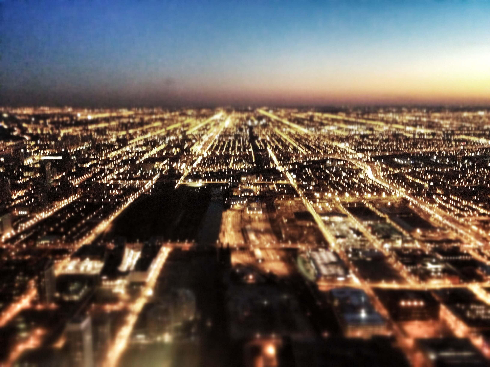

441 meters. 110 stories. Willis Tower is not the tallest building in the world but is the highest in the western continent. I went up to the 103 floor, where they have the Skydeck. You can see the entire city from there.

