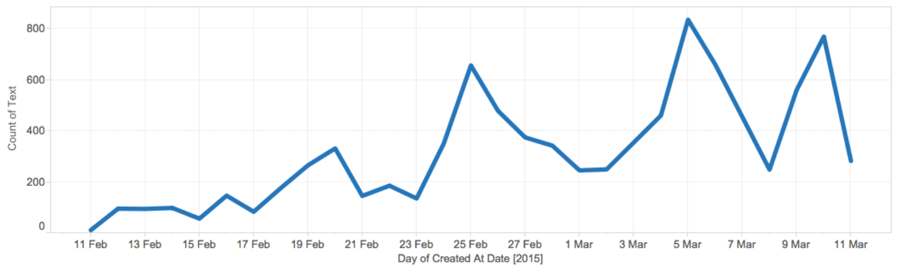
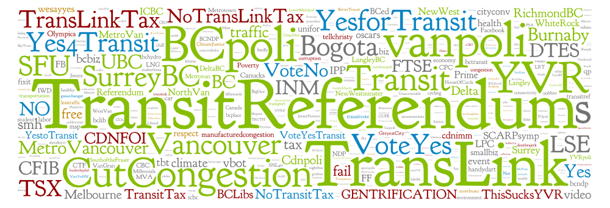

_Conventionally, civic engagement takes forms as deliberative and decision making processes, such as elections, referendums, and public consultations. However, civic engagement does not reduce the single act of vote, recognized as the “democratic duty.” Rather, the debate about collective issues and public affairs happens daily on the streets, on the workplace, at home, and, more recently, through digital social media. Explore the dynamic of social media networks and its impacts on the society become crucial to understand civic engagement in the contemporaneous social and political movements. Through a visual network and semantic analysis, we propose to map and investigate how digital social media platforms, particularly Twitter, has been used not only to inform and broadcast information about the Vancouver Transit Referendum but also to encourage civic engagement about mobility and public transportation in a very controversial environment._

An [interactive visualization](https://vancouver-transit-referendum.lucianofrizzera.com/) was build for this project. There is also a [blog post](/blog/the-cartography-of-transitreferendum-in-vancouver) explaining the development process. If you are interested in the code source: [github.com/lucaju/transit-debate](https://github.com/lucaju/transit-debate)

* * *

## Introduction

Traditionally, civic engagement is defined as the involvement of the general public in the political process and the issues that affect them. It is the community coming together to be a collective source of change, political and non-political. Conventionally, this takes forms of deliberative and decision-making processes, such as elections, referendums, and public consultations. However, civic engagement does not reduce the single act of vote, recognized as the “democratic duty.” Rather, the debate about collective issues and public affairs happens daily on the streets, on the workplace, at home, and, more recently, through digital social media (Silva & Frith, 2012).

Recent political events, such as Arab Spring (Middle East), 15M (Spain), Occupy (USA), and #vemprarua (Brazil), show that social media can serve as platform for civic engagement for political change (Allagui & Kuebler, 2011; Costanza-Chock, 2012; Malini _et al._, 2014). Perhaps most importantly, as Jurgenson (2012) claims, “social media and mobile phones allow protests occurring both in and offline to be far more participatory than ever before” (p. 87). The public sector also began to use digital tools and social media to increase inclusivity, reduce costs, and enhanced interaction. Though these tools might be a starting point for the public sector to have greater transparency, and improved participation and collaboration with citizens, social media has been used mostly as a way to represent public agencies in the new media (Mossberger _et al_., 2013). That is, the primary function is to push information to people, without any response, feedback, or exchange (Zavattaro & Sementelli, 2014) following a top-down approach, which indicates that the public sector has been using new media without full understanding of their affordance and limitations (Dunn, 2013).

Explore the dynamic of social media networks and its impacts on the society become crucial to understand civic engagement in the contemporaneous social and political movements (Reis, 2013). It is important to understand how social media has been used in public debates and how people participate in these conversations (Foth _et al._, 2011). Ergo, this study will map and investigate how digital social media platforms, particularly Twitter, has been used not only to inform and broadcast information about the Vancouver Transit Referendum but also to encourage civic engagement about mobility and public transportation.

Metro Vancouver Mayors’ Councils (2015b) aims to reduce the congestions by 33% over the next 30 years by making the road network more efficient, upgrading transit system, and improving pedestrian and cycling facilities. To fund this plan Mayors’ Councils proposed 0.5% increase to the Provincial Sales Tax and a plebiscite has been called to ask people if they agree with this measure. The proposed tax increase, however, is a source of controversy: the proponents argue that the hike is necessary to expand the transit system and cut congestions, while the opponents assert the increase would only benefit the transit company.

Our goals are, therefore, to explore the digital network formation around this debate in order to identify (1) what topics generate more interactions among users — Are there any controversies? Or the debate is mostly composed by a cohesive conversation? (2) Who are the main actors of this network — is this a one-to-many conversation? Is there any authority? How people cluster? (3) The dynamics of this network — Is it possible to identify why and when a topic emerges? Is there any shift or change during the analyzed time?

The methodological approach to examine the problem is two-fold. Drawn from the official campaign mote “#cutcongestion,” we will first collect public “tweets” and identified hashtags related to the referendum and the Mayors’ Transportation plan. Then, through a combination of visual network and semantic analysis, we will produce graphs to look at people’s involvement in the debate about the transit referendum in Metro Vancouver.

The information and conversation produced at the digital level contribute not only to generate multiple narratives but also reveals how people perceive and get involved with the issue being discussed (Malini _el a_l., 2014). When the topic is controversial, such as mobility, public transportation, and taxes, the debate can quickly heat up, revealing different points of view beyond of the dichotomy of a “yes” or “no” we usually find in referendums. With so many voices, these conversations are not linear, though all this noise not only reveals the tensions common to heterogeneous spaces but also intensify the demands for better ways to communicate and participate.

## Related Work

Tim O’Reilly (2005) coined the term Web 2.0 in 2005 to define the technologies that enable user content generation (_e.g._, blogs, wiki, data portals, crowdsourcing tools, social media). Unlike traditional media types, social media provide the means for a “many-to-many” communication, which quickly become very popular tools for information sharing, socialization, mobilization, and P2P exchange. These tools might be a starting point for the public section to have greater transparency and improved participation and collaboration with citizens.

Mossberger _et al._ (2013) show a rapid jump on the use of these tools among the 75 largest U.S. cities in 2011: for instance, “87% used Twitter, in comparison with 25% two years before” (p. 354). They argue that government agencies use social media mainly to represent the institution in the new media environment and build the image of responsiveness and accessible to the public. That is, the primary function is to push information to people, with low levels of response, feedback, or exchange (Zavattaro & Sementelli, 2014). Nonetheless, a few places employ ways for effective direct participation, such as ask budget ideas, ideation platforms, and a live conversation with the mayor (Mossberger _et al._, 2013). Iceland’s government, for example, turned toward social media technologies to crowdsource its revised constitution (Zavattaro, 2013).

Even though public institutions intend to use social media to enable greater involvement in public affairs and increase participation in a deliberative democracy, it is not clear how to engage people in this process. Dunn (2013) argues that instead of solving problems, such as, increase inclusivity, reduce costs, and enhanced interaction, new media has, in fact, produced a number of unintended consequences: enhanced bias, overload user cognitive apparatus, weaken social ties, and might even be a cause of depression and narcissism behaviour. Dunn (2013) emphasizes that advocates of new media are techno-optimists that “prioritize the implementation of technology as an end in itself as opposed to a solution to a clearly defined problem” (p. 129), which means that the public sector has been using new media without full understanding of their affordance and limitations.

Zavattaro and Sementelli (2014) also criticize the rapid adoption of social media by the public sector, since “recent empirical studies show that engagement practices are not quite reaching dialogic ideals of governance” (p. 258). Their argument is that social media encourages administrators and citizens to perform omnipresent (everywhere and nowhere) participation in shallow actions (liking, sharing), instead of engaging in a two-way dialog. That is, even though the practice follows a discourse of public administration toward governance through networking rather than only top-down interventions, Zavattaro and Sementelli (2014) argue that it might increase the capacity of participation instead of engagement.

The problem might be that, in many cases, the use of social media by public sector focuses on collaboration and deliberation in decision-making situations assuming that there is cohesion between government-citizen interactions. In practice, the conflict is the normal state of affairs in the current representation system. As put by Chomsky, social media allows for the increased possibility of “manufacturing dissent” (as cited in Jurgenson, 2012). Venturini _et al._ (2015) agree, “there is no such a thing as homogenous public” (p. 4), which is not inconsistent with Lippmann’s assertion: “in no two ages or places is there the same public. Conditions make the consequences of the associated action and the knowledge of the different” (cited in Venturini _et al._, 2015, p. 4).

Accordingly, social media might not be the best platform for decision-making, but it can be used to discover and respond to patterns (Zavattaro & Sementelli, 2014). In this case, social media has a dual role: serve as a way to identify where and what sort of information is needed to enrich the discussion, as well as be a platform for civic engagement in order to influence an actor within the political or administrative process, or claim for political change. Perhaps most importantly, as Jurgenson (2012) claims, “social media and mobile phones allow protests occurring both in and offline to be far more participatory than ever before” (p. 87).

This has been observed on many occasions in the recent years: Arab Spring (Middle East), 15M (Spain), Occupy (USA), #vemprarua (Brazil), and many others places. Participants of these events coordinated the protest using mobile devices and social media to spread their opinions about public affairs, produce and broadcast their own view of the event, and reappropriated the public space into a territory of resistance (Allagui & Kuebler, 2011; Panisson, 2011; Costanza-Chock, 2012). Participants also used mobile and social media as a surveillance instrument to catch excessive violence and government censorship (Jurgenson, 2012), reversing in some sense Foucault’s panopticon, as observes McCollough (2006): “before raising the usual Orwellian red flag, consider how much more likely than Big Brother are ten thousand pesky ‘little brothers’” (p. 27).

Nonetheless, the study of these on/off-line movements is as complex as the network they form. Twitter alone involves thousands of participants and millions of “tweets” in an intricate debate about a variety of topics. To understand this heterogeneous space, Venturini (2010) delineates a technique named Cartography of Controversies, derived from Bruno Latour’s Actor-Network Theory (ANT), to observe and describe social debate and public issues. Venturini (2010) defines controversy as “situations where actors disagree,” and begins “when actors discover that they cannot ignore each other” (p. 261). Actors are not only humans and human groups, but also institutions, products, natural and biological elements, technological artefact, and so on. In fact, any actor can be decomposed in a loose network (revealing other related actors) and be part of a greater network. Above all, controversies are disputes and represent the complexity of a conflicting world. As Venurini (2010) puts it, “controversies are struggles to conserve or reverse social inequalities. They might be negotiated through democratic procedures, but often they involve force and violence” (p. 262).

Scholars like Cancian _et al._ (2014) and Malini _et al._ (2014) are using this approach to investigate social movements and political debate: both produced network graphs to describe the connections, relations, and controversies in the _#vemprarua_ movement, also known _Manifestações dos 20 centavos_ \[20 cent manifestations\] occurred in 2013 in Brazil. Our own research builds on this related work. Using the cartography of controversies approach we aim to investigate how Twitter has been used not only to inform and broadcast information about the Vancouver Transit Referendum but also to encourage civic engagement about mobility and public transportation. Our goals are to describe the connections of these controversial debates and identify the main actors of this network.

## Context

According to the Mayor’s Council (2015b), traffic congestion in Metro Vancouver costs $1 billion per year to the regional economy. They estimate that 1 million people will move to Vancouver in the next 30 years making traffic congestion worst and doubling the costs to $2 billion per year in 2045. To solve the problem, a substantial investment has to be made to improve transportation and transit system (Mayors’ Council, 2015b). As a result, Metro Vancouver Mayors come up with a plan to reduce congestions by 33% over the next 30 years by making the road network more efficient, upgrading transit system, and improving pedestrian and cycling facilities (Mayors’ Council, 2015b). The plan also includes: expansion of the Skytrain system in Vancouver, a light rail transit in Surrey and Langley, replacement of Patullo Bridge, 11 new B-line rapid bus, and other minor improvements (Mayors’ Council, 2015a).

To fund and put the plan into effect, a new regional revenue source generating at least $250 million per year is required (Mayors’ Council, 2015a). Following other North America cities, such as Seattle and Los Angeles (Askarian, 2015), the Mayors’ Council has proposed a 0.5% increase to the Provincial Sales Tax dedicated to the Mayors’ Transportation and Transit Plan: “a small increase to the Provincial Sales Tax was found to be the fairest because everyone pays, including residents, businesses and visitors to the region, just as everyone benefits from the transportation and transit system” (Mayors’ Council, 2015a, p. 4).

In agreement with Mayors’ Council, BC province pledged that a public consultation, in the form of a referendum, would be held to decide the adoption of this new revenue sources for Metro Vancouver transportation. The proposed increase, however, is a source of controversy in Metro Vancouver: The proponents argue that the hike is necessary to expand the transit system and cut congestions, while the opponents assert the increase would only benefit the transit company.

The Mayors’ Council prepared an aggressive campaign, including usage of mass media (TV, and Newspaper ads) and new media, such as blogs, and social network, to involve and persuade citizens to vote YES in the plebiscite. They claim, “investments are essential to protecting our environment, strengthening our economy, and improving our health and quality of life” (Mayors’ Council, 2015b), and “if the referendum fails, the result will be more congestion, pollution, and longer commutes in the region,” which “will negatively impact the economy and growth of the region” (Askarian, 2015).

On the other hand, there is a campaign, mainly using social media, against the proposed tax increased. Organizers argue that the increase will only benefit TransLink (Agency responsible for the public transportation in Vancouver). TransLink has been accused of inefficiency, incompetence, and to spent too much money with the board of directions (No TransLink Tax, 2015). They also claim that if TransLink “saved only 0.5% of the future revenue growth \[they\] could pay for their plan without raising your taxes a dime” (No TransLink Tax, 2015).

## Method

Both the public sector and independent social groups are using social media, particularly Twitter, to encourage civic engagement and participation in discussions related to public affairs. The conversation about the proposed referendum was first anchored with the hashtag #cutcongestion, the mote of the official Mayors’ Council campaign. Drawn from a one-week exploratory analysis using the hashtag above, we thought that this hashtag would be very narrow to account for the interaction of other groups, especially from people that would disagree with the proposed transit plan. To have a broader view of the debate, we added the topmost hashtags used with #cutcongestion:

_#transitreferendum_: used as a more general and neutral anchor that quickly replaces the official #cutcongestion mote;

_#yes4transit_: mostly used by people in favour of the Mayor’s council plan;

_#notranslinktax_: used to protest against the idea to give more money to the regional transit company;

_#TransLink_: the regional transit company;

_#BCpoli_: anchors the political debate in British Columbia, Canada;

_#vanpoli_: anchors the political discussions in Vancouver, Canada.

Using Twitter Search API we collected and stored almost 100,000 public tweets from about 21,000 profiles using the above-mentioned hashtags from February 11, 2015, when the discussion around the topic started to increase the heat, and we will continue harvesting tweets about this topic until March 11, 2015.

To have a better understanding of the content of these messages we used a word cloud visualization based on word frequency to categorize the main themes of this conversation. To answer questions related to the network’s structure and user interactions, we examined a subset of the corpus, composed of tweets that connect people (_i.e._, retweets). We used Gephi to produced a series of visualizations and apply metrics capable of providing dynamic configuration and operation of the network connected to the debate through the selected hashtags. Following the cartography of controversies approach (Venturini _et al._, 2015) we aimed to identify and understand the nature of the main actors (nodes) according to their position in the network. In this study we considered the following features:

_Centrality_ — defines the significance of an actor in the network. An actor is central when they directly or indirectly communicate to a large number of people;

_Authority_ — Correspond to the number of links a node receives: the higher the number, the greater its authority;

_HUB_ — Correspond to the number of links a node makes: the higher the number of links, the greater the chances of a node to become a hub;

_Betweenness Centrality_ — defines the ability to intermediate the information flow between different parts of the network.

## Results

### Hashtags as filters: choose wisely

Choosing the right terms to perform a search and collect data on a massive social network like Twitter is crucial to the success of the study. The multiplicity of hashtags found in our initial dataset was overwhelmingly high: 4,737. In fact, in our first incursion on the dataset, we were surprised to identify the most popular profile as @FunnyThingsd, who had the most retweeted tweet:

> RT @FunnyThingsd: \[pastedGraphic.png\] TransLink 8-) BEST Summer Cocktails! http://t.co/XNpTi8xu6g http://t.co/wP6pY5Eltg

This tweet contains the hashtag #translink, selected by us because of homonymous Vancouver transit service company. However, it refers to a new summer cocktail drink on a Caribbean island. We found out many other examples of misleading information that had nothing to do with our research. In fact, TransLink is a very common English term for communication and transportation companies, particularly at UK, Australia, and the USA.

We have similar problems with the hashtags #vanpoli and #bcpoli. Both are locally recognized as aggregator terms for the political discussion in Vancouver and British Columbia (Canada), respectively. However, the scope of these topics is very broad, covering all ranges of regional political topics (_e.g._, environment, finances, taxes, heath). Yet, we could not just remove them from our dataset.

To solve the problem we used #vanpoli and #bcpoli to filter #translink. That is, we only keep tweets that contained both #vanpoli and #translink, or both #bcpoli and #translink. The other four selected hashtags (#cutcongestion, #transitreferendum, #yes4transit, and #notranslinktax) were more specific to the topic we are studying and did not have to be filtered out. As a result, our dataset was reduced to 8,755 tweets from 2,710 profiles, using 437 different hashtags. With a more concise and specific data, our analysis can be performed in a more reliable dataset that reflects the current debate about the transit referendum in Vancouver.

### Debate Evolution

Figure 1 shows the number of tweets per day between February 11 and March 11. The graph reveals peaks and valleys, showing that the interest in the debate varies through the days in this period. The flow of tweets increases from February to March until reaching its peak around 800 messages on March 5. Note that on February 11 the number of tweets is very low, close to zero because we started collecting late at night. Similarly, March 11 has close to 300 tweets, figure that would be higher if we had continued to collected tweet, especially because CBC Radio hosted a live debate on this day.

 Figure 1: Number of tweets per day between February and March 2015 shows a significant increase on the information flow after February 24, when Metro Vancouver Mayors publicly endorse the campaign in favor of the new transit plan.

The first two peaks (February 20 and 25) we see in the graph (Fig. 1) are related to significant events in the transit referendum debate. On February 20, a poll showed that the ‘No’ side took the lead in the Vancouver transit plebiscite: 53% were willing to vote ‘No,’ and only 32 percent of residents would vote Yes. The buzz can be illustrated by this tweet by the political activist @JodieEmery:

> RT @JodieEmery: I'm voting NO on the tax referendum - here's why: http://t.co/fjNILeQ3kv #bcpoli #vanpoli #notranslinktax #translink

(retweeted 10 times)

With the polling’s unexpected results, the Mayor’s council began to work harder to campaign in favour of their plan. Not only they increased the presence in the traditional media, giving public declamatory speeches about the importance of the new transit plan, but also started to invest in social media. For instance, on February 25 @yesfortransit — the official profile created to broadcast information about the Mayor’s Council plan — was the second most retweeted account with:

> RT @yesfortransit: A fight for good transit is a fight for good jobs says @gavinmcgarrigle #bcpoli #transitreferendum http://t.co/t9NfJQnbcp

(retweeted 12 times)

In the same day, @voteyestransit, created by a group of Mayor’s Council plan supporters, was the third most retweeted account with this tweet:

> RT @voteyestransit: We are voting YES for shift workers who struggle to get home late at night/early in the morning. 80% more NightBus service

(retweeted 15 times)

From February 11 to 23 the debate generated an average of 154 tweets per day. On February 25, the flow of tweets raised to 655 in a single day. From February 25 to March 11, the average increase to 471 tweets per day, with a peak on March 5 with 834 tweets, and keeping always above 240 tweets per day.

When analyzing the entire period, it is not hard to see the dominance of the traditional media upon regular users in this debate on social media. The most retweeted profile is the urbanist and CBC Radio columnist [@BrentToderian](https://twitter.com/BrentToderian) — retweeted 899 times. The discourse broadcasted by the media is most of the time aligned to the Mayor’s council:

> RT @BrentToderian: 66% of #Millennials say reliable #transit is among the top 3 factors on where they choose to live. #TransitReferendum

(retweeted 148 times);

or to express frustration with the quality of the public debate:

> RT @BrentToderian: Every time I hear public debates on the #TransitReferendum, I'm reminded why it was a horrible idea to make transit decision

(retweeted 79 times).

### Network Structure

According to Malini _et al_. (2014), analyze a network formed by retweets from certain hashtags means to “observe the role, position, and relationships between profile through the content republication” (p. 6, our translation). Here, we proposed to represent these relations and the dissemination of public content about the transit referendum through graphs composed by the personal and institutional profile (nodes) and their relationship (edges).

Figure 2 shows one of the possible reading of the network configuration formed around the transit referendum discussion on Twitter. It is possible to quickly identify the formation of two main groups, which are the focus of this controversy, and together represent 91% of the network: the blue cluster, with 2 cores, are composed of the actors in favour of the Mayor’s council proposal; the red cluster comprises the actors against the proposal. This representation has four main aspects of interpretation: the connection of nodes, the position of a node in the graph, node size, and node colour. Rather than build a hierarchy among the metrics or even the nodes, the central question here is to uncover the actor’s agency capability, the association among them, and the exchange of information and effects common to the socialization process.

 Figure 2: Network visualization showing the connections made from retweets during the discussions in the analyzed period: people in favour of the Mayor’s council proposal supporters in dark and light blue, people against the plan are in red; node’s authority is represented by its size (the bigger the size, the higher its authority).

The authorities in this network can be identified by the InDegree metric — the number of links a node receives: the higher the number, the greater its authority. This shows the most “popular” actors (most retweeted profile), whose have strong connections to hubs in the network. Hubs are the actors that distribute information, identified by the OutDegree metric: they also have a higher number of connections, but in the other directions, that is, they retweet information.  On the other hand, we also pay attention to the betweenness centrality metric, which indicates the capacity of an actor to intermediate the information flow to a certain part of the network — they are responsible to make information reach different groups of people.

Analyzing the authorities, the first thing we noticed in the graph is the dominance of @BrentToderian, and the prominent role profiles related to the media (_i.e._, newspaper and TV) had in this conversation and in the configuration of the network. Of the top 12 identified authorities, four act as journalists or columnists on regional media vehicles, according to their account description: @BrentToderian (20k+ followers), urbanist and CBC columnist; @Norm\_Farrell (1k+ followers), independent journalist and critic of liberal party ideology; @bobmackin (6k+ followers), news, sports, business and politics journalist; and @BillTieleman (7k+ followers), The Tyee newspaper’s columnist. The high public visibility and the number of followers built from their professional activity might explain their position in the debate.

Institutional accounts and collective profiles had important roles in this network, especially in campaigning in favour of the Mayors’ Council transit plan: @yesfortransit (1k+ followers) is the official account of the Mayors’ Council on Regional Transportation; @CityofVancouver (69k+ followers) is the official Twitter account for the city of Vancouver; @voteyestransit (1k+ followers), maintained by a coalition of local organizations. Consultant agencies focus on urban planning also helped to promote the Yes side: @modacitylife (7k+ followers), a “multi-service consultancy, focused on inspiring healthier, happier, simpler forms of urban mobility”; and @TODUrbanWORKS (4k+ followers), a Vancouver-based city-planning consultancy (led by @BrentToderian). On the other hand, the No side had two important spokesmen: @jordanbateman (4k+ followers), BC Director of Canadian Taxpayers Federation, and one of the leaders of No TransLink Tax, a coalition of local citizens, small business owners and concerned activists; and @schtev69 (827 followers), a fiscal conservative and free market defender.

HUBs are important to disseminate information, which in this case is the action of retweeting another actor. The main HUBs in the No side are @TranstinkBC (187 followers), a sarcastic profile created to criticize TransLink; @magtell (~5k followers), a No side supporter, and @ThinkSpinRepeat (39 followers), another sarcastic profile which the description is “Willing to burn it down to light it up.” Unfortunately, except for @magtell, these profiles do not seem to reach very far and attract more users to their cause. On the Yes side, the main HUBs are the already cited @voteyestransit; @symphily (5k+ followers), a BC teacher and education policy analyst; and @marcellam (3K+ followers), communication strategist and Volunteer President of the board Vancouver Contemporary Art Gallery.

The already identified authorities also intermediate the information flow to remote parts of the network. This is the case of @BrentToderian, @voteyestransit, @modacitylife, @CityofVancouver, and @Norm\_Farrell. The first four are important intermediators in the Yes core, and the latter is the main intermediator in the No side. That is, they make the information flow inside their own groups. However, other actors, some with few connections, works to connect the different cores of this network: @MikeFolka (313 followers), described simply as the “cable guy,” is an important bridge between the Yes side to the No side, especially connecting @BrentToderian to @lailayuile; @lailayuile (2k+ followers), a columnist at 24hrs Vancouver, does the same thing, but it is more connected to the No side. Though almost invisible in the network, it is also important to mention @ianabailey (8k+ followers), Vancouver-based Globe and Mail reporter, since he is exactly in the middle of the two core groups, possibly establishing common grounds between them.

### Hashtag semantic analysis

To have a better understanding of the content of the messages, we categorized the hashtags in three main themes: informational (green), call for action (blue), and criticism (red). Though these themes are not exclusive, with some hashtags having more than one meaning (_e.g._, notranslinktax), they work as there different modes of memetic productions in the collective network (fig. 3).

 Figure 3: Word cloud showing the frequency and category of each hashtag used in the conversation: informational (green), call for action (blue), and criticism (red).

The informational tags were mainly used to anchors the discussion topic, for example, #cutcongestion, #transitreferendum, #bcpoli, #vanpoli, #transit; and to tight to the geographic space where the debate was happening, such as #vancouver, #surreybc, #metrovancouver. This is a way to organize the massive information flow on social media platforms, connecting them to physical places and to the nature of the debate, which helps people to follow the discussions.

The call for actions tags, such as #yes4transit, #yesfortransit, #voteyes, #notransittax, and #voteNo, aims to demonstrate the user support, persuade other to vote in the plebiscite, and reinforce their arguments. Together, they serve as an instrument to measure the balance of the debate.

Finally, hashtags with criticisms represent how activists, especially from the No side, define their opponent: #TransLinkTax, #notranslinktax, # GENTRIFICATION, #thissucksyvr, #manufacturedcongestion, #dontbeajerk, and #corruption. Important to note that “translinktax” and “notranslinktax” are protest vocabulary, since the proposed increased tax is not focused on the regional transit company TransLink, neither will go directly to TransLink account.

## Discussion

### Official Channels

In spite of social media platforms enable and encourage people to express and broadcast they own opinions, producing different point of views of any event, official channels, and mass media dominate the debate about Metro Vancouver’s transit referendum. A substantial number of authorities, HUBs, and intermediators in this network are somehow connected to newspapers, radio, or media agencies. For instance, the most distinctive among authorities, @BrentToderian (Fig. 2), illustrates a network dynamic that moves between the logic of mass media and personal exchange. In the analyzed period, his tweets demonstrate a strong opinion in favour of Mayor’s council transit plan, though sometimes he also he also questions the idea of a plebiscite to decide this matter.

As a CBC columnist, @BrentToderian has access to more than 20k followers, which extends his tweets to a wider and diverse audience, producing a big circular cluster of consumers/repeaters around him (Fig 2, the big light blue circle on the top centre). The nodes on this cluster distribute @BrentToderian’s tweets but not necessary establish horizontal relationships among them, which is very similar to the mass media logic. On the other hand, @BrentToderian also connects to a very tight and centralized cluster (Fig. 2, dark blue area in the centre left). This group has a higher rate of interaction and small distance between the actors, making the messages repeatedly rotate within the group.

Official actors guide the transit debate: Mayor’s Council, City of Vancouver, Director of Canadian Taxpayers Federation, and consultant agencies. It is in fact, a top-down conversation, very different from the bottom up movements studied by Cancian _et al._ (2014), Malini _et al._ (2014). Indeed, the debate is so important to the future of the city that a number of the central actors are city planners, urbanists, and defenders of a better quality of life in Vancouver for the next 30 year. Most of the time the conversation is not casual and mundane, but has a strategic character: it is the organization of forces seeking to influence the collective decision of the transit plebiscite. The problem with this approach is that it can drive people away since the content of the messages can become too specialized (_e.g._, focus on a long-term project, and lots of statistical data), or even gain contours of threats and obscure future.

### One question, unexpected answers

The single question plebiscite elaborated by BC Province is: “Do you support a new 0.5% Metro Vancouver Congestion Improvement Tax, to be dedicated to Mayors’ Council transportation and transit plan?”, in which the possible responses are “yes” or “No”. This type of question only asks citizens if they agree with the tax increase to fund the plan, but does not address the plan itself and how it will be put in action. In the discussions on social media, people are in fact addressing three different issues: (1) how effective and who benefits from the proposed plan; (2) how fair is to increase the sales tax to fund the proposed plan; and (3) how the plan will be executed and how the money will be managed.

The first issue questions the supposed benefits of the plan and its effectiveness to solve congestions problems in Vancouver: where the investments should be made, which regions should be prioritized, which type of public transportation people should use. All these questions are in fact described in publicly available documentation produced by the Mayor’s Council, however, either people are not aware of the plan or they disagree how the plan was elaborated. Most important, it seems to have an agreement that a new transit plan is necessary to keep the city moving forward, showing that this debate has a cohesion in its intentions, but some dispute regarding where and who should be served first.

The second issue is directly connected to the plebiscite question: should Vancouverites pay more taxes to fund the plan? Here lies the main controversy of this debate. Mayor’s council argues that a 0.5% tax increase is the fairest way to fund the new transit plan and will not be a burden to most of the families living in Metro Vancouver (Mayors’ Council, 2014c). On the other hand, No TransLink Tax (2015) argues that it will hurt families’ budget, only benefiting the regional transit company. At this level, the dispute reveals an ideological confrontation between liberals, planning the province to meet future challenges, and conservatives, striving to reduce the interference of the state in the economy.

Underneath of this discourse, we can find another layer to this debate: how the plan will be executed and how the money will be managed. The controversy here is if the money will be well managed, particularly because there is distrust on TransLink board of governance. For instance, No TransLink Tax (2015) accuses TransLink of not only spending too much on the board of director and other administrative costs but also bad management decisions, such as the sluggish implementation of the Compass program (fare gates and electronic fare cards). This exposes a dissatisfaction with the way TransLink has been administrated, as well as a critique against the contradictions of capitalism: more money is necessary to invest in common infrastructures, but we keep spending large sums in bonuses to high-level executives even when they fail. However, while one could argue that a vote in favour of the Mayor’s Council transit plan validates these practices, a vote against it would not make any difference to solve this particular problem.

### Social Media and Civic Participation

In terms civic participation, our findings resonate Zavattaro and Sementelli (2014) assertion that the use social media by government agencies does not reach dialogic and conversational idea exchange with citizens. The primary function is to push information to people, with few responses or feedback. That is, local government agencies use Twitter as an instrument of mass media to broadcast information in one direction. In fact, it is also not inconsistent with Dunn’s (2013) claims that public sector fails to understand social media affordances and limitations. However, it does not means that new media is the source of all problems.

Dunn (2013) argues that, if we use new media without understanding how it works, it will create unintended consequences, such as weaken social ties. However, the relationship’s strength is not always a decisive factor for network formation. In a study about job seeking, Granovetter (1973) showed that weaken social ties are the foundation and the essence of network preservation. According to Reis (2013), understood as a set of nodes that remains connected and through which travels the fluids that give meaning to a community, a social network contains discourses that carries emotions, feelings, concepts and positions, substances that initiate the social, and the struggle for power. Thus, social networks cannot be seen only as a stable cohesive group of friends that shared the same ideas; rather they can also be controversial and temporary, involving people with different interests.

Indeed the public opinion about public transportation, in particular, the Mayor’s Council transit plan, is not uniform. The conflict we observe in this debate, with different points of view from a number of different actors, exists and materializes on social media independent of government agencies. The unintended consequences described by Dunn (2013) are not caused by social media usage, but reflects the normal state of affairs in the current representation system. The development of a narrative through social media platforms is made up by many voices that articulate and collaborate shared argumentations. Together these actors configure ephemeral collectives that confront against each other and dispute the territory in order to influence people opinions and actions, which, in the case of this debate, is to vote in favour or against the Mayor’s Council transit plan.

## Limitations

This study only shows a small part of a large debate about the transit referendum in Vancouver. Due to the massive amount of information shared in social media, we framed the discussion using hashtags we identified as anchors: #cutcongestion, #transitreferendum, #yes4transit, #notranslinktax, #TransLink, #BCpoli, and #vanpoli. Though we collected more data we expected, we also might have excluded conversations that were happening a step away from our selected hashtags (_e.g._, tweets using #yesfortransit instead of #yes4transit).

We are interested in the public debate, so we choose to analyze Twitter because its flow of information is usually public, which makes it convenient for researchers to mine data. Even though the discussions on other social media platforms, such as Facebook and Google Plus, seems to be public, they usually happen within closed groups, with posts and comments only accessible to user’s personal network. Thus, the difficulties to collect data due to privacy issues limited us to study a single social media, which prevent us to generalize our findings to other platforms.

Finally, this debate does not happen exclusively in the digital realm. It involves a myriad of other forms of information exchange, such as the media (_e.g._, Newspaper, TV), face-to-face communication, advertising, and many another way to actively participate and influence public opinion: rally, polling, coalitions, donations, and so on.

## Conclusion

Some scholars (_e.g._, Dunn, 2013; Zavattaro & Sementelli, 2014) adopt a narrow definition of civic engagement to argue that social media has been wrongly used to discuss public affairs. Dunn (2013) claims that public sector does not understand new media affordances and limitations, which can produce unintended consequences when employed in public consultation. However, the problem may be institutional and conceptual, rather than technical (Mossberger _et al._, 2013), such as an oversimplification of how the public debate is disputed.

Civic engagement is more than a simply voting in elections and referendums, or take part in a deliberative process. Public debate about collective issues and public affairs happens daily on the streets, in the workplace, at home, and, more recently, through digital social media. Moreover, public opinion is not uniform and homogenous (Jurgenson, 2012; Venturini et al., 2015); conflict is the normal state of affairs in the current representation system.

The analysis of social media reveals processes of conversation and controversies, at the same time that allows us to ask questions regarding the structure and nature of social networks, their main actors, the information flow, and the consequences these exchanges. In the case of the #transitreferendum debate, it shows a configuration composed of institutional and official agencies, the media, and leadership from different areas attempting to influence the outcomes of the transit plebiscite in Metro Vancouver. Unfortunately, this dispute is highly steered by mass media agents, which can be explained by the low levels of political participation in North America, which “often occurs only when individuals are dissatisfied” (Mossberger et al., 2013, p. 356).

In the current format, social media encourages and increases civic participation even when there is no leadership or facilitators: dynamic and ephemeral collectives formations proved the motivating power of social relations for social activism. Ergo, conversations in social media platforms intersect with the importance of the face-to-face debate democratizing the public debate, ultimately, empowering citizens to act or vote more consciously.

## ACKNOWLEDGMENTS

We thank researchers at Labic/Ufes (Brazil) for all the help in the process of data mining and archiving.References

Allagui, I., & Kuebler, J. (2011). The Arab spring & the role of icts| introduction. International Journal of Communication, 5, 8.

Askarian, M. (2015). Vancouver follows other North American sales tax transit referenda. Retrieved from [http://www.movinginalivableregion.ca/vancouver-follows-north-american-sales-tax-transit-referenda/](http://www.movinginalivableregion.ca/vancouver-follows-north-american-sales-tax-transit-referenda/)

Cancian, A., Falcão, P., & Malini, F. (2014). Ciberativismo e Manifestações Sociais. O# vemprarua no Brasil. In Comunicação e cultura na era de tecnologias midiaticas onipresentes e oniscientes. São Paulo, Brasil. Retrieved from [http://www.abciber.org.br/simposio2013/anais/pdf/Eixo\_4\_Politica\_%20Inclusao\_Digital\_e\_Ciberativismo/ciberativismo\_e\_manifestacoes\_sociais\_o\_vemprarua\_no\_brasil.pdf](http://www.abciber.org.br/simposio2013/anais/pdf/Eixo_4_Politica_%20Inclusao_Digital_e_Ciberativismo/ciberativismo_e_manifestacoes_sociais_o_vemprarua_no_brasil.pdf)

Costanza-Chock, S. (2012). Mic check! Media cultures and the Occupy Movement. Social Movement Studies, 11(3-4), 375–385.

Dunn, W. B. (2013). New media in planning: a critical review (Master of Science). University of British Columbia, Vancouver, Canada. Retrieved from [https://elk.library.ubc.ca/handle/2429/45374](https://elk.library.ubc.ca/handle/2429/45374)

Foth, M., Forlano, L., Satchell, C., & Gibbs, M. (2011). From Social Butterfly to Engaged Citizen: Urban Informatics, Social Media, Ubiquitous Computing, and Mobile Technology to Support Citizen Engagement. Cambridge, Mass.: The MIT Press.

Granovetter, M. S. (1973). The strength of weak ties. American Journal of Sociology, 78(6), 1360–1380.

Jurgenson, N. (2012). When atoms meet bits: Social media, the mobile web and augmented revolution. Future Internet, 4(1), 83–91.

Malini, F., Goveia, F., Ciarelli, P., Carreira, L., Herkenhoff, G., Regattieri, L., & Leite, M. V. (2014). #VemPraRua: Narrativas da Revolta Brasileira. In GI1: Comunicación Digital, Redes y Procesos. Lima, Peru. Retrieved from [http://www.labic.net/wp-content/uploads/VemPraRua-Narrativas-da-Revolta-brasileira.pdf](http://www.labic.net/wp-content/uploads/VemPraRua-Narrativas-da-Revolta-brasileira.pdf)

Mayors’ Council. (2014a). A Vision for Metro Vancouver: Plan Overview (p. 4). Retrieved from [http://mayorscouncil.ca/wp-content/uploads/2015/02/Mayors-Council\_Plan-Overview\_December-11-2014.pdf](http://mayorscouncil.ca/wp-content/uploads/2015/02/Mayors-Council_Plan-Overview_December-11-2014.pdf)

Mayors’ Council. (2014b). Regional Transportation Investments: a Vision for Metro Vancouver. Vancouver, Canada. Retrieved from [http://mayorscouncil.ca/wp-content/uploads/2015/02/Mayors-Council-Vision-Document\_June-2014.pdf](http://mayorscouncil.ca/wp-content/uploads/2015/02/Mayors-Council-Vision-Document_June-2014.pdf)

Mayors’ Council. (2015, February 20). New Study: Congestion Costs Metro Vancouver $1 Billion | Mayors’ Council. Retrieved from [http://mayorscouncil.ca/new-study-congestion-costs-metro-vancouver-1-billion/](http://mayorscouncil.ca/new-study-congestion-costs-metro-vancouver-1-billion/)

McCullough, M. (2006). On the Urbanism of Locative Media. Places: Forum of Design for the Public Realm, 18(2), 26–29.

Mossberger, K., Wu, Y., & Crawford, J. (2013). Connecting citizens and local governments? Social media and interactivity in major U.S. cities. Government Information Quarterly, 30(4), 351–358. http://doi.org/10.1016/j.giq.2013.05.016

No TransLink Tax. (2015). Retrieved February 24, 2015, from [http://www.notranslinktax.ca/](http://www.notranslinktax.ca/)

No Translink Tax: A Better Plan. (2015). Retrieved from [https://d3n8a8pro7vhmx.cloudfront.net/notranslinktax/pages/39/attachments/original/1421345843/No\_TransLink\_Tax\_-\_A\_Better\_Plan.pdf?1421345843](https://d3n8a8pro7vhmx.cloudfront.net/notranslinktax/pages/39/attachments/original/1421345843/No_TransLink_Tax_-_A_Better_Plan.pdf?1421345843)

O’Reilly, T. (2007). What is Web 2.0: Design patterns and business models for the next generation of software. Communications & Strategies, (1), 17.

Panisson, A. (2011, January 15). The Egyptian Revolution on Twitter. Retrieved from [https://gephi.org/2011/the-egyptian-revolution-on-twitter/](https://gephi.org/2011/the-egyptian-revolution-on-twitter/)

Reis, R. (2013). Cartografia das Disputas nas Redes Digital. In Anais do XXXV Congresso Brasileiro de Ciências da Comunicação (pp. 1–15). Manaus, Brasil: Intercom. Retrieved from [http://www.intercom.org.br/papers/nacionais/2013/resumos/R8-1425-1.pdf](http://www.intercom.org.br/papers/nacionais/2013/resumos/R8-1425-1.pdf)

Silva, A. de S. e, & Frith, J. (2012). Mobile interfaces in public spaces: locational privacy, control, and urban sociability. New York: Routledge.

Venturini, T. (2010). Diving in magma: How to explore controversies with actor-network theory. Public Understanding of Science, 19(3), 258–273.

Venturini, T., Ricci, D., Mauri, M., Kimbell, L., & Meunier, A. (2015). Designing Controversies and their Publics. Design IIssues 31(3). Retrieved from [http://www.tommasoventurini.it/wp/wp-content/uploads/2014/08/Venturini-etAl\_Designing-Controversies-Publics.pdf](http://www.tommasoventurini.it/wp/wp-content/uploads/2014/08/Venturini-etAl_Designing-Controversies-Publics.pdf)

Zavattaro, S. M. (2013). Social Media in Public Administration’s Future: A Response to Farazmand. Administration & Society, 45(2), 242–255. http://doi.org/10.1177/0095399713481602

Zavattaro, S. M., & Sementelli, A. J. (2014). A critical examination of social media adoption in government: Introducing omnipresence. Government Information Quarterly, 31(2), 257–264. http://doi.org/10.1016/j.giq.2013.10.007

* * *

_This paper was written as an assigment for the course Cognition, Leaning, Collaboration for the SIAT PhD program_
