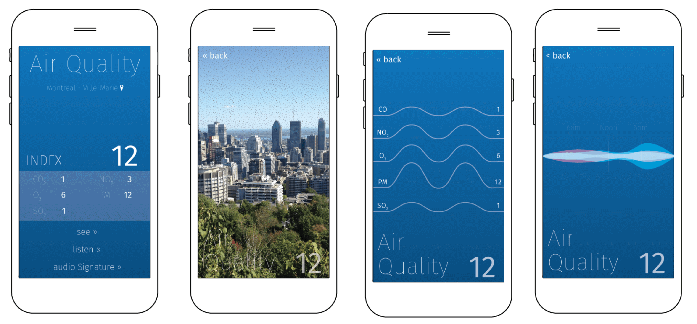

Our contemporary society is constantly pursuing different ways to improve and enhance urban systems, particularly in a big metropolis. Efficiency is the ultimate goal in the urban fabric in which regulatory laws delimit and prescribe how the city should be organized (Sassen, 2006). Its pulse is controlled by traffic lights, gates, and passwords; the parameters of this control come from the numerous datasets collected through structured surveys, electronic sensors, and tracking devices. The contemporary city is a techno-space beyond the materiality of its geography and architecture, in which digital technologies such as data clouds, mobile devices, and pervasive computers play equivalent roles to those of the streets, sidewalks, and public spaces in the city.

With all this data being produced by the urban infrastructure, it might be said that the city has some sort of consciousness or ‘sentience’ of its own existence — “not quite ‘smart’ … yet not exactly dumb either” (Shepard, 2011, p. 31). A sentient city is able to _hear_ and to _feel_ things happening in its surroundings, yet does not necessarily _know_ anything in particular about them. All that the city knows has to be reinterpreted by societal standards in order to make sense of it and invoke the appropriate response. But what exactly does the city knows about itself? How has this information been interpreted? What can we learn from these data? Is it possible to learn new ways to perceive the space by recasting these data?

According to Desouza and Bhagwatwar (2012), there is a growing initiative from all government spheres towards open data and public transparency, which take the form of web portals, web services, and Application Program Interfaces (APIs). Despite open data initiatives still being in their infancy in the city of Montreal, the Portal Données Ouverts, launched in 2011, contains 56 datasets (December 2015) from a variety of topics and themes (from infrastructure to sports; from human resources to elections; from the environment to security). However, making the data publicly available is not enough to promote engagement and citizens’ empowerment. Urban planners and designers, public managers, and elected officials must “harness the power of open data being made available to the public to design, develop, and revitalize smart urban spaces” (p. 108) and encourage emergent solutions of local problems by the general public as well as artistic interventions.

This project proposes a synesthetic experiment in which data collected by the city will be translated to a human sensorial input. More specifically, this project uses a mobile application to retrieve information about air quality in Montreal (Canada) to produce data-driven audio and visual feedback. The city of Montreal has a network of stations equipped with electronic sensors to measure pollution particles in the air at specific locations generating real-time geo-located data about air quality conditions. Based on the data collected by each sensor, an index is calculated within the range of the device for a certain period of time, which is used to predict future trends, direct strategic plans, and inform citizens about the air quality in their neighbourhood. Air and air quality are perceived through a variety of channels in the human body: skin, respiratory system, taste, smell, and sight. The goal of the project is to add alternative layers of perception and overload our sensorial apparatus not only to create awareness about the data itself but also to learn what the city might be sensing.

## Unstructured Stories

According to De Certeau (2002), ordinary people experience the city by walking. They “write,” or create small interferences in the proper path, but they are not able to “read,” or consciously understand what they are doing. The only way to see these “stories” is from the rooftop of a tall building. This bird’s eye view gives the necessary perspective to see how urban life is produced: millions of tiny little stories, inaudible to consumer-producer, but that make the city be in constant motion.

De Certeau was referring to human activities and the variety of tactics people used to overcome the proper use of space defined by urban planners and the city infrastructure. What can be said of the unstructured stories of non-human agents present in the urban environment (_e.g._, waterways, electrical grids, airways, sound waves, magnetic fields)? All of these features have an effect on and are impacted by, human activities in the urban environment. The air quality, for instance, is perceived by humans in many different sensorial ways (skin, respiratory system, taste, smell, and sight) — it is an immediate embodied experience. That is, our body is directly affected by what is contained in air, including pollution particles. In extreme cases (more common in large urban settings) we can even ‘see’ pollution; however most of the time we are incapable of perceiving minor concentrations of pollutants.

Experiencing the world in ways different than those prescribed by society can be pretty revealing. Benjamin’s (1986) “Hashish in Marseilles” explores the substance’s liberating effect. His description emphasizes the exploration of the urban fabric through relaxation and distortion of our sensorial apparatus and moral judgments: “the street I have so often seen is like a knife cut” (p. 138). Though Benjamin does not make any direct apology for drug use (or abuse), the quote at the beginning of his essay introduces the state of mind and body of one that adventures to try it:

“Space can expand, the ground tilt steeply, atmospheric sensations occur: vapour, an opaque heaviness of the air; colours grow brighter, more luminous; objects more beautiful, or else lumpy and threatening. … All this does not occur in a continuous development; rather, it is typified by a continual alternation of dreaming and waking, a constant and finally exhausting oscillation between totally different worlds of consciousness.” (Joël and Fräkel, as cited in Benjamin, 1986, p. 137)

Instead of chemical substances, this project makes use of a digital tool to assist users in this exploration. With current technologies, we also experience air quality through an arbitrary numeric scale based on electronic sensors in the city, usually to identify patterns, observe trends, and create strategies to manage the environment and mitigate possible health-related problems. That is, we rely on machines to collect and convert data into an appropriate scale to inform us about any danger. However, this disembodied experience distances ourselves from other possible stories these non-human agents might have been telling.

This project proposes to take a different look at the air quality data; through a synesthetic experiment, the meditated sensation of its numeric scale is translated to be perceived also as sound and image. Synesthesia is an involuntary neurological phenomenon in which stimulation of one sensory pathway leads to experiences in a second sensory or cognitive pathway. Using the data captured by the city’s infrastructure, this project deliberately used the concept of synesthesia to stimulate sensorial paths not normally used to perceive air quality. Thus, in addition to the natural way we sense air, extra layers of the same information will be available to users. The goal of the project is to overload our senses in order to create awareness and learn different ways to perceive this specific spatial feature.

For this project, I developed a mobile web application using public data made available by the city of Montreal, and the audio, video, and geo-locative features of a mobile phone. The application has four main features (see the user experience section below): (1) _Dashboard_: shows the instant air quality index and the concentration of pollutant particles in the surroundings; (2) _See_: superimposes noise patterns based on the current air quality index to degrade the image captured by the camera; (3) _Listen_: plays a sine wave based on the current air quality index, which can be decomposed based on the pollutants present in the environment ; and (4) _Audio signature_: based on averages of the previous week’s air index, the user will be able to see and listen to a waveform pulse that represents the city’s air index in a form of an audio signature.

There are a variety of applications and services that take on environmental data, especially weather and temperature, both for mobile and desktop computer (Weather, The Weather Network, The Weather Channel, etc.). Most of them are functional dashboards to convey temperature, precipitation, climate trends, and general instantaneous information about the weather in different locations. Air quality index is often present to notify of any risks, particularly for people with health issues, children, and the elderly, but usually neglected by most people.

The locative feature is also very common to many mobile applications, especially as a way to find routes and venues (e.g., Google Maps, Foursquare, Uber). To mention one that uses this feature in a non-trivial way, “Audio-Mobile,” developed by the Mobile Media Lab at Concordia University, explores the soundscape in urban settings. The app allows users to record sounds around them, attaching photographs and GPS coordinates to the file. These elements can then be uploaded to an online “sound map” and shared with others in a variety of ways.

Synaesthesia is a rare experience, though one already explored in the context of mobile technologies. “Synaesthesia App by Stromatolite”, for instance, was designed for 2012’s Music Tech Fest to explore the synesthetic experience of turning colours into sounds. By scanning the colour of someone’s t-shirt, the user finds a sound loop and can start to jam with their friends. Each colour triggers a different sound or instrument. The app adds an auditory dimension to a feature that we usually only perceive with our eyes.

## Method

To develop this experience, I used the critical making approach to investigate the affordances of the air quality data made available by the city in relation to a mobile device’s features. The term ‘critical making’ describes a desire to theoretically and pragmatically connect two modes of engagement with the world that are often held separate: “critical thinking, typically understood as conceptually and linguistically based, and physical ‘making,' goal-based material work” (Ratto, 2011, p. 253). Critical making focuses on the process rather than on the production of efficient objects: “the final prototypes are not intended to be displayed and to speak for themselves. Instead, they are considered a means to an end and achieve value through the act of shared construction, joint conversation, and reflection” (p. 253).

The strength of critical making is the act of shared construction itself as an activity and a site for enhancing and extending conceptual understanding of critical socio-technical issues. However, what is the point of a research methodological approach that locks itself in the laboratory of academia? Indeed, the prototype should not be considered a well-rendered product for public consumption. Still, it might be used as a strategy to create opportunities for reflexive perspectives not only for designers and researchers but also for other potential users. Thus, this project, including its code and designs, was made publicly available since its inception.

### Data

The mobile app consists of three components: air quality index, coding, and a graphic interface. The data is retrieved from the Portal Données Ouverts through a dedicated API. The standard request results in an XML file containing the current day’s air quality in Montreal, as well as a list of all stations spread throughout the city and the indexes of each pollutant that these stations are set to collect. The data is updated hourly and every request delivers the log of each station during the current day. Though the station is not geo-located, the city’s website informs where each station is located, which can be crossed with the air quality index data to geo-locate each station. This is important because the user receives the data from the station nearest they are at the time they access the mobile app.

The city has 19 stations spread throughout the city to measure the concentration of fine particles in the air and several different pollutants, such as carbon monoxide (CO), ozone (O3), sulphur dioxide (SO2), and nitrogen dioxide (NO2). Not all stations are active at all times, and some pollutants are not captured by all stations. Only indexes are available; however, the city explains how it is calculated, thus, the actual concentration measures can be inferred by simply reversing the equation.

### Coding

The app is built using web standard language (HTML, CSS, JavaScript). The decision to make it as a web app as opposed to a native mobile app (iOS, Android) has to do with accessibility and the availability of tools to build prototypes. However, some restrictions may apply the possibility of to access the phone’s camera and possible limitations in the use of GPS data. In addition to custom-made scripts to retrieve, compute, and display data, I have used JavaScript libraries for sound and video manipulation, specifically Seriously.js, timbre.js, and SiriWaveJS.

## User Experience

The app has four distinguished stages: _dashboard_, _see_, _listen_, and _audio signature_ (fig. 1). The _dashboard_ is similar to any other weather application: a flat design showing the location of the nearest station (based on the user’s geo-location), the air quality index, and the index of each pollutant. The familiarity of this screen serves as an anchor for all of the three other stages. The background is colour coded, changing according to the warning scale defined by the city (good: 0-25 \[blue\]; acceptable: 26-50 \[yellow\]; bad: 51+ \[red\]).

_See_ is a pretty straightforward visualization: it overlays a noise layer on top of the image captured by the mobile phone’s camera. The noise amount varies according to the air quality index: the higher the index (the worse the air quality), the denser the noise becomes, causing the image to degrade. The idea here is to “enhance” human vision, giving the sense that the user can see pollution that usually is not detected by human vision.

Figure 1: First version of the graphical interface. From left to right: Dashboard, see, listen, and audio signature.

_Listen_ has a more heterodox approach: using the instant air quality index the mobile app generates an audible sine wave. The index defines the frequency of the wave that is played back to the user and displayed as an animated waveform on the screen. By touching the waveform, the sound is decomposed: each pollutant’s index defines its own sine wave, revealing a different sound pattern. Again, this is an experience of augmenting human senses — perceiving the world through different sensorial paths.

_Audio Signature_ represents the air quality’s pulse of the city in a 24-hour-cycle. For this to work, the app needs to retrieve the data from a predefined period (e.g., week, month, year) and calculate the index averages by the hour in order to generate a pulse composed of multiple sine waves. The audio is then played back and displayed as a dynamic waveform, changing frequencies based on the calculated hourly index. This can be useful to understand patterns of air quality in the city: day and night, seasons, relevant climate events (e.g., el niño), and the impact of human activities (e.g., rush hour).

## Outcomes

The first release of this project worked as expected; however, the experience proposed was not fully achieved, especially because of issues with accessing the mobile phone camera using the web browser. Yet, this first version raised important questions related to the meaning and limitation of the public air quality dataset, as well as the best way to generate visual and auditory experiences from this data.

The first question has to do with the sample collected by the stations used to calculate the air quality index. According to the Quebec Government (n.d.), these stations have a spatial representation of 1 km or less; that is, the sample they collect represents the air quality in the area around 1000 meter from the station. This limitation restricts the area where the user can have a ‘valid’ read of the data but does not disrupt the sensorial experience. That is, the user has to be within a range of 1 km from the closest station in order to have a ‘valid’ sensorial experience delivered through the app. However, this specificity of the place can reveal intrinsic characteristics of various types of polluting human activities, such as residential heating with wood, or high intense transit in central areas.

It would be useful to have access to a real-time feed of the amount of pollution and fine particles in the air; nonetheless, the city service only releases air quality indexes (and the indexes of each pollutant collected by the station) in hourly intervals. This index is an arbitrary number relative to a predetermined scale that defines the optimum ratio of these concentrations for human activities. However, it masks the actual concentration of pollution in the environment (though it can be estimated by reversing the equation). For the purposes of this app, shorter intervals could enhance the sensorial experience, while real-world data could give the basis for a better interpretation as well as more variables to build into the app.

Although the visualization (_see_) needs improvements, particularly consistent access to the mobile phone’s camera, it is the sonification (_listen_ and _audio signature_) that requires more attention. Feedback from the first demonstration pointed out that the sound is “too flat” and “difficult to relate to the quality of air.” Because the data is only updated hourly, the frequency of the sine wave stays constant for a long period, generating a sense of discomfort. Furthermore, there is no clear relation between the quality of the sound (technical or aesthetic) and the quality of the air. How should clean air without pollution be represented? Silence?

Other more elaborate options might generate interesting aesthetic results, for instance using pollutant indexes as variables of a more complex composition, or even a curated set of songs that would be triggered depending on the combination of the different pollutants in the atmosphere. Other elements, such as distance from the closest station could also be considered as a variable. Moreover, the nature, effects, and impacts of each type of pollutant should be taken into consideration in order to help users identify the meaning of each one and the effects between them. Does it matter that CO concentration is higher than SO2? How do we represent and create a meaningful sensorial experience of higher concentrations of O3 in the environment?

Finally, the air quality audio signature needs more control options and visual feedback. It can become a useful tool to compare and contrast the current condition to historical patterns and trends. If recognizable, the audio feature of this pulse can create awareness about the air quality and be an adviser for a dangerous concentration of pollution at a given time. This signature can eventually be useful to contrast the quality of air in different cities, as the majority monitor the air quality.

## Conclusion

Today we tend to design everything according to prescriptive technologies, seeking systematic effectiveness, accuracy, and control (Franklin, 1989). As the urban space becomes larger and denser, digital devices are employed to comply with this desire of control. The city collects so much data that it becomes ‘sentient,’ developing some sort of awareness about its surroundings. As the city slowly ‘learns’ how to respond to critical events, we become more dependent on this centralized system. As Franklin pointed out, prescriptive processes are a social innovation of discipline and control: once we define and start to use them, they become culture, they become a norm, and soon it is understood as the only way to do things.

This project proposes an alternative sensorial way to experience the cityscape through the use of urban computing and mobile media. Though Franklin believes that algorithms eliminate choice, it does not mean that we cannot reprogram them and generate other outputs. In this first prototype, the synesthetic awareness project seeks to visualize and sonify air quality in Montreal. This holistic reappropriation of prescriptive technologies not only gives clues about how ‘sentient’ cities work, and what their intentions are but also reveals how the city might be sensing its surrounding environment and teaches us different ways to perceive reality.

## Bibliography

Benjamin, W. (1986). Hashish in Marseilles. In Reflections (pp. 137–145). New York: Shocken Books.

De Certeau, M. (2002). The Practice of Everyday Life. (S. F. Randall, Trans.) (2nd ed.). Berkeley, CA, USA; Los Angeles, CA, USA; London, UK: University of California Press.

Desouza, K. C., & Bhagwatwar, A. (2012). Citizen Apps to Solve Complex Urban Problems. Journal of Urban Technology, 19(3), 107–136.

Franklin, U. (1989). The Real World of Technology - Part 1. Retrieved September 30, 2015, from /player/Radio/Ideas/Massey+Lectures/1980s/ID/14250086/

Quebec Government. (n.d.). Indice de la qualité de l’air (IQA). Retrieved from [http://www.iqa.mddelcc.gouv.qc.ca/contenu/calcul.htm](http://www.iqa.mddelcc.gouv.qc.ca/contenu/calcul.htm)

Ratto, M. (2011). Critical Making: Conceptual and Material Studies in Technology and Social Life. The Information Society, 27(4), 252–260.

Sassen, S. (2006). Why cities matter. Catalogue of the 10th International Architecture Exhibition, Venice Biennale, 26–51.

Shepard, M. (2011). Sentient City: Ubiquitous Computing, Architecture, and the Future of Urban Space. New York City: Cambridge, MA: The MIT Press.

Ville de Montréal. (2011). RAPPORT SUR L’OUVERTURE DES DONNÉES de la Ville de Montréal: Un capital numérique générateur d’innovation et de participation. Ville de Montréal. Retrieved from [http://donnees.ville.montreal.qc.ca/demarche/](http://donnees.ville.montreal.qc.ca/demarche/)

* * *

_This project was developed as a final assigment for the Media Technology Practice, supervised by Prof. Owen Chapman, in the Communication Studies PhD program._
