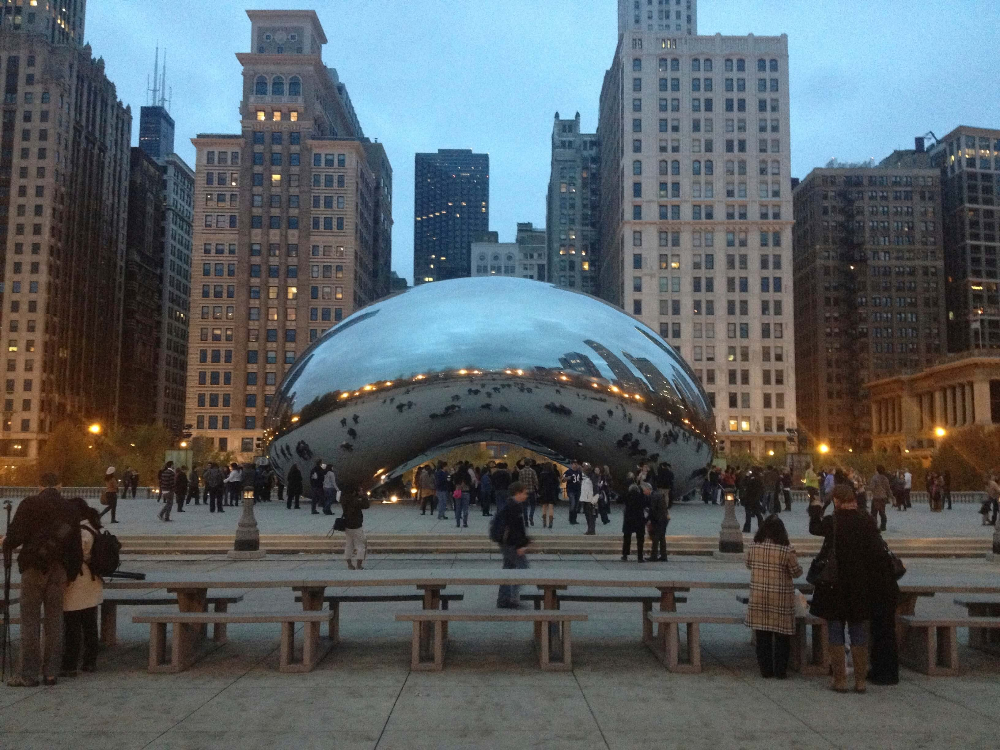
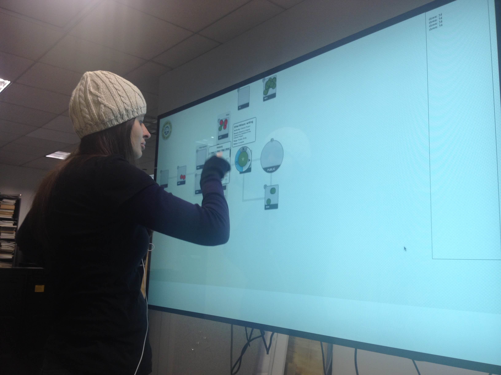
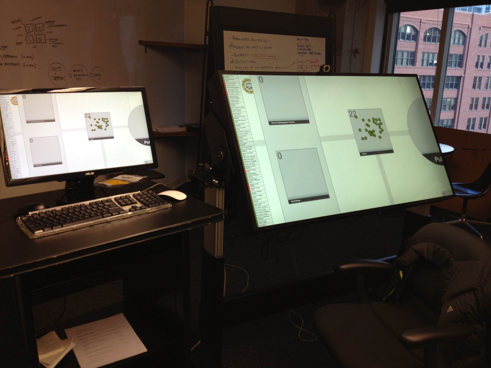

Under Stan Rucker supervision, Samia Pedraça and I visited the Institute of Design (IIT-ID) in Chicago for one week to assist in research projects. I developed the first iteration of our _Tangible Workflows_ prototype experimenting with the recently acquired 55” multitouch display as shown in the picture. Samia produced comprehensive use instruction for Citelens, a citation visualization tool in development by INKE team in Edmonton. She also assisted Gerry Derksen in a usability test of a search engine interface for Grainger Motors, which has more than 900.000 products in its catalog.

