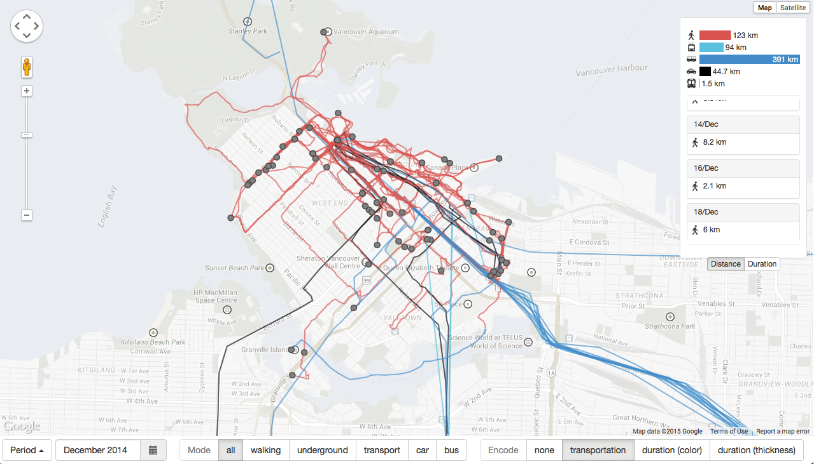

Leibniz (1646-1716) once observed that all things “are, like ‘rivers, in a perpetual flux; small parts enter and leave them continually,’” suggesting that “‘the very substance of things’ consists in ‘their force to act and be acted upon’” (as cited in Tiessen, 2008, p. 114). As an inherent human condition, mobility brings together communicative, technological, geographical, economic, cultural, and social forces that transform the surrounding space. In fact, space only becomes social meaningful through human agency and activities (De Certeau, 2002), such as walking and the desire to move in one or another direction. Ergo, the human spatial movement must leave some sort of traces behind, which could be both immaterial, like nostalgia or desire, and concrete, such as built environment, and marks on the sand.

At first glance, human spatial flow seems to be chaotic: endless vectors of movement coming and going to an infinite number of places as we drive from home to work, take public transportation to go to school, walk on the streets, and fly to any place in the planet. These movements are transitory (space) and temporary (time), which makes difficult to understand and analyze their nature and rules. Yet, if we follow our trails we might be able to understand our interactions with the surrounding environment and with other people (Zhao _et al._, 2008); we even might be able to grasp the patterns and rules that govern our movements.

Much has been made to improve visualization of human flows for planning, management, and economic purposes. However, these visualizations usually exclusively focus on data analysis to answer very specific questions, complex to use, very narrow in scope, and not suitable for unskilled eyes. Indeed, the visualization of such a corpus is still challenged by its rich and multidimensional data: combining space, time, and the categorical information is not an easy task. Nonetheless, occasional and informal use of such tool should also allow non-professional users to look at and perceive a pattern in their own movements. As an attempt to make visualization of human flows more accessible to a wider public, this paper introduces a user-centred interactive visualization prototype tool intended to explore everyday personal movement data collected from a mobile device. We believe that serendipitous exploration of our own personal data can reveal in-depth mobility patterns only perceived by who traveled those routes.

## Human Spatial Data

Human spatial movement data is composed of multiple dimensions: spatial (_e.g._, position, distance, direction), temporal (_e.g._, start, end, duration), derived data (_e.g._, speed), and whatever feature is attached to these movements (_e.g._, type of activity, mode of transportation, desire). Additionally, local physical features, like barriers and shortcuts, also affect the movement of individuals. Thus, it is important to think about movement not only in term of trajectories through time and space but also as human actions upon the environment. That is, it is crucial to incorporate social, cultural, and geographical contextual information to help us understand the properties and motivations of our movement (Zhang _et al._, 2014).

Nevertheless, keep track of and maintain records of our unceasing movements across space is not an easy task, as even material traces, like trails on the snow and traditional printed maps, disappear after some time and are hard to manage. Digital maps, on the other hand, are easily updated and can serve various purposes. Despite the fact they are a very recent technology, only made publicly available in the last 15 years (_e.g._, vehicle GPS), digital maps have become very popular (also very intrusive) tool among the general population. In fact, new technologies, mobile devices, in particular, are making geo-locative data more accessible, which has been increased not only in volume but also in details. For Zhao _et al_. (2008) this is a burgeoning of a corpus that could enhance our knowledge of mobility and behaviour over space.

The problem is that this corpus is enormous, and the question now shifts to how we make sense of such a big dataset. Andrienko and Andrienko (2007) point out that the best way to analyze such a corpus is through visualizations: “appropriate positioning and/or appearance of graphical elements representing data items can stimulate holistic perception of multiple data items as a unit” (p. 51), in which the most common techniques are maps and timelines. For instance, they use geographic maps, heat maps, and vectors to show traffic data aggregated by space and time in Milan, Italy. Zhao _et al._ (2008) demonstrate the importance of contextual data in the interpretation of the movement combining maps and timelines to visualize and analyze a large dataset of human movements in Halifax, Canada. Zhang _et al._ (2014) make intense usage of multiple timelines to show individuals’ temporal connections to the city of Tallinn, Estonia.

However, all these examples attempt to visualize spatial movement from multiple individuals at once, which makes the visualization cluttered, confusing, and difficult to read and use. In fact, they are tools aimed at professional visual analytics, interested in urban spatial flow, which restrict the scope and the audience of these visualizations. Spatial and temporal data can tell much about a certain environment, but the richest stories combine the type of desires and choices people make when they are moving from one place to another. Thus, instead of using multiple flows of individuals, the visualization proposed in this paper aims to engage users in a personal perspective of their own data, ultimately allowing them to see and perceive a pattern of their everyday life.

## Mobile Trackers

There are, in fact, many ways to visualize personal movement information using mobile media applications, most of them focused on fitness and exercise training. Nike+, for instance, tracks users running using GPS and accelerometer, in order to allow them to record and analyze the performance of their activities. It generates a visualization showing the traveled route on a map using colours to encode instant speed (Fig. 1A). Additionally, a second panel displays duration, calories burnt, and a timeline with speed and elevation along the route. Similarly, Runkeeper tracks users running or walking activities, though its simple visualization only shows the route and distance marks in a map, with distance, duration, pace, and calories burnt as a textual information (Fig. 1B).

Google Maps, on the other hand, aims the everyday life, and it versatile nature made it become one of the most used mobile apps around the globe (GlobalWebIndex, 2013). Among other things, Google Maps track user position and show a contextual map of the local surroundings, where the user can to search for places and routes. In fact, when a user search for a route to go to someplace, Google Maps shows predictions of possible futures: a map with a number of path options with distance and estimated time duration. Further, depending on the user’s settings, Google may have been recording their movements through space using mobile device’s GPS and accelerometer — with this data it is possible to visualize all user’s geolocation captured by Google.

Moves is a more dedicated mobile application for track and categorize user’s movements. It not only uses the accelerometer and the GPS to record user’s locations, but also calculates and categorizes them into a number of different activities, such as walk, run, and transportation. Its visualization is centred in a timeline, showing the sequence of movement the user did in a given day, including durations, types of activity, and places where they have been (Fig. 1C).

 Figure 1: (A) Nike+ shows the runner performance after the exercise: a map displays the route traveled coloured by the instant speed in each section, while the graph below presents elevation and speed. (B) Runkeeper shows the route traveled after a physical activity. (C) Moves' main screen shows a timeline of user’s daily movement activity.

## Personal Spatial Movement Visualization

### Dataset

The dataset used in this prototype was collected using Moves in an iPhone 5C smartphone and contains spatial movement data of a single person. It is stored in GeoJSON files and includes timestamps, duration, distance, and mode of transportation used in each movement. The data has more than 2,000 entries, spans seven months, from May to December 2014, and have a range of different modes of transportation, such as walking, running, bus, car, and aircraft.

### Visualization

The interactive visualization proposed in this paper is intended for personal consumption, focusing on discovery action performed by the data owners, who will be able to explore the dataset to identify, compare, and summarize their own movement patterns. With this tool, people could identify trends and features in the dataset, make correlations (_e.g._, walk more during the weekends, while driving more during weekdays), and check for similarities (_e.g._, same duration to go to different places using two different modes of transportation).

Hence, using Google Maps and D3.js, this prototype parse the dataset to draw multiples lines (_i.e._, routes) representing movement activities, and circles indicating places where the person stop or start a movement. The data is superimposed, piling up layers of activities one on top of the other, in which the location and length of each line are bound to the map coordinates and indicates the exact position and distance traveled (Fig. 2). Each movement activity contains metadata — duration, distance, mode of transportation, and timestamps — that can be used to filter and brush the data and to interact with the visualization.

### Filtering

As the dataset spans through months, the routes displayed on top of the map can quickly become cluttered, making difficult for users to distinguish one from another. To avoid this issue and enhance the lookup for detail and specific data points, we implement a filter where users can select the period of time they desire to see in the visualization: single day, a range of days in a given month, or a full month of activities. With fewer routes drawn to the screen, users can focus on the specificity of the selected time period.

A second filter allows users to focus on a specific mode of transportation. The options depend on the modes of transportation used in the period of time specified prior: by choosing “walking,” for example, the visualization hides the other modes of transportation.

 Figure 2: The proposed visualization uses Moves dataset on to of a map to show all the routes and places traveled by the user during October 2014. Each line represents a non-stop movement activity, carrying metadata containing duration, distance, mode of transportation, and timestamps. Users can filter the data by the period of time and by mode of transportation.

### Encoding Channels

According to Munzner (2014), position is the most visual salient attribute: “attributes encoded with position will dominate the user’s mental model … compared with those encoded with any other visual channel” (p. 102). In this case, position, as well as length, is inherent to the nature of the dataset: it is both the most important information and a fixed attribute channel in the map visualization. Other information, such as duration, distance, and mode of transportation has to be encoded in other visual channels. For the categorical data (_e.g._, mode of transportation), the use of colour (hue) was a straightforward choice, where each mode of transportation is assigned to a different colour (Fig. 3).

Numeric data type, particularly duration and distance, on the other hand, can be encoded either with scaled visual channels, like thickness or colour brightness, or aggregated into categorically coloured groups, for example. In order to define which strategy to use, we designed and conducted an experiment to compare the effectiveness and efficiency of time representation of human spatial movement on geographic maps using two encoding techniques: Colours (hue) and thickness. A total of twenty participants (N = 18), nine females and nine males, from four countries (Canada, USA, Brazil, and India) completed the experiment.

 Figure 3: When the user selects to encode data by “transportation,” each route is colour coded to reflect the type of transportation used.

As duration is a scaled dimension, our hypothesis was that we should use a visual attribute that can represent its nature. Since colour (hue) do not have an inherent scaled order or sequence (Munzner, 2014), it would be expected that line thickness would be more effective and efficient to represent duration in a map. In other words, people would quickly identify the right information in the visualization using line thickness.

However, the experiment demonstrates that colour is both more efficient and effective to encode duration in route maps. Indeed, participants spent less time to answer the questions and did fewer mistakes using a coloured scale. Combining both channels to code time duration did not enhance efficiency or effectiveness. In any case, we built the visualization prototype with the option for both encoding techniques, so we can perform further investigation in this matter.

### Additional Information

Additional contextual information, particularly duration and distance, is displayed in the floating panel on the right of the screen (Fig. 2 and 3). At the top, a horizontal bar chart shows aggregates distance (or duration) traveled using each mode of transportation in the selected period of time. If the user encodes the data by “transportation,” the graph becomes colour coded, and can serve as a legend to help identify the mode of transportation used in the routes drawn on the map. Further, the graph can be used to brush a specific mode of transportation: by hovering the mouse on top of the bars, the routes that used the targeted mode of transportation are highlighted, making easier to see patterns on the map.

The panel also provides a list of the days within the range of the selected time period. Each day lists the mode of transportation used and the total distance or duration traveled, according to the user choice. Similar to the mode of transportation graph, the days’ list is also interactive: by hovering the mouse on top of a day, users highlight the routes traveled in that day, facilitating the view of daily patterns.

### Limitations

The prototype proposed in this paper still has a number of restrictions and limitations. Even though Moves provides public APIs to access personal data, at the current state, this visualization only works with static data, which have to be downloaded, allocated into a specific folder, and manually added to the script. Also, to avoid overload and slowness, the maximum number of days in a period visualized is set to 30, which have to be within the selected month. Further development could easily connect to Moves public API, making the data instantly available and prevent overload of large size files.

Depending on the number of days in the selected period, and the number of routes traveled, the data can quickly become cluttered. Filtering and brushing can reduce the number of routes in the visualization, however, it could not be enough: lines will crisscross and overlap one another, making difficult to identify specific data points. Further, the number of colours needed to encode different modes of transportation can exceed our capacity to quickly distinguish them. In both cases, data aggregation could be a solution to ease on the visual encode channel, as well as improve our capacity to identify trends and pattern of the data.

## Conclusion

Space only becomes meaningful with human movement through the mapped space (De Certeau, 2002; Farman, 2011). As geo-locative data becomes more accessible through new technologies, especially mobile devices, users are able to take control of the space: our position in space is used to retrieve locational information from the Internet, augmenting our levels of understanding. Consequently, we are observing an increase in the volume and detail of this type of information, only possible to comprehend using visualizations techniques, such as interactive maps. Thus, if we track our movements, and follow our path through space, we might be able to enhance our knowledge of mobility and behaviour over space and time.

The visualization presented in this paper aims to assist people, particularly non-professional analysts, to have insights about their own spatial movement. It is important to design simple visualization tools that are more comprehensive for lay people since a serendipitous exploration of a personal data can reveal in-depth mobility patterns only perceived by who traveled those routes. Nonetheless, this tool can also be useful for urban planners and scholars interested in the dynamic of the city, especially in the topics of origin and destination, and human flows. Such knowledge is valuable for explaining people’s behaviour and needs and can be converted into valuable public policies, as well as engaging people in visualizing their own spatial rhetoric through the urban fabric.

The future directions for this project should look at: (1) data aggregation techniques in order to solve some technical problems, as well as to scale up as the dataset grows; (2) more filtering options, so users can refine their query and focus on specific questions; (3) additional panels to show other metadata contained in the dataset, such as number of steps and calories burnt in each travel, and categories of places in which people spend their time; and (4) establish links with other datasets that can be meaningful to analyze human spatial data, such as routes of public transportation, weather information, transit, and even location-based mobile game challenges.

## Bibliography

Andrienko, N., & Andrienko, G. (2007). Designing Visual Analytics Methods for Massive Collections of Movement Data. Cartographica: The International Journal for Geographic Information and Geovisualization, 42(2), 117–138. [doi:10.3138/carto.42.2.117](doi:10.3138/carto.42.2.117)

De Certeau, M. (2002). The Practice of Everyday Life. University of California Press.

Farman, J. (2011). Mobile Interface Theory: Embodied Space and Locative Media (1st ed.). New York, NY, USA: Routledge.

GlobalWebIndex. (2013). Top global smartphone apps, who’s in the top 10. GlobalWebIndex | Analyst View Blog. Retrieved from [http://blog.globalwebindex.net/Top-global-smartphone-apps](http://blog.globalwebindex.net/Top-global-smartphone-apps)

Munzner, T. (2014). Visualization Analysis and Design (1 edition.). Boca Raton: A K Peters/CRC Press.

Tiessen, M. (2008). Uneven Mobilities and Urban Theory: The Power of Fast and Slow. In P. Steinberg & R. Shields (Eds.), What Is a City?: Rethinking the Urban after Hurricane Katrina (pp. 112–128). Athens, Georgia, USA: University of Georgia Press.

Zhang, Q., Slingsby, A., Dykes, J., Wood, J., Kraak, M.-J., Blok, C. A., & Ahas, R. (2014). Visual analysis design to support research into movement and use of space in Tallinn: A case study. Information Visualization, 13(3), 213–231. [doi:10.1177/1473871613480062](doi:10.1177/1473871613480062)

Zhao, J., Forer, P., & Harvey, A. S. (2008). Activities, Ringmaps and Geovisualization of Large Human Movement Fields. Information Visualization, 7(3-4), 198–209. [doi:10.1057/palgrave.ivs.9500184](doi:10.1057/palgrave.ivs.9500184)

* * *

_This paper was written as an assignment for the course Knowloedge Visualization in the SIAT PhD program._
