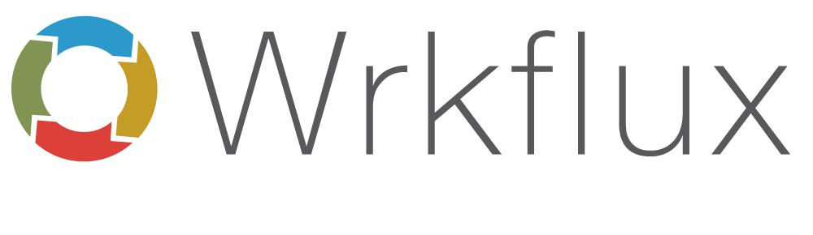
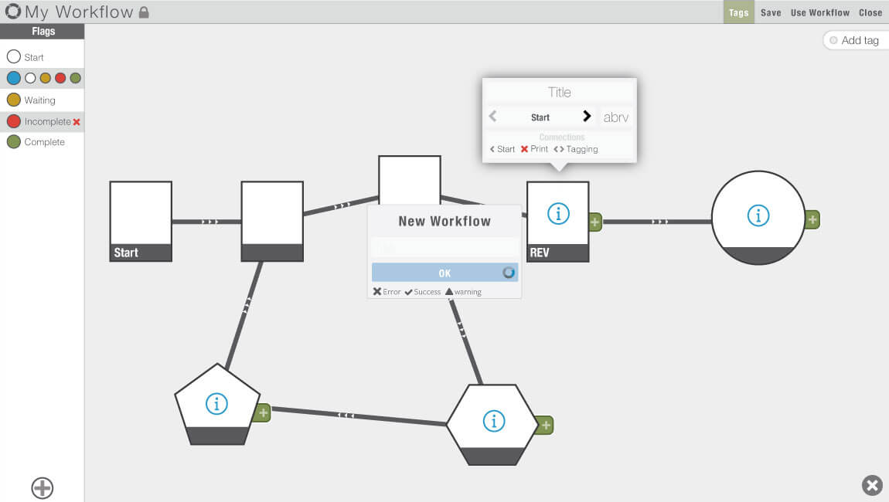

<iframe
  allow="fullscreen; picture-in-picture; clipboard-write; encrypted-media; web-share"
  allowfullscreen
  class="rounded-lg w-full md:h-max aspect-video object-cover"
  loading="lazy"
  src="https://player.vimeo.com/video/100567400?h=1c78150135" 
  title="vimeo-player"
  referrerpolicy="strict-origin-when-cross-origin"
/>

The process of modeling workflows for any purposes might be seen as a laborious and tedious experience. Even fun projects, like the development of mobile applications or video games, depending on tools with very formal structural representation, usually not user-friendly, and somewhat complex to use. So, how can we improve user experience in the process of modeling workflows, and perhaps make it more insightful and enjoyable? How can we mutate a workflow tool in order to make workflows more attractive, flexible, and useful for scholars?

This paper presents INKE’s research on workflows, which strives not only to explore alternative interface designs for workflow modeling process but also to imagine useful ways in which people could take advantage of the data. We have generated a series of prototypes developing visual and interactive affordances in order to make this process more intuitive, easier, and perhaps fun.

We began with the basic interactions with mouse and keyboard and an innovative visual interface for an editorial workflow. We spent a year from our first static layout to a functional prototype. We produced a pipe-and-flow type of workflow, in which each stage of the process is represented by a rectangle, and the little coloured-circles are documents in a review process. Colours reflect the status of each item within a stage, and at any point, users can change item’s status and move them through the flow.

Preliminary usability tests demonstrated that the majority of participants were pleased with the interface, especially with the quality of graphic elements on the screen. However, the same study pointed out to some important issues related to visual information delivered to the user as well as the interaction with the elements. From that, we identified and chose two main problems to address in future versions: The first is to solve cluttering areas like this: stages with high density of tokens challenge the user to find or access information; The second is to explore manual interaction with elements, since participants highlighted that the ability to move things manually would be incredibly helpful.

For the second version of our experiment, we built a tangible interface. We use the multitouch affordance on tablets to exaggerate manual interaction with elements on the screen, so, rather than click, grab, release, and double-click, we implement touch, swipe, hold, pan and zoom. In fact, this helped us to solve the cluttering areas: implementing a semantic zoom the system now delivers context information to users. These sorts of interactions, also called “natural gestures,” resemble the way we deal with real objects on a daily basis, perhaps resulting in a more engaging task with a semi-automatic process like workflow modeling.

Nonetheless, the most requested feature on our interactive workflow tool was not available yet: the possibility to create workflows. As always, a prototype born with an “ideal” pre-set in mind, and now we wanted to let users mess around with our toy and see what sort of new ideas they would come up.

Now, let me introduce the new features we have implemented in the third version of our workflow interface, now named Wrkflux. 

In order to let users create their own workflows; we had to develop a profile and authentication system. However, we made all projects public, that is, anyone can see someone else’s workflow, but cannot edit. As a result, we are building a public collection of different ideas on how people use workflows.

Once you are logged in, click on add new workflow, give it a name, and start building. The build screen is composed of two panels: Flags on the left, and Structure on the right.

On the Flags panel, the user defines colours and titles for item’s flags. Flags are the status of each item on top of the workflow structure. It could take the format of progression such as start, in progress, and complete, for example; or it could be a way to identify different types of files, like audio, video, and text.

The structure panel is where the user designs how the workflow will look like. It always starts with one step. From there, to add more steps, just drag the plus tab to any point on the screen. The same action can be done to connect one step to another: just release the plus tab on top of an existing step. It is possible to edit the title and the shape of each one of them. You can also remove existing connections, change a step’s position, or remove it.

There is also an annotation function, where users can make comments on the workflow’s structure. Just grab a “tag” on the right side of the screen and put it anywhere, just like a post-it.

After finish building, the structure of your workflow, just save it and switch to use mode to test it. But first, we need to add some items to this new workflow. Click on the green plus button at the bottom, give it a name and description, and define its initial flag and stage. A token will be added to the screen. Now you can start playing with your workflow. If you need to change anything, just go back to the edit mode (Fig 1).

 Figure 1: Wrkflux introduce flexible visual elements to help scholars build and test workflows.

In order to test Wrkflux and see what sort of different ideas to build workflows would come up, we began to collaborate with Mauricio Bernardes, a design professor at UFRGS in Brazil. His students are creating workflows for a range o different purpose: creative decision process, marketing products, editorial flow in a newspaper environment, mind mapping charts, and board games.

In fact, a student notes that Wrkflux looks like a board game. Simone Sperhacke is a board game designer and told us that we could enhance the tool engagement using game affordances. This was one of the most fascinating feedbacks we received about our research. In our endeavour for less laborious and tedious experience of workflow modeling, board games could be an answer. And here is where our project forks the path and starts mutating into a different format.

So, what sort of things a board game could bring in to help scholars in the process of workflow modeling? We looked at what game study theorists are saying about games and education. Gee (2005) affirms that games offer to “players continual opportunities to learn, solve problems, and become more skilled. That is, indeed, what makes \[...\] games fun” (p. 29). While Thomas and Brown (2007) argue that play, as an exploratory method for producing new knowledge, breaks with the traditional model of pedagogy practices usually disseminated, Butler (2012) points out “play is our first tool for making sense of the world” (p. 32). Therefore, it seems that allowing people to create games based on their own workflow process, we may encourage them to think critically about and explore the process they are modeling, mutating what might be a laborious and tedious experience into the ludic engagement offered by gameplay.

So, we decided to incorporate the ludic affordances of board games in the Wrkflux. We just needed a game. But which game? The whole idea is to let the users create games based on their workflows process. And we, as DH graduate students, decided to model the academic research workflow in the context of DH projects and practices around the world into a game. The game models the experience of researching and publishing in a multi-disciplinary academic environment. Players collaborate to collect data, perform research and publish their work in order to succeed, competing against the system inherent to the game.

<iframe
  allow="fullscreen; picture-in-picture; clipboard-write; encrypted-media; web-share"
  allowfullscreen
  class="rounded-lg w-full md:h-max aspect-video object-cover"
  loading="lazy"
  src="https://player.vimeo.com/video/90163548?h=7659a9b6d5"
  title="vimeo-player"
  referrerpolicy="strict-origin-when-cross-origin"
/>

We firstly developed and tested a paper-based version of the game with all the rules, roles, and flavours. We are now using Wrkflux to code the game’s mechanic in order to develop the digital version of this game. If you are interested and want to know more about this game, please come talk with us after the panel. We will also be at CGSA next Thursday running a demonstration. You are all invited to watch and play.

To sum up, this project aims to reimagine the process of modeling workflows. We want to produce new interfaces that could make this process less tedious, and more interactive. During our research, new ideas come up from many different sources. And today I want to highlight the possible synergy between our interactive workflow building environment and the ludic nature offered by gameplay. By transforming a work tool into a game platform, we are offering a method of serendipitous discovery; while enjoying the game, people are prone to critically explore the process of modeling, which could lead to new insights about knowledge construction.

The Wrkflux is a public prototype. The code is here: [https://github.com/lucaju/Wrkflux](https://github.com/lucaju/Wrkflux)

## References

Butler, C. (2012). Interaction. playing with data. A theory of amateur information design. \[Melbourne, Vic.\]: Common Ground Publishing. Print, 66(3), 32-33.

Frizzera, L., Radzikowska, M., Roeder, G., Pena, E., Dobson, T., Ruecker, S., … The INKE Research Group. (2013). Visual workflow interfaces for editorial processes. Literary and Linguistic Computing, 28(3), 615–628. doi:10.1093/llc/fqt053

Gee, J. P. (2005). Why video games are good for your soul: pleasure and learning. \[Melbourne, Vic.\]: Common Ground Publishing.

Radzikowska, M. (2011). A structure for every surface. Presented at the Digital Humanities, Stanford.

Thomas, D., & Brown, J. S. (2007). The Play of Imagination Extending the Literary Mind. Games and Culture, 2(2), 149–172. doi:10.1177/1555412007299458

\------------

_Authors: Luciano Frizzera, John Montague, Simone Sperhacke, Maurício Bernardes, Geoffrey Rockwell, Stan Ruecker, and the INKE Team._

_Paper part of the panel “The lifecycle of the interface” presented at CSDH 2014. St. Catherine, Canada. May 2014._
